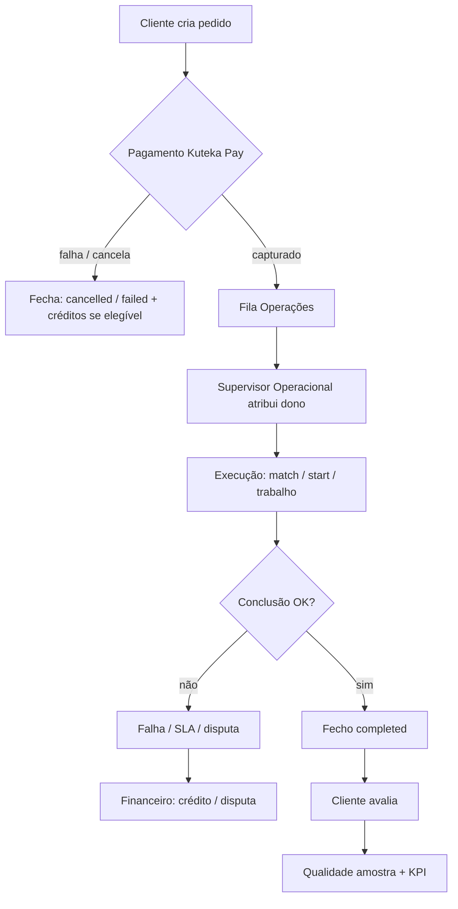

# KUTEKA OPERATING SYSTEM (KOS)

| Campo           | Valor                                                                                                        |
| --------------- | ------------------------------------------------------------------------------------------------------------ |
| **Versão**      | 1.0                                                                                                          |
| **Data**        | 2026-08-05                                                                                                   |
| **Natureza**    | Operação empresarial diária — **não** é especificação de software                                            |
| **Complementa** | [KUTEKA_ROADMAP_MASTER.md](./KUTEKA_ROADMAP_MASTER.md) (plataforma) · Arquitectura Financeira v1.0 (negócio) |
| **Produção**    | https://kutekalink.com                                                                                       |

Este documento define **como a empresa Kuteka funciona**: quem decide, quem executa, em quanto tempo, com que indicadores, e como escala.  
Software (rotas, RPCs, Super Admin) é a **ferramenta**; o KOS é o **modo de operar**.

---

## 0. Princípios operacionais

1. **Um pedido = um dono.** Sem dono explícito, o pedido não avança.
2. **Ledger-first.** Nenhuma cobrança, crédito ou reembolso sem rasto no sistema financeiro.
3. **Sem custódia nesta fase.** `custody_mode = none` — Kuteka não segura dinheiro do cliente até decisão legal/PO.
4. **Configuração > código.** Preços, flags e gateways vivem no Super Admin (`/app/super`).
5. **Versões comerciais > módulos.** A partir de agora o trabalho serve `v1.0` / `v1.5` / `v2.0` / `v3.0` (§10), não “terminar todos os módulos”.
6. **Papéis empilháveis.** Em beta, a mesma pessoa pode exercer vários chapéus; o organograma descreve **funções**, não headcount obrigatório.
7. **Demo ≠ produção.** Contas `demo.*` e gateway `sandbox` saem do caminho crítico antes de beta pública.

---

## 1. Estrutura organizacional

Departamentos = **funções da empresa**. Em `v1.0` Beta, vários departamentos podem ser cobertos por 1–3 pessoas.

| Departamento         | Missão                                                        | Ferramenta principal                      |
| -------------------- | ------------------------------------------------------------- | ----------------------------------------- |
| **Direção Geral**    | Estratégia, prioridades de versão, decisões PO                | Roadmap Master + KOS                      |
| **Operações**        | Executar pedidos (match, concierge, assistência, marketplace) | `/app/*` serviços + Admin                 |
| **Comercial**        | Parceiros, prestadores, planos, conversão                     | Patrimónios, planos, CRM Super            |
| **Financeiro**       | Preços, cobrança, créditos, reconciliação, faturas            | `/app/super`, `/app/financeiro`           |
| **Jurídico**         | Contratos Kuteka, termos, compliance                          | Contratos + docs legais (a publicar)      |
| **Tecnologia**       | Plataforma, deploy, segurança, Kuteka Pay                     | Repo + Deploy Kuteka + Supabase           |
| **Marketing**        | Aquisição, comunicação, campanhas                             | Landing + Super Campanhas                 |
| **Atendimento**      | 1.ª linha ao cliente / parceiro                               | Ajuda + canais (email/WhatsApp a definir) |
| **Qualidade**        | SLA, avaliações, amostragem de casos                          | Avaliações marketplace + revisões         |
| **Auditoria**        | Fraude, disputas, conformidade de processos                   | Super: Fraude / Disputas / Recon          |
| **Recursos Humanos** | Recrutamento, treino, cobertura de turnos                     | Fora da app (processo interno)            |

**Regra de escala:** só se cria headcount dedicado quando o KPI do departamento falha de forma sustentada (§5 + §7), não por organograma teórico.

---

## 2. Papéis internos

Hierarquia de **autoridade operacional** (não de ego). Mapeamento aproximado para papéis técnicos da plataforma.

```
Super Administrador          → finance.manage / superadministrador
        ↓
Administrador Geral          → admin / reputation.manage
        ↓
Supervisor Comercial         → comercial + partner ops
        ↓
Supervisor Operacional       → agent.operate + filas de serviço
        ↓
Supervisor Financeiro        → finance.read + reconciliação diária
        ↓
Agentes Certificados         → agent.operate
        ↓
Atendimento (1.ª linha)      → leitura + triagem
        ↓
Prestadores / Parceiros      → self-serve + pedidos recebidos
```

### 2.1 Responsabilidades

| Função                     | Responsabilidades                                                                                  | Não faz                                                |
| -------------------------- | -------------------------------------------------------------------------------------------------- | ------------------------------------------------------ |
| **Super Administrador**    | Preços, catálogo, flags, gateway por omissão, campanhas, créditos manuais, acesso total financeiro | Operar cada pedido do dia-a-dia                        |
| **Administrador Geral**    | Utilizadores, agentes, confiança, inventário problemático, escalações graves                       | Alterar motor económico sem alinhamento Super          |
| **Supervisor Comercial**   | Onboarding parceiros/prestadores, planos Bronze–Gold, pipeline leads B2B                           | Capturar pagamentos sandbox/produção                   |
| **Supervisor Operacional** | Filas Mudança / Casa / Concierge / Garantia / Assistência / Marketplace; assigns; breaches SLA     | Alterar preços sem Super                               |
| **Supervisor Financeiro**  | Reconciliação, reembolsos/disputas em curso, exportações, alertas de fraude                        | Desligar escrow ou inventar caminhos de pagamento      |
| **Agente Certificado**     | Visitas, avaliações, mediação, match assistido quando designado                                    | Cobrar fora do Kuteka Pay                              |
| **Atendimento**            | Triagem, FAQ, abrir/encaminhar ticket interno, registar insatisfação                               | Aprovar reembolsos acima do limite (escala Financeiro) |
| **Prestador**              | Orçamentar, executar, concluir pedidos marketplace                                                 | Definir comissão Kuteka                                |
| **Parceiro Patrimonial**   | Registar património, contratos, serviços pretendidos                                               | Operar filas internas Kuteka                           |

**Limites de aprovação (v1.0 / v1.5):**

| Acção                                      | Quem aprova                                 |
| ------------------------------------------ | ------------------------------------------- |
| Preço / produto novo                       | Super Admin                                 |
| Reembolso ≤ créditos de política do módulo | Sistema automático ou Supervisor Financeiro |
| Reembolso excepcional / disputa            | Supervisor Financeiro + registo em Disputas |
| Banir conta / demos                        | Admin Geral                                 |
| Activar gateway real                       | Super Admin + Direção (+ checklist go-live) |
| Publicar Termos / Privacidade              | Jurídico + Direção                          |

---

## 3. Fluxo interno padrão (pedido de cliente)

Aplica-se a **qualquer** serviço pay-per-use (D1–D5 e marketplace). Nomes de estado alinham com a plataforma.



### 3.1 Quem faz o quê no ciclo

| Etapa                | Quem                                                      | Sistema                                                                                   |
| -------------------- | --------------------------------------------------------- | ----------------------------------------------------------------------------------------- |
| **Recebe**           | Plataforma (pedido criado) + Atendimento se canal externo | `/app/mudanca`, `/encontrar-casa`, `/concierge`, `/garantia`, `/assistencia`, `/servicos` |
| **Cobra**            | Kuteka Pay (automático)                                   | Intent → capture (sandbox hoje; gateway real em v1.5)                                     |
| **Aprova / atribui** | Supervisor Operacional (ou Agente designado)              | Mudança de estado / match / start                                                         |
| **Acompanha**        | Dono do pedido + Atendimento (updates)                    | Timeline de eventos do módulo                                                             |
| **Fecha**            | Operador (complete) ou política automática (cancel/fail)  | RPC `*_complete` / `*_cancel` / `*_fail`                                                  |
| **Avalia**           | Cliente (marketplace); amostragem Qualidade nos outros    | Rating / revisão                                                                          |
| **Contabiliza**      | Ledger + Supervisor Financeiro (recon)                    | Super: Receita / Recon / Export                                                           |

### 3.2 Canais de entrada (ordem)

1. App autenticada (preferencial).
2. Atendimento (email/WhatsApp) → cria ou orienta o cliente a criar na app.
3. Parceiro/Agente em nome do cliente (quando papel permitir).

**Regra:** pedido só “existe” operacionalmente depois de estar na app com estado e (se aplicável) pagamento.

---

## 4. SLA (tempos máximos)

Dois níveis: **Beta (v1.0)** — horário comercial AO (ex.: 08:00–18:00, dias úteis) — e **Alvo estável (v1.5+)**.  
Breach = marcar `sla_breached` / evento + escalar Supervisor Operacional.

### 4.1 Transversal

| Evento                                      | Beta v1.0                              | Alvo v1.5+            |
| ------------------------------------------- | -------------------------------------- | --------------------- |
| 1.ª resposta Atendimento (pedido humano)    | 4 h úteis                              | 2 h                   |
| Pagamento (intent → resultado gateway)      | Imediato (sandbox) / &lt; 2 min (real) | Imediato / &lt; 2 min |
| Reembolso em créditos (política automática) | &lt; 15 min após trigger               | &lt; 5 min            |
| Disputa financeira (1.ª análise)            | 48 h úteis                             | 24 h                  |
| Publicação de anúncio após confiança OK     | 24 h úteis                             | 12 h                  |

### 4.2 Por serviço

| Serviço                           | Resposta operacional (após pagamento)                 | Execução / match                               | Fecho após conclusão técnica                           | Avaliação cliente |
| --------------------------------- | ----------------------------------------------------- | ---------------------------------------------- | ------------------------------------------------------ | ----------------- |
| **Mudança Inteligente**           | 2 h úteis (ack + dono)                                | Conforme urgência já no schema (ex. 720→120 h) | 24 h após aceitação do match                           | 48 h              |
| **Encontrar Casa**                | 4 h úteis                                             | SLA procura (ex. 168 h / 7 dias)               | 24 h após aceitação                                    | 48 h              |
| **Concierge**                     | 2 h úteis                                             | Início &lt; 24 h úteis                         | 24 h após `in_progress` concluível                     | 48 h              |
| **Garantia**                      | Activação imediata pós-pagamento                      | Cobertura contínua                             | Cancelamento: mesmo dia = crédito; depois sem pró-rata | N/A mensal        |
| **Assistência 24h**               | **30 min** ack (beta: melhor esforço fora de horário) | Início &lt; 2 h                                | 24 h após conclusão                                    | 48 h              |
| **Marketplace**                   | Prestador: orçamento &lt; 12 h                        | Início conforme orçamento aceite               | 24 h após complete                                     | 48 h              |
| **Contrato**                      | Revisão Admin/Agente &lt; 24 h úteis                  | —                                              | Assinatura/fecho conforme fluxo N5                     | —                 |
| **Manutenção / pedido prestador** | 12 h úteis                                            | Conforme orçamento                             | 24 h                                                   | 48 h              |
| **Avaliação de imóvel**           | 48 h úteis (agendamento)                              | Visita + relatório                             | 24 h após visita                                       | —                 |

**Nota de honestidade:** Assistência “24h” em v1.0 Beta só é credível com **plantão** ou mensagem clara de horário. Até haver plantão, comunicar “urgência prioritária em horário estendido” e tratar 30 min como objectivo, não garantia legal.

---

## 5. KPIs por departamento

Medir semanalmente em v1.0; diariamente em v1.5+ para Operações e Financeiro.

| Departamento    | KPIs principais                                                                                              | Alvo inicial (orientação)                     |
| --------------- | ------------------------------------------------------------------------------------------------------------ | --------------------------------------------- |
| **Financeiro**  | Receita bruta; margem após comissões; % cobranças capturadas; créditos emitidos vs redimidos; tempo de recon | Recon D+1 sem gaps; 0 cobranças órfãs         |
| **Operações**   | Tempo médio 1.ª resposta; % SLA cumprido; backlog aberto; % fechos sem disputa                               | ≥ 90% SLA em horário comercial                |
| **Qualidade**   | Nota média avaliações; % reabertura; amostragem semanal                                                      | ≥ 4.0/5; &lt; 10% reabertura                  |
| **Comercial**   | Leads → parceiro activo; novos prestadores; conversão planos; churn parceiro                                 | Pipeline semanal visível                      |
| **Agentes**     | Visitas; contratos avançados; avaliações feitas                                                              | Produtividade por agente activo               |
| **Atendimento** | 1.ª resposta; CSAT; % resolvido sem escalar                                                                  | ≥ 80% resolvido em 1.ª linha                  |
| **Marketing**   | Visitas landing; registos; activação `/app`                                                                  | Funil semanal                                 |
| **Tecnologia**  | Uptime; falhas deploy; incidentes Pay; tempo de rollback                                                     | Uptime ≥ 99% beta                             |
| **Auditoria**   | Disputas abertas; alertas fraude; acções sem audit log                                                       | 0 acções financeiras sem rasto                |
| **Jurídico**    | Docs publicados; contratos problemáticos                                                                     | Termos/Privacidade live antes de beta pública |
| **Direção**     | Progresso versão comercial; receita vs custo ops                                                             | Decisão quinzenal de prioridade               |

---

## 6. Manual de operações (procedimentos internos)

Formato único: **Triagem → Pagamento → Execução → Fecho → Pós-venda**.

### 6.1 Mudança Inteligente

1. **Triagem** — Cliente cria pedido com urgência/preferências; Atendimento só se canal externo.
2. **Pagamento** — Cobrar `opening_fee` via Kuteka Pay; estado `awaiting_payment` → `active`.
3. **Execução** — Supervisor Operacional/Agente regista match; cliente aceita/recusa; se aceitar, cobrar `success_fee`.
4. **Fecho** — `completed` / `failed` / `cancelled` conforme política; créditos automáticos se elegível.
5. **Pós-venda** — Verificar SLA; amostragem Qualidade; notas KAI se relevantes.

### 6.2 Encontrar Casa

1. Cliente define preferências → paga `priority_fee`.
2. Operações procura / propõe match dentro do SLA de procura.
3. Cliente aceita → `completed` (sem segunda cobrança).
4. Falha/cancel elegível → crédito integral.
5. Qualidade: feedback opcional + registo de motivo de falha.

### 6.3 Concierge

1. Cliente cria (categoria, notas, imóvel opcional) → paga `service_fee`.
2. Operador `start` → trabalho → `complete`.
3. Cancel antes de `in_progress` → crédito 100%.
4. Fecho com notas na timeline.
5. Se insatisfação → Atendimento → Disputa se necessário.

### 6.4 Garantia Kuteka

1. Cliente activa subscrição mensal → pagamento → `active`.
2. Cobertura: registar pedidos cobertos conforme política comercial (comunicar limites ao cliente).
3. Cancelamento: mesmo dia UTC → crédito; depois → fim sem pró-rata (regra actual do produto).
4. `past_due` (v1.5 com billing real) → aviso → suspensão.
5. Financeiro reconcilia mensalidades no Super.

### 6.5 Assistência 24h

1. Cliente cria urgência → paga taxa de chamada.
2. Ack operacional (objectivo 30 min) → `start` → resolução → `complete`.
3. Cancel antes de `in_progress` → crédito 100%.
4. Se fora de plantão (beta): mensagem clara + melhor esforço; registar breach se ultrapassar SLA publicado.
5. Pós-venda: causa raiz; se recorrente no mesmo imóvel → escalar Parceiro/Saúde do imóvel.

### 6.6 Marketplace de Prestadores

1. Cliente cria pedido → prestador orçamenta (&lt; 12 h).
2. Cliente aceita → execução → `complete`.
3. Pagamento via Kuteka Pay (valor do orçamento) → comissão Ledger.
4. Avaliação cliente.
5. Breach orçamento/SLA → Supervisor Operacional + Qualidade.

### 6.7 Contratos / Património (resumo)

1. Parceiro regista património (PDK) → Confiança/KYC conforme gate.
2. Contrato criado → revisão Agente/Admin &lt; 24 h úteis.
3. Pagamentos associados **só** via Kuteka Pay (quando aplicável).
4. Fecho contratual + arquivo.
5. Disputas → Jurídico + Financeiro.

---

## 7. Escalabilidade

| Escala | Clientes (ordem) | Modelo operativo                                                                         | O que muda                                                  |
| ------ | ---------------- | ---------------------------------------------------------------------------------------- | ----------------------------------------------------------- |
| **S0** | ~100             | Fundador(es) com chapéus empilhados; filas manuais na app                                | Go-live; SLA horário comercial; sandbox→real                |
| **S1** | ~1 000           | Separar **Operações** e **Atendimento**; Super Financeiro dedicado a tempo parcial       | Turnos; playbooks §6; KPIs semanais                         |
| **S2** | ~10 000          | Supervisores por fila; prestadores em volume; automação KAI regras; cron SLA obrigatório | Plantão Assistência; CRM outbound; recon diária             |
| **S3** | ~100 000         | Centros por cidade/região; BI; API; possível white label; KAI preditivo                  | Internacionalização; marketplaces setoriais; decidir escrow |

**Alavancas técnicas (já alinhadas à plataforma):** feature flags, preços no Super, um motor Pay, timelines append-only, créditos/reembolsos transversais — **não** criar processos paralelos em Excel sem espelho no Ledger.

**Regra de ouro:** contratar quando % SLA &lt; alvo **e** backlog cresce 2 sprints seguidos — não antes.

---

## 8. Plano de Go-Live (antes de abrir ao público)

Checklist mínimo. Itens P0 bloqueiam beta pública (`v1.0`).

### 8.1 Legal

- [ ] Termos de uso publicados (substituir “em preparação”)
- [ ] Privacidade publicada
- [ ] Política de reembolsos/créditos comunicada
- [ ] Decisão explícita: escrow continua **desligado**

### 8.2 Fiscal

- [ ] Modelo de fatura vs documento interno esclarecido
- [ ] Preparar caminho AGT/SAF-T (pode ser `v1.5`/`v2.0`, mas dono nomeado em `v1.0`)

### 8.3 Pagamentos

- [ ] Conta comercial Multicaixa e/ou EMIS
- [ ] Webhooks + reconciliação no Super
- [ ] Sandbox **não** é gateway por omissão em produção pública
- [ ] Teste ponta-a-ponta: D1 + marketplace com valor real simbólico

### 8.4 Segurança

- [ ] Contas demo banidas / credenciais fora de docs públicos
- [ ] Revisar RLS e papéis `finance.manage`
- [ ] Storage: privacidade `property-media` / documentos KYC

### 8.5 Backups

- [ ] Backup Supabase verificado + restore testado
- [ ] Prebuilt / deploy reproduzível documentado

### 8.6 Monitorização

- [ ] Alertas de falha deploy / 5xx
- [ ] Alertas intents Pay falhados
- [ ] Dashboard mínimo: pedidos abertos + breaches SLA

### 8.7 Suporte

- [ ] Canal oficial (email e/ou WhatsApp)
- [ ] Horário publicado
- [ ] Playbook Atendimento (§3 + §6)

### 8.8 Comunicação & Marketing

- [ ] Página / mensagem de Beta (o que está incluído / excluído)
- [ ] Parar de prometer Assistência 24h sem plantão, ou activar plantão

### 8.9 Treino

- [ ] Super Admin: preços e flags
- [ ] Operações: filas D1–D5 + marketplace
- [ ] Atendimento: triagem e escalação
- [ ] Ensaio com contas internas (não demo públicas)

---

## 9. Roadmap executivo — três estados

Percentagens honestas à data **2026-08-05** (pós–Fase D sandbox). Actualizar a cada versão comercial.

| Dimensão       | %         | O que mede                                             | Como sobe                                                  |
| -------------- | --------- | ------------------------------------------------------ | ---------------------------------------------------------- |
| **Plataforma** | **≈ 62%** | Produto/schema/UI entregue (Core + finanças + D1–D5)   | Gateways, profundidade ops, módulos só se na versão activa |
| **Operação**   | **≈ 25%** | Empresa a correr pedidos com donos, SLA, KPIs, suporte | KOS adoptado + plantões + filas reais + treino             |
| **Empresa**    | **≈ 20%** | Legal, fiscal, receita real, marca, equipa mínima      | Go-live §8 + primeiros clientes pagantes + docs legais     |

**Leitura:** a plataforma está **à frente** da operação e da empresa. Por isso a metodologia muda para versões comerciais: o gargalo já não é “mais um módulo”, é **operar e monetizar o que existe**.

---

## 10. Metodologia — versões comerciais

A metodologia **N1→N5 por módulo** continua válida **dentro** de uma versão. A priorização passa a ser:

> Só entra trabalho que desbloqueia a versão comercial activa.

| Versão                                                     | Objectivo de negócio                                             | Inclui (essencial)                                                                                                                                                                                      | Fora de âmbito (adiar)                                                  |
| ---------------------------------------------------------- | ---------------------------------------------------------------- | ------------------------------------------------------------------------------------------------------------------------------------------------------------------------------------------------------- | ----------------------------------------------------------------------- |
| **Kuteka v1.0 — Lançamento Beta**                          | Utilizadores reais; operação mínima; transparência do que é beta | Go-live §8; Termos/Privacidade; demos off; suporte; SLA horário comercial; D1–D5 + marketplace **estáveis** (pay pode ainda ser limitado/sandbox controlado se gateway atrasar — mas comunicação clara) | Escrow; white label; API pública; marketplaces setoriais; i18n completa |
| **Kuteka v1.5 — Pagamentos reais + operação estabilizada** | Receita real em Kz; filas com SLA ≥ 90%                          | Multicaixa/EMIS; Pay por omissão real; recon D+1; plantão ou política Assistência; billing Garantia; notificações email; upload Confiança                                                               | BI enterprise; Academia completa; internacional                         |
| **Kuteka v2.0 — KAI + Marketplace maduro + i18n**          | Escala S2; inteligência e prestadores em volume                  | KAI preditivo; marketplace com payouts; i18n; Passaporte produto; AGT/SAF-T avançado                                                                                                                    | White label total; escrow (salvo decisão legal)                         |
| **Kuteka v3.0 — Ecossistema**                              | Expansão e plataforma                                            | APIs; white label; marketplaces setoriais; indicação/pontos; BI; escrow **se** aprovado                                                                                                                 | —                                                                       |

### 10.1 Regra de aceitação de novas funcionalidades

Uma funcionalidade só é aceite no backlog activo se cumprir **pelo menos um**:

1. Desbloqueia critério de saída da versão corrente, **ou**
2. Reduz risco legal/financeiro/segurança do go-live, **ou**
3. Aumenta receita mensurável sem novo silo de pagamento.

Caso contrário: regista-se em [Roadmap Master](./KUTEKA_ROADMAP_MASTER.md) (Pendente/Futuro) e **não** compete com a versão activa.

---

## 11. Visão completa (trilogia)

| Documento                   | Responde a                                              |
| --------------------------- | ------------------------------------------------------- |
| **Arquitectura Financeira** | Como a Kuteka ganha dinheiro e o que não faz (custódia) |
| **Roadmap Master**          | O que a plataforma tem / falta / % técnica              |
| **KOS (este)**              | Como a empresa opera, escala e lança por versões        |

A partir daqui, cada entrega deve apontar explicitamente: **`v1.0` | `v1.5` | `v2.0` | `v3.0`**.

---

## 12. Controlo de alterações

| Versão | Data       | Notas                                                                                                    |
| ------ | ---------- | -------------------------------------------------------------------------------------------------------- |
| 1.0    | 2026-08-05 | Primeira edição: org, papéis, fluxos, SLA, KPIs, manuais D1–D5, escala, go-live, 3 %, versões comerciais |

**Próxima revisão:** ao fechar checklist §8 ou ao declarar início oficial de **Kuteka v1.0 Beta**.
