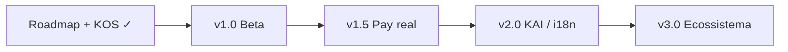

# KUTEKA ROADMAP MASTER

| Campo        | Valor                                                                                                     |
| ------------ | --------------------------------------------------------------------------------------------------------- |
| **Versão**   | 1.1                                                                                                       |
| **Data**     | 2026-08-05                                                                                                |
| **Estado**   | Auditoria de maturidade pós–Fase D + alinhamento a versões comerciais                                     |
| **Produção** | https://kutekalink.com                                                                                    |
| **Repo**     | EduardoZ121/Site_Angola · branch `main`                                                                   |
| **Fontes**   | Core v1.0 · ADRs 001–024 · Arquitectura Financeira v1.0 · migrations `0001`–`0028` · código em `apps/web` |
| **Operação** | [KUTEKA_OPERATING_SYSTEM.md](./KUTEKA_OPERATING_SYSTEM.md) (KOS) — empresa diária + versões v1.0–v3.0     |

---

## 0. Síntese executiva

A **Fase D do roadmap financeiro** (primeiro conjunto de serviços comerciais sobre a infra A/B/C) está **concluída**. Isso **não** significa que a monetização ou a plataforma estejam concluídas — significa que o ciclo **Ledger → Kuteka Pay (sandbox) → Marketplace → cinco serviços N5 de negócio** está fechado em produto e schema.

| Pergunta                                    | Resposta                                                                                                                            |
| ------------------------------------------- | ----------------------------------------------------------------------------------------------------------------------------------- |
| **Onde estamos?**                           | Core v1.0 congelado + pós-Core (Contratos, KYC, Finanças A–D5) em produção com **dinheiro simulado**.                               |
| **O que foi entregue?**                     | Plataforma imobiliária operacional + motor financeiro transversal + 5 serviços pagos sandbox.                                       |
| **O que falta para lançamento comercial?**  | Gateways reais, documentos legais, hardening go-live, canais de notificação, profundidade operacional (não novos módulos isolados). |
| **% conclusão plataforma (produto/schema)** | **≈ 62%**                                                                                                                           |
| **% prontidão comercial (cobrar Kz reais)** | **≈ 48%** — bloqueada sobretudo por contas gateway + legal + go-live                                                                |

**Princípio aprovado (PO 2026-08-05):** B2B2C · núcleo gratuito · pay-per-use · Plus opcional · `custody_mode = none` · sem wallet/escrow nesta fase · Super Admin parametriza preços · Ledger-first · um só caminho de pagamento (Kuteka Pay).

**Metodologia (a partir de 2026-08-05):** deixar de priorizar “fechar todos os módulos”. Passar a **versões comerciais** — ver KOS §10 e §6 abaixo:

| Versão        | Foco                                     |
| ------------- | ---------------------------------------- |
| **v1.0** Beta | Go-live + operação mínima                |
| **v1.5**      | Pagamentos reais + SLA estável           |
| **v2.0**      | KAI + marketplace maduro + i18n          |
| **v3.0**      | Ecossistema (API, white label, expansão) |

**Próxima decisão de produto:** validar Roadmap Master + KOS e declarar início oficial de **Kuteka v1.0 Beta** (checklist KOS §8).

---

## 1. Concluído (N5) — em produção e congelado / aceite

Critério: fluxo implementado, migration + ADR (quando aplicável), UI ligada a RPCs reais, testes de validação, estático em `prebuilt/web-out`, deploy Kuteka.  
**Nota:** “N5 sandbox” = ciclo de negócio completo **sem** dinheiro real.

### 1.1 Platform Core v1.0 (congelado — ADR-011)

| Módulo                 | Rota / área        | ADR / ref.       |
| ---------------------- | ------------------ | ---------------- |
| Landing                | `/`                | ADR-002          |
| Autenticação           | `/auth/*`          | ADR-004          |
| Shell contínuo         | `/app`             | ADR-005, ADR-013 |
| Patrimónios (Parceiro) | `/app/patrimonios` | ADR-006          |
| Habitação (Cliente)    | `/app/habitacao`   | ADR-007          |
| Agente Certificado     | `/app/agente`      | ADR-008          |
| Administração          | `/app/admin`       | ADR-009          |
| Confiança (checklist)  | `/app/confianca`   | ADR-010          |
| Listing / Premium UX   | fichas + feed      | ADR-011 + polish |

### 1.2 Pós-Core aceite

| Módulo                        | Rota             | ADR / migration  |
| ----------------------------- | ---------------- | ---------------- |
| Contratos                     | `/app/contratos` | ADR-012 · `0011` |
| Identidade / KYC (self-serve) | `/app/perfil`    | ADR-014 · `0018` |

### 1.3 Infraestrutura financeira transversal (Fases 1 + A + B + C)

| Entrega                                                                | Migration | ADR     | Estado                     |
| ---------------------------------------------------------------------- | --------- | ------- | -------------------------- |
| Ledger, catálogo, preços, créditos, faturas, consentimentos, campanhas | `0019`    | ADR-015 | Schema + UI Super/Hub      |
| Monetização base (flags, seeds Smart Move / marketplace / planos)      | `0020`    | ADR-016 | Base                       |
| Reembolsos, disputas, reconciliação, fraude, KAI rules, CRM, exports   | `0021`    | ADR-017 | Command Center             |
| **Kuteka Pay** motor unificado (sandbox)                               | `0022`    | ADR-018 | Único caminho de pagamento |
| Marketplace operacional (orçamento → pay → comissão → SLA)             | `0023`    | ADR-019 | `/app/servicos`            |

### 1.4 Primeiro conjunto comercial — Fase D1–D5 (concluída)

| Serviço             | Rota                  | Migration | ADR     | Modelo de cobrança (sandbox) |
| ------------------- | --------------------- | --------- | ------- | ---------------------------- |
| Mudança Inteligente | `/app/mudanca`        | `0024`    | ADR-020 | Abertura + sucesso no match  |
| Encontrar Casa      | `/app/encontrar-casa` | `0025`    | ADR-021 | Taxa prioritária única       |
| Concierge           | `/app/concierge`      | `0026`    | ADR-022 | Taxa de serviço              |
| Garantia Kuteka     | `/app/garantia`       | `0027`    | ADR-023 | 3 500 AOA/mês (activar)      |
| Assistência 24h     | `/app/assistencia`    | `0028`    | ADR-024 | 5 000 AOA/chamada            |

**Congelamento deste conjunto:** não reabrir arquitectura destes cinco módulos sem ADR de revisão. Evoluções comerciais (gateway real, renovação automática da Garantia, dispatch telefónico da Assistência) entram como **parcial / pendente**, não como “recomeçar o módulo”.

---

## 2. Parcial — existe, precisa de evolução

| Área                                            | O que já existe                                                                                           | O que ainda falta                                                  |
| ----------------------------------------------- | --------------------------------------------------------------------------------------------------------- | ------------------------------------------------------------------ |
| **Kuteka Pay**                                  | Motor unificado; intents; adaptadores `sandbox\|multicaixa\|emis\|stripe\|wise\|bank_transfer`; Super tab | Contas comerciais; webhooks reais; settlement; activar adaptadores |
| **Marketplace de Prestadores**                  | Ciclo completo sandbox; prestadores demo; comissão no Ledger                                              | Onboarding real de prestadores; payouts reais; catálogo vivo       |
| **Revenue Command Center** (`/app/super`)       | 16 separadores config-first                                                                               | Profundidade ops (fraude ML, recon bancária real, CRM outbound)    |
| **Ledger Financeiro**                           | Entradas imutáveis + créditos/reembolsos                                                                  | Relatórios CFO; fecho contabilístico; ligação AGT                  |
| **KAI**                                         | Regras + cartões de insight; editor Super                                                                 | Predição (churn, matching, forecast); automação                    |
| **Dashboards / cockpits**                       | Ops intelligence, hubs por papel                                                                          | BI real; métricas live de ocupação/receita                         |
| **CRM financeiro**                              | Tabelas + UI Super                                                                                        | Pipelines comerciais; automação de contacto                        |
| **Passaporte Digital (PDK)**                    | Painel na ficha; `pdk_code`; históricos                                                                   | Produto autónomo; partilha pública; versão certificada             |
| **Painel de Saúde**                             | UI na ficha do imóvel                                                                                     | Métricas live; alertas; integração manutenção                      |
| **PDK / ICK**                                   | Campos + painéis Parceiro; seed/demo scoring                                                              | Motor automático A–G; evolução ICK contínua                        |
| **Financeiro (utilizador)** (`/app/financeiro`) | Hub Plus, faturas, créditos, consentimentos, lembretes                                                    | Cobrança real de renda; canais email/SMS                           |
| **Jurídico**                                    | Rota stub                                                                                                 | Módulo operacional; marketplace jurídico (futuro)                  |
| **Relatórios**                                  | Nav aponta para `/app`                                                                                    | Relatórios dedicados / exportações por papel                       |
| **Confiança**                                   | Checklist + revisão                                                                                       | Upload de ficheiros (hoje notes/metadata)                          |
| **Garantia**                                    | Activação mensal sandbox                                                                                  | Renovação automática; `past_due` com gateway real                  |
| **Assistência 24h**                             | Ciclo taxa + ops                                                                                          | Dispatch; integração telefone/WhatsApp                             |
| **Planos Parceiro**                             | Bronze–Gold activação sandbox                                                                             | Benefícios Platinum profundos; billing real                        |
| **Lembretes de renda**                          | Tabela + RPC + lista no Hub                                                                               | Notificações push/email/SMS                                        |
| **Definições / Ajuda**                          | Locale; FAQ fino                                                                                          | Tema/notificações reais; centro de ajuda completo                  |
| **Termos / Privacidade**                        | Páginas “em preparação”                                                                                   | Textos legais publicados                                           |
| **i18n**                                        | Shell pt/en/es/fr                                                                                         | Cobertura total de módulos comerciais                              |
| **Agente / visitas**                            | Ops reais + fallbacks demo                                                                                | Agenda completa (módulo `agenda` ainda stub)                       |

---

## 3. Pendente — ainda não iniciado (por prioridade)

Prioridade orientada a **versão comercial pronta para lançamento** (não a expansão de catálogo).

### P0 — Bloqueadores de lançamento comercial

1. **Gateways reais** (Multicaixa Express e/ou EMIS) — conta comercial + webhooks + reconciliação.
2. **Documentos legais** — Termos, Privacidade, política de reembolsos/créditos.
3. **Go-live hardening** — desactivar contas demo públicas; credenciais fora de docs públicos; privacidade `property-media`; smoke E2E multi-papel.
4. **Canal de notificação mínimo** — email transaccional (pagamentos, KYC, contratos, SLA).

### P1 — Monetização operacional (sem novos “produtos de marketing”)

5. **Cobrança de renda / intents de pagamento habitação** sobre Kuteka Pay (hoje lembretes).
6. **Payouts a prestadores/parceiros** (ainda sem custódia; payout no gateway do destinatário).
7. **Garantia: billing recorrente** real.
8. **Conformidade fiscal AGT / SAF-T** (Fase E da doc financeira) sobre exports Fase A.
9. **Upload Confiança** + política de retenção de documentos.

### P2 — Produto pós-lançamento imediato

10. **Passaporte Imobiliário** como produto (além do painel PDK).
11. **Motor ICK** completo (categorias A–G automáticas).
12. **Academia / certificação** de agentes e prestadores.
13. **Módulos FASE 1 stub** com regras de negócio: Agenda, Mensagens, Documentos (os stubs `wallet` / `pagamentos` **não** devem duplicar Kuteka Pay — reutilizar o motor).
14. **Serviços de catálogo leves** ainda sem módulo N5: `avaliacao.imovel`, `reserva.visita`, `destaque.listing` (só se reutilizarem Kuteka Pay).

### P3 — Expansão estratégica (só após consolidação)

15. Marketplaces setoriais (ver §4).
16. API pública Kuteka.
17. White label.
18. Carteira / Escrow (se aprovado legal/PO).

---

## 4. Melhorias futuras — ideias estratégicas aprovadas / discutidas

| Ideia                          | Notas                                                                                             |
| ------------------------------ | ------------------------------------------------------------------------------------------------- |
| **Programa de Indicações**     | Ainda sem produto; complementar a Casa+ / créditos.                                               |
| **Sistema de Pontos Kuteka**   | Distinto de créditos financeiros; fidelidade / Casa+.                                             |
| **Marketplace Financeiro**     | Crédito, bancos — comissões B2B (Arquitectura §12).                                               |
| **Marketplace Jurídico**       | Evolução do stub `/app/juridico`.                                                                 |
| **Marketplace de Seguros**     | Mesma arquitectura financeira transversal.                                                        |
| **Marketplace de Arquitetura** | Remodelação / Valor+ / projectos.                                                                 |
| **API Kuteka**                 | Licenciamento tech/dados (fase avançada).                                                         |
| **White Label**                | Multi-tenant / marca parceira — não iniciado.                                                     |
| **Business Intelligence**      | Explicitamente fora do MVP Admin (ADR-009); necessário para escala.                               |
| **Analytics**                  | Módulo stub; eventos de produto + funis.                                                          |
| **Internacionalização**        | Schema multi-moeda/país preparado; operação AO primeiro.                                          |
| **Kuteka Pay completo**        | Todos os adaptadores vivos + reconciliação + chargeback.                                          |
| **Carteira Digital (Escrow)**  | **Só se** decisão jurídica/regulatória + PO; hoje `custody_mode = none` e schema `escrow_future`. |
| **Academia**                   | Formação paga agentes/prestadores.                                                                |
| **Publicidade / leads CPA**    | Matriz de receita Arquitectura §5.                                                                |
| **KAI preditivo**              | Churn, matching, forecast de receita.                                                             |
| **Vídeo / 360° / plantas**     | URLs suportadas; conteúdo e UX “em breve”.                                                        |

---

## 5. Auditoria final de maturidade

### 5.1 Demo vs operacional

| Camada                                               | Classificação                                                                 |
| ---------------------------------------------------- | ----------------------------------------------------------------------------- |
| Registo → login → onboarding → `/app`                | **Operacional**                                                               |
| Patrimónios / Habitação / Agente / Admin / Contratos | **Operacional** (com inventário `is_demo` ainda seedado)                      |
| KYC self-serve + storage documentos                  | **Operacional** (sem vendor eID externo)                                      |
| Super Admin / Finance Hub / D1–D5 / Marketplace      | **Operacional em sandbox** — ciclos reais de estado; **pagamentos simulados** |
| Jurídico, Relatórios, Termos/Privacidade             | **Stub / placeholder**                                                        |
| Contas `demo.*@kuteka.local`                         | **Demo** — remover/banir antes de beta pública                                |

### 5.2 Integrações externas

| Integração                                                           | Estado                                                |
| -------------------------------------------------------------------- | ----------------------------------------------------- |
| Supabase Auth + Postgres + RLS/RPC                                   | Ligado                                                |
| Supabase Storage (`property-media`, `identity-documents`, `avatars`) | Ligado                                                |
| Email (via Supabase Auth SMTP)                                       | Parcial — auth; pouco/nenhum transaccional de negócio |
| SMS / OTP telefone                                                   | **Não ligado** (`phone_verified_at` no schema)        |
| Mapas                                                                | OSM embed + links Google — sem SDK Maps pago          |
| Multicaixa / EMIS / Stripe / Wise                                    | Códigos de adaptador; **só sandbox activo**           |
| KYC vendor (Onfido etc.)                                             | **Ausente**                                           |
| Cron SLA                                                             | RPCs existem; agendamento em produção **a confirmar** |
| Google OAuth / S3 / Resend (docs legadas)                            | **Não** no `.env` KEOS actual                         |

### 5.3 Conta comercial necessária

- Conta **Multicaixa Express** e/ou **EMIS** (Angola) — bloqueador nº 1 para sair do sandbox.
- Opcional: **Stripe** (diáspora), **Wise**, conta bancária para transferências.
- Se escrow for algum dia aprovado: parceiro bancário / licenciamento de custódia.

### 5.4 Licenciamento

- Escrow / carteira: **adiado** até enquadramento legal (Arquitectura §19).
- Faturação actual: documentos internos / PDF stub — **validade fiscal AGT** não certificada.
- Academia / certificação de agentes: produto futuro; pode exigir enquadramento formativo.

### 5.5 Decisões de negócio em aberto

| Decisão                                                                             | Impacto        |
| ----------------------------------------------------------------------------------- | -------------- |
| Ordem da próxima grande fase (recomendação §6)                                      | Foco da equipa |
| Gateway primário (Multicaixa vs EMIS vs ambos)                                      | Integração Pay |
| Precificação final pós-sandbox (revisão Super Admin)                                | Receita        |
| Benefícios Platinum / Academia no go-to-market                                      | Parceiros      |
| Escopo beta (só Core+sandbox vs Core+pay real)                                      | Go-live        |
| Activar ou não catálogo fino (`avaliacao`, `reserva`, `destaque`) antes do Pay real | Escopo         |

### 5.6 Decisões jurídicas / regulatórias

| Tema                                        | Estado                                                     |
| ------------------------------------------- | ---------------------------------------------------------- |
| Termos de uso + Privacidade                 | Placeholder — **obrigatório** antes de beta pública        |
| Custódia / escrow                           | Desligado; requer decisão legal explícita                  |
| KYC / AML                                   | Self-serve; avaliar obrigações se volumes/pagamentos reais |
| AGT / SAF-T                                 | Fase E documentada; não iniciada                           |
| Créditos / reembolsos em “moeda plataforma” | Modelo técnico ok; texto legal ao cliente em falta         |

### 5.7 Percentagens por domínio

| Domínio                        | %   | Nota                            |
| ------------------------------ | --- | ------------------------------- |
| Auth / RBAC                    | 92  | N5; OAuth/SMS pendentes         |
| Identity / KYC                 | 78  | Forte self-serve; sem vendor    |
| Shell / i18n                   | 88  | Settings finos                  |
| Patrimónios                    | 90  | Core N5 + enrichments           |
| Habitação                      | 88  | Core N5                         |
| Agente                         | 82  | Agenda ainda parcial            |
| Admin operacional              | 85  | Sem BI                          |
| Confiança                      | 70  | Sem upload ficheiros            |
| Contratos                      | 85  | Pagamentos handoff sandbox      |
| Finance core (ledger/catálogo) | 80  | Sandbox money                   |
| Kuteka Pay                     | 55  | Motor ok; adaptadores inactivos |
| Marketplace                    | 75  | Ciclo sandbox                   |
| Smart Move D1                  | 80  | N5 sandbox                      |
| Encontrar Casa D2              | 75  | Sandbox                         |
| Concierge D3                   | 75  | Sandbox                         |
| Garantia D4                    | 65  | Sem recorrência real            |
| Assistência D5                 | 75  | Sem dispatch                    |
| Super Admin CC                 | 78  | Config-first                    |
| Planos parceiro                | 70  | Sandbox                         |
| PDK / Passaporte               | 45  | Painel ≠ produto                |
| ICK                            | 50  | Scoring limitado                |
| Saúde imóvel                   | 55  | Advisory                        |
| Jurídico                       | 10  | Stub                            |
| Relatórios / Analytics         | 15  | Stub                            |
| KAI                            | 35  | Rules only                      |
| Wallet / Escrow                | 5   | Hook schema + stub módulo       |
| Academia                       | 0   | Docs only                       |
| Legal pages / AGT              | 10  | Placeholders                    |

**Plataforma (média ponderada produto/schema):** ≈ **62%**.  
**Prontidão comercial com Kz reais:** ≈ **48%**.

---

## 6. Caminho mais eficiente — mapeado a versões comerciais

Não construir novos módulos fora da versão activa. Sequência = **KOS go-live + versões**:

| Etapa antiga          | Versão   | Objectivo                       | Critério de saída                              |
| --------------------- | -------- | ------------------------------- | ---------------------------------------------- |
| **C0**                | —        | Congelar visão (Master + KOS)   | PO valida                                      |
| **C1 + C5**           | **v1.0** | Beta pública controlada         | KOS §8; demos off; suporte; SLA comercial      |
| **C2–C4**             | **v1.5** | Receita real + operação estável | Gateway AO; recon; notificações; SLA ≥ 90%     |
| **C6 + profundidade** | **v2.0** | Escala inteligente              | KAI preditivo; marketplace maduro; i18n; AGT   |
| **C7**                | **v3.0** | Ecossistema                     | API; white label; expansão; escrow se aprovado |

**Eficiência:** D1–D5 e marketplace **já** falam com Kuteka Pay. Ligar o gateway em **v1.5** desbloqueia receita sem reescrever módulos.

**Trilogia:** Arquitectura Financeira (negócio) · este Roadmap (plataforma) · [KOS](./KUTEKA_OPERATING_SYSTEM.md) (empresa).

---

## 7. Glossário rápido de estados

| Estado           | Significado                                                |
| ---------------- | ---------------------------------------------------------- |
| **N5 congelado** | Aceite metodológico; não reabrir sem ADR                   |
| **N5 sandbox**   | Ciclo de negócio completo; pagamento simulado              |
| **Parcial**      | Código/UI/schema existem; falta profundidade ou integração |
| **Pendente**     | Não iniciado como produto                                  |
| **Futuro**       | Estratégico; depende de decisão / maturidade comercial     |

---

## 8. Referências canónicas

| Documento                                                                       | Uso                                                 |
| ------------------------------------------------------------------------------- | --------------------------------------------------- |
| [ARQUITETURA_FINANCEIRA_KUTEKA.md](../finance/ARQUITETURA_FINANCEIRA_KUTEKA.md) | Filosofia financeira v1.0                           |
| [docs/finance/README.md](../finance/README.md)                                  | Ordem Fases A–E / D1–D5                             |
| [KUTEKA_PLATFORM_CORE_V1.md](./KUTEKA_PLATFORM_CORE_V1.md)                      | Congelamento Core                                   |
| [CORE_V1_MATURITY_REPORT.md](../backlog/CORE_V1_MATURITY_REPORT.md)             | Maturidade Core                                     |
| [KUTEKA_OPERATING_SYSTEM.md](./KUTEKA_OPERATING_SYSTEM.md)                      | Operação empresarial + versões comerciais v1.0–v3.0 |
| [GO_LIVE_CHECKLIST.md](../backlog/GO_LIVE_CHECKLIST.md)                         | Checklist beta (alinhar a KOS §8)                   |
| [MANUAL_VS_PLATFORM.md](../engineering/MANUAL_VS_PLATFORM.md)                   | PDK / ICK / Saúde                                   |
| ADRs `001`–`024`                                                                | Decisões por módulo                                 |
| Migrations `0001`–`0028`                                                        | Schema efectivo                                     |

---

## 9. Controlo de alterações

| Versão | Data       | Notas                                                                         |
| ------ | ---------- | ----------------------------------------------------------------------------- |
| 1.0    | 2026-08-05 | Primeira consolidação pós–Fase D5; auditoria demo vs comercial; caminho C0–C7 |
| 1.1    | 2026-08-05 | Ligação ao KOS; caminho remapeado para versões comerciais v1.0–v3.0           |

**Próxima revisão:** ao declarar **Kuteka v1.0 Beta** ou após o primeiro gateway real (**v1.5**).
