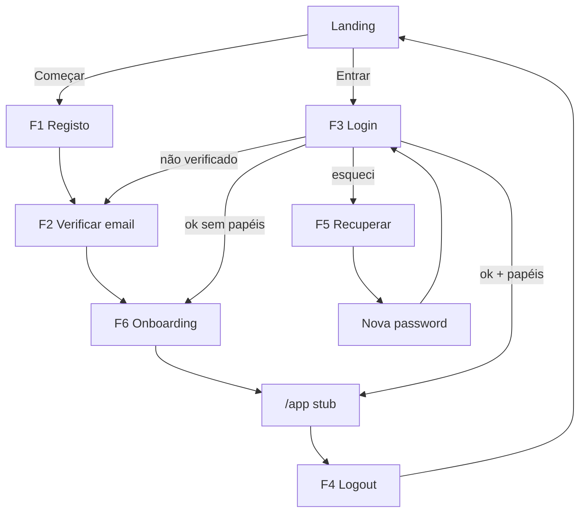
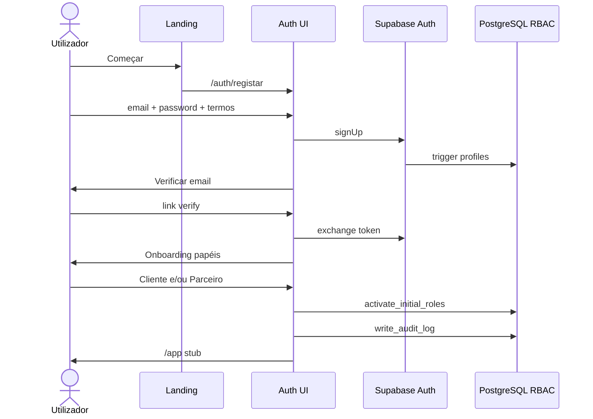

# PRD-001 — Authentication & User Management

**Documento:** Especificação funcional e técnica para revisão de negócio  
**Versão:** 1.0-rc2  
**Estado:** 📄 Em revisão · Blocos 1–2 ✅ · Bloco 3 candidata · **Implementação não autorizada**  
**Módulo KEOS:** `apps/web/modules/authentication` (+ `lib/auth`, rotas `(auth)` / `(app)`)  
**Autoridade de produto:** Manual > Blueprint > Design System Nº 003 > PASSO 0 > `AI_CONTEXT` > este PRD  
**Gate:** `docs/backlog/PHASE_GATE_BEFORE_PRD001.md`  
**Pré-implementação obrigatória:** CI activo · migration `0002` no remoto · aprovação integral desta spec

---

## 0. Registo de autorização e revisão

| Item | Decisão |
| ---- | ------- |
| Fase anterior (dev) | Concluída |
| P0 técnico | Concluído |
| Pendências CI / migration 0002 / domínio | Infra/ops — resolver antes de implementar |
| Elaboração / ajuste desta spec | **Autorizada** |
| Implementação | **Não autorizada** até aprovação oficial integral da spec |
| Bloco 1 — D1–D12 | **Fechado** (2026-07-30) — ver §14 |
| Bloco 2 — Fluxos principais | F1–F6 ✅ · **revisão global** ▶️ — ver §6 e §6.8 |

### 0.1 Princípios arquitecturais oficiais (plataforma)

Assumidos em **toda** a Kuteka a partir deste PRD — não só no módulo auth:

1. **Uma pessoa = uma conta Kuteka.**
2. **Uma conta pode possuir vários papéis.**
3. **Os papéis são contextos de actuação**, não identidades diferentes.
4. **Nenhuma funcionalidade futura** deve obrigar o utilizador a criar uma segunda conta.
5. **Uma identidade, um perfil** (`auth.users` + `profiles`); papéis vivem em `user_roles`.
6. A autenticação deve **escalar** para OAuth, MFA, telefone no perfil e módulos futuros **sem redesenhar** o módulo — apenas estender.

### 0.2 Princípio de experiência — primeiro contacto com o ecossistema

A autenticação **não** é apenas um mecanismo de acesso. É o **primeiro contacto** do utilizador com o ecossistema Kuteka e deve transmitir, desde o primeiro momento, três sensações:

| Sensação | Significado na prática |
| -------- | ---------------------- |
| **Simplicidade** | Poucos campos; etapas curtas; sem questionários longos no MVP |
| **Confiança** | Linguagem clara; o utilizador sabe o que acontece e porquê; tom de património/confiança (não de classificados) |
| **Controlo** | O utilizador percebe o próximo passo; pode voltar, reenviar, recuperar; erros orientados para a solução |

**Regras de UX dos fluxos (MVP):**

1. Progressão por **etapas** (um ecrã = uma missão).
2. **Feedback imediato** (loading, sucesso, estados vazios).
3. **Linguagem simples** (pt-AO).
4. **Validação em tempo real** nos campos (sem esperar só pelo submit, quando fizer sentido).
5. **Mensagens de erro claras** e orientadas para a solução.
6. Explicar sempre: **o que** está a acontecer, **porquê**, e **qual o próximo passo**.
7. Privilegiar redução de fricção sobre formulários longos.

8. **Recuperação guiada em erros (plataforma):** sempre que ocorrer um erro, a Kuteka deve (a) **explicar o problema**, (b) **indicar como resolver**, e (c) **mostrar o próximo passo** — imediatamente. Aplica-se a Login, Recuperação, Onboarding e a todos os módulos futuros.

9. **Experiência oficial de autenticação Kuteka** (narrativa de referência permanente):
   - **F1 Registo** → criar **confiança**
   - **F2 Verificar email** → reforçar **segurança**
   - **F3 Login** → transmitir **continuidade**
   - **F4 Logout** → devolver o **controlo**
   - **F5 Recuperação de conta** → **restaurar o acesso e a confiança**
   - **F6 Onboarding** → criar **pertença** e dar **direcção**
   - Esta sequência marca o início da relação utilizador–plataforma; evoluções futuras devem mantê-la.


### 0.3 Template de documentação de cada fluxo (Bloco 2+)

Cada fluxo principal é descrito com:

1. Objectivo do fluxo  
2. Condições de entrada  
3. Sequência passo a passo  
4. Estados possíveis  
5. Mensagens principais ao utilizador  
6. Casos de erro e comportamento  
7. Critérios de aceitação  
8. Oportunidades futuras (quando aplicável)

---

## 1. Objectivos do módulo

### 1.1 Objectivo de negócio

Transformar um visitante da Landing num **utilizador autenticado da plataforma de património e confiança Kuteka**, com identidade única, um ou mais papéis oficiais, permissões resolvidas na base de dados e rastos de auditoria — sem parecer um site de classificados.

### 1.2 Objectivos específicos

1. **Identidade única** — uma conta Kuteka por pessoa (email + password no MVP) via Supabase Auth.
2. **Sessão** — login, logout, refresh SSR-safe, protecção de rotas `(app)`.
3. **Confiança na entrada** — verificação de email, Termos, mensagens claras, zero fricção desnecessária.
4. **Multi-papel desde o dia 1** — modelo N:N (`user_roles`) como arquitectura permanente; onboarding activa papéis self-serve permitidos; adição/remoção futura sem nova conta.
5. **Autorização** — consumir apenas a fonte oficial P0 (`fetchAuthorizationContext` / RPCs).
6. **Auditoria** — eventos auth só via `writeAuditLog`.
7. **Extensibilidade** — arquitectura preparada para OAuth (Google, Apple, …), MFA e telefone no perfil, sem os entregar no MVP.
8. **Contratos discretos** — identidade/RBAC/audit compatíveis com Passaporte e KAI futuros **sem** expectativas visuais nestes ecrãs.
9. **Substituir** o placeholder `/auth` pelos fluxos reais ligados aos CTAs da Landing.

### 1.3 Métricas de sucesso (pós-lançamento do módulo)

| Métrica | Intenção |
| ------- | -------- |
| Taxa registo → email verificado | Medir fricção do verify |
| Taxa verify → papel activado | Medir abandono no onboarding |
| Tempo até primeiro acesso `(app)` | Simplicidade do fluxo |
| Taxa de recuperação concluída | Qualidade do reset |
| Incidentes de auth / locks indevidos | Segurança vs usabilidade |

*(Instrumentação detalhada pode ficar para um follow-up analítico; o módulo deve emitir eventos audit nomeados.)*

---

## 2. Fora de âmbito (não-objectivos)

| Fora do MVP do PRD-001 | Preparação arquitectural | Onde vive depois |
| --------------------- | ------------------------ | ---------------- |
| MFA (UI / enforcement) | Sim — modelo de auth extensível | PRD futuro |
| OAuth Google / Apple / outros | Sim — provider-agnostic via Supabase Auth | Follow-up auth |
| Telefone como login | Não | Telefone **no perfil** depois; não como auth inicial |
| UI de gestão de papéis (adicionar/remover) | Modelo `user_roles` já o permite | Shell / definições de conta |
| Switcher visual “Actuar como…” | Conceito de contextos de actuação desde o dia 1 | Shell |
| KYC completo | — | Trust / Pós-MVP |
| Shell / dashboards de negócio | Navegação futura preparada (rotas `(app)`, `next`) | FASE 3+ |
| Passaporte Digital (produto / UI) | Só contrato de identidade/RBAC/audit | PRD património |
| KAI (dock / chat) | Só contrato de identidade/contexto | Fase KAI |
| Auth legado Vite | — | Proibido reutilizar |

**Regra:** preparar **arquitectura e documentação**; **não** criar expectativas visuais de Passaporte/KAI/SCK nos ecrãs de auth ou no stub `/app`.

---

## 3. Perfis de utilizador e multi-papel

### 3.1 Conceitos (princípio fundamental)

| Conceito | Definição Kuteka |
| -------- | ---------------- |
| **Pessoa** | Humano real — corresponde a **uma** conta |
| **Conta / Utilizador** | Identidade única (`auth.users` + **um** `profiles`) |
| **Papel** | Contexto de actuação (`roles.code`) — **não** é outra identidade |
| **Permissão** | Capacidade (`permissions.code`) |
| **Atribuição** | Ligação N:N em `user_roles` (adicionar/remover ao longo do tempo) |
| **Contexto de actuação (UX)** | Papel(is) com que o utilizador opera num momento; switcher visual pode chegar no Shell, mas o **modelo existe desde o dia 1** |

### 3.2 Papéis oficiais (seed actual)

| Código | Nome de produto | Self-serve no onboarding MVP? | Permissions iniciais |
| ------ | --------------- | ----------------------------- | -------------------- |
| `client` | Cliente | ✅ Sim (pode coexistir com Parceiro) | `platform.access` |
| `patrimonial_partner` | Parceiro Patrimonial | ✅ Sim (pode coexistir com Cliente) | `platform.access` |
| `certified_agent` | Agente Certificado | ❌ Só Kuteka | `platform.access` |
| `administrator` | Administrador | ❌ Só Kuteka | `platform.access` + `admin.panel` |

### 3.3 Regras de multi-papel (desde o primeiro dia)

1. **Uma pessoa = uma conta**; nunca segunda conta para “ser também Parceiro”.
2. Cliente e Parceiro Patrimonial **podem coexistir** na mesma conta desde o registo/onboarding.
3. Mais tarde o utilizador poderá **adicionar ou remover** papéis self-serve permitidos **sem** nova conta (UI de gestão pode ser pós-MVP; o modelo de dados e as APIs devem prevê-lo).
4. Autorização **nunca** usa `if (role === 'admin')` — usa `can(permission)`.
5. União de permissions de todos os papéis atribuídos = contexto efectivo (até existir switcher de contexto no Shell).
6. Novos papéis futuros = rows + seed, sem mudar o modelo estrutural.
7. Utilizador **sem** nenhum papel após verify → onboarding de papéis antes de `(app)`.
8. Agente e Admin **não** são self-serve; copy: “Estes papéis são atribuídos pela Kuteka.”
9. O switcher visual “Actuar como…” pode aparecer só no Shell; a especificação **não** trata multi-papel como “feature do Shell” — é **arquitectura de plataforma**.

### 3.4 Perfis (dados mínimos MVP)

| Campo | Origem | Obrigatório MVP |
| ----- | ------ | --------------- |
| Email | Auth | Sim |
| Password | Auth (MVP) | Sim |
| `display_name` | `profiles` | Sim no onboarding se vazio |
| `locale` | `profiles` (default `pt`) | Default; i18n preparado |
| Telefone | Perfil futuro | **Não** no MVP; não é método de auth inicial |
| `avatar_url` | `profiles` | Não (opcional; storage = risco P1) |
| Aceitação Termos | audit + (proposto) `profiles.terms_accepted_at` | Sim no registo |
| Email verificado | Auth | Sim antes de `(app)` |

### 3.5 Extensibilidade de autenticação (sem UI no MVP)

| Capacidade | MVP | Preparação obrigatória na arquitectura |
| ---------- | --- | -------------------------------------- |
| Email + password | ✅ | — |
| Google / Apple / outros OAuth | ❌ | Fluxos e sessão provider-agnostic (Supabase Auth); sem redesenhar o módulo |
| MFA | ❌ | Conta/sessão preparadas para segundo factor futuro |
| Telefone | ❌ | Campo de perfil futuro; recuperação/login por telefone = evolução |

---

## 4. Permissões

### 4.1 Fonte de verdade

- Seed / tabelas PostgreSQL (`docs/database/PERMISSIONS_MATRIX.md`)
- Runtime: `get_user_permission_codes` → `fetchAuthorizationContext`
- App: `@kuteka/auth` avalia arrays já resolvidos — **proibida** matriz TS paralela

### 4.2 Matriz MVP (actual)

| Permissão | client | patrimonial_partner | certified_agent | administrator |
| --------- | ------ | ------------------- | --------------- | ------------- |
| `platform.access` | ✓ | ✓ | ✓ | ✓ |
| `admin.panel` | | | | ✓ |

### 4.3 Uso no PRD-001

| Permissão | Efeito UX |
| --------- | --------- |
| Ausência de qualquer papel / sem `platform.access` | Bloqueia `(app)` → onboarding |
| `platform.access` | Acesso ao stub autenticado `/app` |
| `admin.panel` | Acesso a stub `/app/admin` (sem consola real) |

Novas permissions de negócio (ex. `passport.read`, `kai.use`) **não** entram no MVP auth; ficam reservadas para PRDs futuros, documentadas como extensão do mesmo modelo.

---

## 5. Segurança

### 5.1 Princípios

1. Passwords **nunca** em texto simples na aplicação; só Supabase Auth.
2. Service role **nunca** no browser.
3. RLS mantido; writes privilegiados via RPC `SECURITY DEFINER` auditada.
4. Auditoria auth **só** por `write_audit_log` / `writeAuditLog`.
5. Mensagens de erro genéricas no login (não revelar se o email existe).
6. Rate limiting: confiar nos controlos Supabase + UX de reenvio com cooldown.
7. `robots: noindex` em `/auth/*`.
8. Sessão via cookies HTTP (`@supabase/ssr`); middleware refresca tokens.
9. Logger já bloqueia campos `password` / `token` — manter.
10. HTTPS em todos os ambientes públicos.

### 5.2 Ameaças e controlos

| Ameaça | Controlo |
| ------ | -------- |
| Enumeração de contas | Copy genérica no login/reset |
| Session fixation / XSS roubo de sessão | Cookies seguros, CSP base existente, sem tokens em `localStorage` de produto |
| Privilege escalation self-serve | RPC de activação rejeita agent/admin |
| Tamper `audit_logs` | P0-2 (sem INSERT directo) |
| Bypass de verify | Middleware + server checks: email confirmado obrigatório para `(app)` |
| Open redirect em `?next=` | Allowlist de paths relativos internos |

### 5.3 Checklist pré-produção (implementação futura)

- [ ] Migration `0002` aplicada
- [ ] Providers Auth (email) configurados no Supabase
- [ ] Templates de email (verify / reset) com marca Kuteka
- [ ] URLs de redirect allowlist no Supabase
- [ ] CI verde no PR

---

## 6. Fluxos principais (Bloco 2)

> Cada fluxo segue o template §0.3 e o princípio de UX §0.2 (simplicidade, confiança, controlo).
> Regras de navegação transversais: §9.

### 6.0 Mapa geral



---

### 6.1 F1 — Registo (email + password)

**Estado da revisão UX:** ✅ **Aprovado** (2026-07-30) com ajustes de experiência incorporados abaixo.

#### Objectivo do fluxo

Criar a **única conta Kuteka** da pessoa, transmitir o **propósito** da plataforma antes do primeiro campo, obter aceite dos Termos, e conduzir com clareza ao próximo passo (verificação de email) — com simplicidade, confiança e controlo.

#### Condições de entrada

| Condição | Comportamento |
| -------- | ------------- |
| Visitante anónimo | Mostrar ecrã de registo com proposta de valor |
| Sessão activa, verify + papéis OK | Redirect app (§9.2) — sem re-registo |
| Sessão activa, onboarding incompleto | Ir para o passo em falta |
| Entrada | `/auth`, `/auth/registar`, CTA **Começar** |

#### Narrativa UX — acompanhar o utilizador

| Pergunta | Resposta |
| -------- | -------- |
| O que pretende? | Criar a sua única conta Kuteka e perceber **porquê** vale a pena |
| O que vê? | Propósito + formulário curto + motivos do email + checklist de password em tempo real |
| O que o sistema faz? | Valida em tempo real; no submit cria identidade/perfil; audita só o necessário; nunca grava password em audit |
| Se correr bem? | Entende que o próximo passo é verificar o email → F2 |
| Se falhar? | Erro claro no sítio certo; dados preservados; caminhos Entrar / Recuperar se email existir |
| Como recupera? | Corrige no mesmo ecrã, faz retry, ou usa Entrar/Recuperar sem “voltar atrás” manual confuso |
| Simplicidade / confiança | Propósito primeiro; poucos campos; linguagem PASSO 0; a11y; botão com estados consistentes |

#### Sequência passo a passo

1. **Chegada (Passo 0):** mensagem de propósito (não só “formulário”). Conceito aprovado: *“Crie a sua conta Kuteka e comece a gerir, encontrar e valorizar patrimónios com segurança e transparência.”* Indicar que a seguir pediremos confirmação do email.
2. **Email:** campo + microcopy: *“O seu email será utilizado para proteger a sua conta e permitir a recuperação de acesso.”*
3. **Password:** checklist em **tempo real** dos critérios cumpridos (ex.: ✓ ≥8 caracteres · ✓ maiúscula · ✓ número · ✓ símbolo *se adotado na política*). Evitar tentativas cegas.
4. **Confirmar password** + **Termos/Privacidade**.
5. Validação contínua; CTA só activo quando o formulário estiver válido (**Desativado** enquanto incompleto).
6. Submit → estado **Loading** no botão (sem duplo submit).
7. `signUp` → perfil via trigger; audits necessários (ver Auditoria).
8. Sucesso → feedback breve (**Sucesso**) → **F2 Verificar email** (sem entrar em `(app)`).

#### Estados possíveis

| Estado | UI |
| ------ | -- |
| Vazio / edição | Formulário; CTA **Desativado** se incompleto |
| Validação local inválida | Erros inline; foco no primeiro erro; CTA desativado |
| A submeter | CTA **Loading** |
| Sucesso | CTA/estado **Sucesso** breve → F2 |
| Erro de servidor / rede | CTA/estado **Erro** + mensagem; **dados preservados** |

#### Estados do botão CTA (padrão de plataforma)

| Estado | Quando |
| ------ | ------ |
| **Normal** | Formulário válido, pronto a submeter |
| **Desativado** | Formulário incompleto ou inválido |
| **Loading** | Pedido em curso |
| **Sucesso** | Conta criada (transição imediata para F2) |
| **Erro** | Falha recuperável; permite nova tentativa |

*Estes cinco estados aplicam-se de forma consistente nos CTAs dos fluxos auth (e, por extensão, na plataforma).*

#### Mensagens principais ao utilizador (tom PASSO 0)

Tom: **humano, profissional, tranquilizador, transparente** — sem jargão técnico nem burocracia.

| Momento | Copy (orientação aprovada) |
| ------- | -------------------------- |
| Propósito | Crie a sua conta Kuteka e comece a gerir, encontrar e valorizar patrimónios com segurança e transparência. |
| Porque o email | O seu email será utilizado para proteger a sua conta e permitir a recuperação de acesso. |
| Password | Checklist visual dos critérios (cumprido / por cumprir) |
| Termos | Li e aceito os Termos de utilização e a Política de privacidade |
| CTA | Criar conta |
| Secundário | Já tem conta? Entrar |
| Pós-sucesso (para F2) | Deve ficar claro **porque** precisa de verificar o email (proteger a conta) |

**Proibido ao utilizador final:** mensagens técnicas (stack traces, códigos HTTP, jargão de API).

#### Casos de erro e comportamento

| Erro | Comportamento |
| ---- | ------------- |
| Campo inválido | Inline + **foco automático no primeiro erro**; linguagem simples e positiva |
| Email já registado | Mensagem segura + **opções imediatas no mesmo ecrã:** **Entrar** · **Recuperar acesso** (sem obrigar a “voltar atrás” manualmente) |
| Rede / 5xx | “Não foi possível criar a conta. Tente novamente.” · **preservar todos os dados** do formulário · estado botão Erro → Normal/Desativado conforme validade |
| Password fraca (servidor) | Alinhar checklist; focar password |

#### Auditoria (segurança e conformidade)

Registar **apenas** eventos necessários — sem informação sensível desnecessária:

| Evento | Inclui | Não inclui |
| ------ | ------ | ---------- |
| `auth.signup` | user id / metadata mínima | password, tokens |
| `auth.terms_accepted` | timestamp / versão Termos se existir | conteúdo irrelevante |

Nunca armazenar passwords, tokens ou PII extra em `metadata` de audit.

#### Acessibilidade (critério de qualidade)

- [ ] Navegação completa por teclado
- [ ] Labels acessíveis em todos os campos
- [ ] Mensagens compatíveis com leitores de ecrã
- [ ] Foco automático no primeiro erro

#### Critérios de aceitação

- [ ] Propósito da Kuteka visível **antes** do primeiro campo
- [ ] Utilizador compreende **porque** pedimos o email
- [ ] Checklist de password em tempo real
- [ ] Estados do botão: Normal · Desativado · Loading · Sucesso · Erro
- [ ] Email duplicado → Entrar + Recuperar no mesmo ecrã
- [ ] Erro de rede/servidor → dados preservados
- [ ] Utilizador compreende claramente **porque** precisa de verificar o email a seguir
- [ ] Nenhuma mensagem técnica ao utilizador final
- [ ] Linguagem simples, positiva, tom PASSO 0
- [ ] Fluxo concluível em **menos de dois minutos** por utilizador sem experiência prévia
- [ ] Acessibilidade (§ acima)
- [ ] Auditoria mínima sem dados sensíveis
- [ ] Sem acesso `(app)` antes de verify + papéis
- [ ] Uma conta por pessoa

#### Oportunidades futuras

- OAuth (Google, Apple, …) na mesma identidade
- Telefone no perfil (não como auth inicial)

---

### 6.2 F2 — Verificação de email

**Estado da revisão UX:** ✅ **Aprovado** (2026-07-30) com refinamentos de confiança incorporados abaixo.

#### Objectivo do fluxo

Confirmar que o email pertence ao utilizador, **proteger a conta**, reduzir ansiedade, e conduzir com clareza ao próximo passo (onboarding ou app) — com simplicidade, confiança e controlo.

#### Condições de entrada

| Condição | Comportamento |
| -------- | ------------- |
| Após F1 bem-sucedido | Ecrã pendente “Verifique o seu email” |
| Clique no link do email | `/auth/verificar` com token |
| Login com email não verificado | Redireccionado para este fluxo |
| Já verificado | Saltar para F6 ou app conforme papéis |

#### Narrativa UX — acompanhar o utilizador

| Pergunta | Resposta |
| -------- | -------- |
| O que pretende? | Confirmar o email e sentir que a conta está segura |
| O que vê? | Mensagem tranquilizadora; email mascarado; reenvio claro; confirmação positiva |
| O que o sistema faz? | Envia/reenvia email; valida token; audita o mínimo; nunca expõe tokens |
| Se correr bem? | “Conta confirmada” → próximo passo óbvio (F6 / app) |
| Se falhar? | Linguagem humana; problema + como resolver + próximo passo |
| Como recupera? | Reenviar, verificar spam, ou Entrar se já confirmado |
| Confiança | Tom PASSO 0; sem jargão; estados de botão consistentes com F1 |

#### Sequência passo a passo

1. **Ecrã pendente:** mensagem principal tranquilizadora (conceito aprovado): *“Estamos quase lá. Só precisamos confirmar que este email pertence realmente a si para proteger a sua conta.”*
2. Mostrar o email **parcialmente mascarado** (ex.: `ma*****@gmail.com`) para o utilizador validar que usou o endereço certo.
3. Indicar o próximo passo: abrir a caixa de correio e clicar no link.
4. CTA **Reenviar email** com estados Normal · Desativado (cooldown) · Loading · Sucesso · Erro.
5. Após reenvio com sucesso: *“Enviámos um novo email de confirmação.”* + *“Se não encontrar a mensagem, verifique também a pasta Spam ou Promoções.”*
6. Utilizador clica no link → ecrã de progresso humano: *“Estamos a confirmar a sua conta…”* (não apenas “A confirmar…”).
7. Sucesso → audit mínimo `auth.email_verified` → se sem papéis **F6**; senão app/`next` (§9).
8. Se o link **já tinha sido usado** / conta já confirmada: **não tratar como erro**. Mensagem: *“A sua conta já se encontra confirmada.”* + botão **Entrar na Kuteka**.

#### Estados possíveis

| Estado | UI |
| ------ | -- |
| Aguardando verificação | Instruções tranquilizadoras + email mascarado + reenvio |
| Cooldown de reenvio | CTA **Desativado** com tempo restante |
| Reenvio OK | Confirmação positiva + dica spam/promoções |
| A validar token | “Estamos a confirmar a sua conta…” |
| Confirmado (primeira vez) | Sucesso + próximo passo explícito |
| Já confirmado anteriormente | Mensagem positiva + **Entrar na Kuteka** |
| Token inválido / expirado | Problema + como resolver + próximo passo (pedir novo email) |

#### Mensagens principais (tom PASSO 0 · i18n-ready)

Todas as strings deste fluxo devem viver em **content centralizado** (ex. `modules/authentication/content.ts`) — pt-AO no MVP, preparado para internacionalização (não embutir textos soltos na implementação futura).

| Momento | Copy (orientação aprovada) |
| ------- | -------------------------- |
| Principal | Estamos quase lá. Só precisamos confirmar que este email pertence realmente a si para proteger a sua conta. |
| Email mascarado | Mostrar `ma*****@domínio` |
| Reenvio OK | Enviámos um novo email de confirmação. |
| Ajuda entrega | Se não encontrar a mensagem, verifique também a pasta Spam ou Promoções. |
| Em validação | Estamos a confirmar a sua conta… |
| Já confirmado | A sua conta já se encontra confirmada. · CTA: Entrar na Kuteka |
| Pós-sucesso | Conta protegida / email confirmado · próximo passo: onboarding ou app |

#### Segurança de mensagens (explícito)

- O sistema **nunca** revela informação técnica sobre tokens.
- **Nunca** apresenta mensagens exploráveis para ataques (ex.: detalhes internos de validação).
- Todos os erros de validação são **traduzidos** para linguagem compreensível.
- Em qualquer erro: **problema → como resolver → próximo passo** (princípio §0.2.8).

#### Casos de erro e comportamento

| Situação | Comportamento |
| -------- | ------------- |
| Email “não chegou” | Orientar spam/promoções + reenviar (cooldown) |
| Token expirado / inválido | Linguagem humana + pedir novo email de confirmação |
| Já confirmado / link reutilizado | Mensagem positiva + Entrar na Kuteka (não “erro”) |
| Rede no reenvio | Erro simples + retry; contexto preservado |
| Rate limit | Cooldown visível e compreensível |

#### Auditoria

Apenas informação **mínima** para segurança e conformidade:

| Evento | Inclui | Não inclui |
| ------ | ------ | ---------- |
| `auth.email_verified` | user id / timestamp | token, link, headers sensíveis |
| Reenvio (se auditado) | metadata mínima | conteúdo do email / tokens |

#### Acessibilidade

Mesmos padrões do F1: teclado, labels, leitores de ecrã, foco no primeiro erro / acção principal.

#### Critérios de aceitação

- [ ] Mensagem inicial tranquilizadora (protecção da conta, não só “obrigatório”)
- [ ] Email mascarado visível quando possível
- [ ] Feedback “Estamos a confirmar a sua conta…” ao validar o link
- [ ] Link já usado → mensagem positiva + Entrar na Kuteka
- [ ] Reenvio com confirmação positiva + dica spam/promoções
- [ ] Sem exposição técnica de tokens; erros humanizados
- [ ] Utilizador compreende que a conta está **protegida** após confirmação
- [ ] Nunca fica em dúvida sobre o próximo passo
- [ ] Conclui sem contactar suporte
- [ ] Tom humano, profissional, tranquilizador (PASSO 0)
- [ ] Copy centralizada / preparada para i18n
- [ ] Auditoria mínima sem dados sensíveis
- [ ] Sem acesso `(app)` sem email verificado

#### Oportunidades futuras

- Magic link / passwordless
- Verificação por telefone quando existir no perfil

---

### 6.3 F3 — Login (Entrar)

**Estado da revisão UX:** ✅ **Aprovado** (2026-07-30) com refinamentos de continuidade e segurança.

#### Objectivo do fluxo

Fazer o utilizador **continuar** o que estava a fazer — regressar ao seu espaço na Kuteka com familiaridade, sem ansiedade e sem páginas intermédias desnecessárias. A autenticação é o meio; a **continuidade** é o fim.

#### Objectivo emocional de UX (explícito)

| Deve sentir | Não deve sentir |
| ----------- | --------------- |
| Familiaridade e continuidade | Ansiedade ao “entrar num sistema” |
| Que retomou a sua atividade | Que iniciou um processo novo e pesado |
| Que regressa ao seu espaço Kuteka | Que está a ser interrogado |

#### Condições de entrada

| Condição | Comportamento |
| -------- | ------------- |
| Anónimo | Formulário Entrar |
| Sessão válida completa (qualquer entry point) | **Nunca** pedir autenticação de novo → app / `next` |
| Sessão válida incompleta | F2 ou F6 (passo em falta), não o formulário |
| Entrada | Landing **Entrar**, `/auth/entrar`, deep links, redirects de `(app)` com `?next=` |

**Regra de plataforma:** a Kuteka **nunca** pede autenticação duas vezes para a **mesma sessão válida**, independentemente do ponto de entrada.

#### Narrativa UX — acompanhar o utilizador

| Pergunta | Resposta |
| -------- | -------- |
| O que pretende? | Continuar / regressar ao seu espaço |
| O que vê? | Formulário curto **ou** redirect directo se já autenticado |
| O que o sistema faz? | Autentica; aplica rate limiting; resolve destino; audita o mínimo |
| Se correr bem? | Chega **directamente** ao destino (app ou `next`) em poucos segundos |
| Se falhar? | Problema + como resolver + próximo passo |
| Como recupera? | Retry, Recuperar acesso, Criar conta, ou F2/F6 |
| Continuidade | Sem ecrãs intermédios desnecessários quando tudo está OK |

#### Sequência passo a passo

1. Se sessão válida completa → redirect imediato ao destino (§9) — **sem formulário**.
2. Caso contrário: ecrã “Entrar” com tom tranquilizador (regressar à conta / continuar).
3. Email + password com:
   - botão **Mostrar / Ocultar** password;
   - suporte a **gestores de passwords** (autocomplete adequado);
   - permitir **colar** passwords normalmente.
4. CTA: Desativado se incompleto → Normal → Loading no submit.
5. Sucesso → **sem páginas intermédias desnecessárias** → destino directo (`next` seguro ou `/app`), salvo F2/F6 se obrigatório.
6. Preservar contexto de navegação (`next`) em todo o percurso.

#### Campo password — requisitos UX

| Requisito | Detalhe |
| --------- | ------- |
| Mostrar/Ocultar | Controlo explícito e acessível |
| Password managers | `autocomplete` correcto; não bloquear preenchimento automático |
| Colar | Permitido (não impedir paste) |

#### Estados do botão

**Normal · Desativado · Loading · Sucesso · Erro** (padrão F1/F2).

#### Mensagens e erros (padrão de três perguntas)

Cada erro responde sempre:

1. **O que aconteceu?**  
2. **Como posso resolver?**  
3. **O que devo fazer agora?**  

| Situação | Comportamento |
| -------- | ------------- |
| Credenciais inválidas | Mensagem humana única — **nunca** revelar se foi email ou password; oferecer retry + Recuperar + Criar conta |
| Email não verificado | Explicar protecção da conta → F2 |
| Sem papéis | Explicar escolha de uso → F6 |
| Rede / servidor | Explicar + retry; **preservar dados** |
| Rate limiting / tentativas repetidas | Mensagem tranquilizadora de “aguarde um momento e tente de novo” — sem detalhes técnicos exploráveis |

Tom: Identidade Oficial Kuteka (humano, profissional, tranquilizador, transparente). Copy em content centralizado (i18n-ready). Zero mensagens técnicas ao utilizador.

#### Segurança

- Protecção contra tentativas repetidas (**rate limiting** ou equivalente).
- Nunca revelar se o erro foi email ou password.
- Mesmo tom humano em todos os estados de erro.
- Sem exposição de tokens, códigos internos ou stack traces.

#### Auditoria e privacidade

Eventos relevantes de autenticação (ex. `auth.login`, e falhas se registadas) usam:

- **timestamps consistentes** (UTC / padrão da plataforma);
- **metadados mínimos** necessários para segurança e conformidade;
- **sem** passwords, tokens ou PII desnecessária — alinhado aos princípios de privacidade da plataforma.

#### Acessibilidade

Teclado, labels, leitores de ecrã, foco no primeiro erro; controlo Mostrar/Ocultar acessível.

#### Critérios de aceitação

- [ ] Objectivo emocional: familiaridade e continuidade registados e cumpridos na UX
- [ ] Sessão válida → sem segundo pedido de auth em **qualquer** entry point
- [ ] Destino directo quando condições OK (sem intermédios desnecessários)
- [ ] Utilizador **nunca perde o contexto** de navegação após auth (`next`)
- [ ] Login em **poucos segundos** com credenciais correctas
- [ ] Mostrar/Ocultar password; paste; password managers
- [ ] Erros no padrão das 3 perguntas; anti-enumeração email/password
- [ ] Rate limiting (ou equivalente) activo
- [ ] Mensagens = Identidade Oficial Kuteka; i18n-ready
- [ ] Auditoria com timestamps consistentes + metadata mínima
- [ ] Utilizador sente que **retomou** a atividade, não que iniciou um processo novo
- [ ] Conclusão sem suporte

#### Oportunidades futuras

- OAuth; MFA; gestão de sessões em múltiplos dispositivos

---

### 6.4 F4 — Logout (Terminar sessão)

**Estado da revisão UX:** ✅ **Aprovado** (2026-07-30) com refinamentos de controlo e distinção de sessão expirada.

#### Objectivo do fluxo

Permitir ao utilizador **terminar a sessão por vontade própria**, com encerramento tranquilo, confirmação discreta e regresso natural à Landing — a porta de entrada pública da Kuteka.

#### Objectivo emocional de UX (explícito)

| Deve sentir | Não deve sentir |
| ----------- | --------------- |
| Controlo total da sessão | Que foi “expulsado” da plataforma |
| Encerramento tranquilo | Alarme, erro ou porta fechada |
| Que pode regressar quando quiser | Fricção ou punição |

**Regra:** o Logout é **sempre** uma acção **voluntária** do utilizador. A Kuteka nunca transmite a sensação de o ter expulsado.

#### Distinção de cenários (obrigatória na spec)

| Cenário | Quem inicia | Experiência / mensagens |
| ------- | ----------- | ----------------------- |
| **Logout voluntário** | Utilizador (F4) | Tom de controlo e confirmação positiva discreta |
| **Sessão expirada** (inatividade / TTL) | Sistema | Experiência **diferente** — explicar que a sessão terminou por tempo; convidar a Entrar de novo para continuar. *Implementação da expiração automática pode ser fase posterior; a spec já reconhece a diferença.* |

Não reutilizar a copy de Logout voluntário para expiração automática.

#### Condições de entrada

- Sessão válida numa área autenticada.
- Acção explícita **Terminar sessão** (nunca logout silencioso “punitivo”).

#### Narrativa UX — acompanhar o utilizador

| Pergunta | Resposta |
| -------- | -------- |
| O que pretende? | Sair com controlo |
| O que vê? | Controlo claro; depois Landing + confirmação discreta |
| O que o sistema faz? | Encerra sessão; impede voltar a `(app)` sem nova auth; audita o mínimo |
| Se correr bem? | Landing aberta e acolhedora + “pode voltar a entrar” |
| Se falhar? | Problema + como resolver + próximo passo |
| Controlo | Foi **ele** quem decidiu terminar |

#### Sequência passo a passo

1. Utilizador activa **Terminar sessão** (rótulo humano, acessível).
2. MVP: um clique (sem diálogo obrigatório).
3. Encerramento: Loading → sucesso; `signOut` + invalidação de sessão/cookies.
4. Redirect `/` (Landing) com **todo o conteúdo público acessível normalmente** — a plataforma não “fecha”.
5. Feedback discreto e positivo na Landing (conceito aprovado): *“Terminou a sua sessão com sucesso. Pode voltar a entrar sempre que desejar.”* — sem alerta chamativo.
6. Qualquer novo acesso a conteúdo protegido inicia de novo o fluxo de autenticação (F3, com `next` se aplicável).

#### Segurança pós-logout

- O utilizador **não** consegue regressar a áreas autenticadas só com o botão **Voltar** do navegador sem **nova autenticação** (páginas autenticadas não devem servir conteúdo protegido a partir de cache/histórico sem sessão válida).
- Qualquer tentativa de acesso a conteúdo protegido → fluxo de autenticação de novo.

#### Mensagens (tom PASSO 0 · i18n-ready)

| Momento | Copy (orientação) |
| ------- | ----------------- |
| Acção | Terminar sessão |
| Confirmação na Landing | Terminou a sua sessão com sucesso. Pode voltar a entrar sempre que desejar. |
| Sessão expirada (cenário distinto) | A sua sessão terminou. Entre novamente para continuar. *(não usar copy de logout voluntário)* |

Erros: padrão das 3 perguntas (o que aconteceu / como resolver / o que fazer agora).

#### Auditoria e privacidade

`auth.logout` com a **mesma política** dos restantes eventos auth: timestamps consistentes; apenas informação **estritamente necessária**; sem dados sensíveis — alinhado à privacidade da plataforma.

#### Acessibilidade

Controlo operável por teclado; confirmação anunciável a leitores de ecrã.

#### Critérios de aceitação

- [ ] Logout sempre voluntário; nunca sensação de expulsão
- [ ] Objectivo emocional: encerramento tranquilo + controlo total
- [ ] Confirmação discreta positiva na Landing
- [ ] Landing continua pública e acolhedora (porta de entrada)
- [ ] Distinção documentada logout voluntário vs sessão expirada
- [ ] Sem acesso autenticado via “Voltar” sem nova auth
- [ ] Acesso protegido pós-logout → re-auth
- [ ] Utilizador compreende imediatamente que terminou a sessão
- [ ] Regresso à Landing natural, sem sensação de erro
- [ ] Tom Identidade Oficial Kuteka; copy i18n-ready
- [ ] Auditoria mínima / mesma política de privacidade
- [ ] Conclusão sem suporte

#### Oportunidades futuras

- Terminar sessão em todos os dispositivos
- Confirmação se houver trabalho não guardado (módulos futuros)
- UX completa de expiração por inatividade

---

### 6.5 F5 — Recuperação de conta (password)

**Estado da revisão UX:** ✅ **Aprovado** (2026-07-30) com refinamentos de empatia, segurança e continuidade.

#### Objectivo do fluxo

Ajudar o utilizador a **recuperar o acesso à mesma conta** de forma segura e calma — restaurar confiança e devolver o controlo, sem culpa e sem sugerir criar outra conta.

#### Objectivo emocional de UX (explícito)

O utilizador deve terminar este processo com a sensação de **alívio**, **confiança** e **controlo recuperado**.

#### Condições de entrada

| Condição | Entrada |
| -------- | ------- |
| “Esqueceu a password?” (Login / erro F3) | `/auth/recuperar` |
| Link do email de reset | `/auth/recuperar/confirmar` |
| Sem acesso ao email | `/contacto` (MVP humano) |

#### Narrativa UX — acompanhar o utilizador

| Pergunta | Resposta |
| -------- | -------- |
| O que pretende? | Voltar à sua conta com uma nova password |
| O que vê? | Empatia + motivo de segurança + passos claros |
| O que o sistema faz? | Email de reset (anti-enumeração); token de uso único e validade limitada; actualiza password |
| Se correr bem? | Mensagem positiva → Entrar / continuidade |
| Se falhar? | Problema + solução + próximo passo |
| Como recupera? | Reenviar, novo link, corrigir password, ou contacto se sem email |

#### Sequência passo a passo

**A — Pedido (`/auth/recuperar`)**

1. Mensagem inicial empática (conceito aprovado): *“Não se preocupe. Vamos ajudá-lo a recuperar o acesso à sua conta de forma segura.”*
2. Explicar porque enviamos email (conceito aprovado): *“Enviamos um email porque apenas o proprietário da conta deve poder redefinir a palavra-passe.”*
3. Campo email + validação em tempo real; CTA nos 5 estados.
4. Submit → sucesso **genérico** (anti-enumeração) + próximo passo (abrir email; spam/promoções).
5. Preservar email em erro de rede.

**B — Email**

6. Link Kuteka; token de **utilização única** e **validade limitada**.

**C — Nova password (`/auth/recuperar/confirmar`)**

7. Checklist em tempo real (como F1); Mostrar/Ocultar; colar; password managers.
8. **Boa prática (não obrigatória no MVP):** incentivar escolher uma password **diferente da anterior** (recomendação na UI/copy).
9. Sucesso (conceito aprovado): *“A sua palavra-passe foi atualizada com sucesso. Já pode voltar a entrar na Kuteka.”*
10. Continuidade → Entrar / retomar destino.

**D — Sem acesso ao email**

11. Explicar limite do self-serve → Contactar Kuteka. **Nunca** sugerir criar nova conta.

#### Decisão arquitectural futura (documentada, não MVP)

Após alteração da password, fica previsto que, numa **evolução futura**, seja possível **terminar automaticamente outras sessões activas** por motivos de segurança. Não implementar agora; o comportamento futuro fica registado.

#### Segurança (reforço)

- Anti-enumeração em todas as mensagens do pedido.
- Nunca revelar informação técnica (tokens, internals).
- Links de recuperação: **uso único** + **validade limitada**.
- Tentativas inválidas: sempre **problema + solução + próximo passo**.
- Rate limiting (ou equivalente) no pedido de reset.

#### Auditoria e privacidade

`auth.password_reset_requested` / `auth.password_reset_completed`: timestamps consistentes; metadata mínima; mesma política de privacidade dos restantes eventos auth. Sem passwords/tokens em metadata.

#### Mensagens (tom PASSO 0 · i18n-ready)

| Momento | Copy (orientação aprovada) |
| ------- | -------------------------- |
| Empatia | Não se preocupe. Vamos ajudá-lo a recuperar o acesso à sua conta de forma segura. |
| Porque email | Enviamos um email porque apenas o proprietário da conta deve poder redefinir a palavra-passe. |
| Sucesso genérico pedido | Se existir conta com este email, enviámos instruções… |
| Password diferente | Recomendação (não bloqueante) |
| Sucesso redefinição | A sua palavra-passe foi atualizada com sucesso. Já pode voltar a entrar na Kuteka. |
| Sem email | Contacte a Kuteka — sem sugerir nova conta |

#### Critérios de aceitação

- [ ] Empatia e tranquilidade no primeiro ecrã
- [ ] Utilizador compreende porque enviamos o email (protecção)
- [ ] Sensação final: alívio, confiança, controlo recuperado
- [ ] Nunca sugerir criação de nova conta
- [ ] Conclusão sem apoio externo **quando tem acesso ao email**
- [ ] Checklist + Mostrar/Ocultar; recomendação password diferente (não obrigatória)
- [ ] Mensagem positiva pós-redefinição + caminho para Entrar
- [ ] Anti-enumeração; links uso único / validade limitada
- [ ] Erros no padrão das 3 perguntas
- [ ] Futuro documentado: terminar outras sessões após reset
- [ ] Tom Identidade Oficial Kuteka; copy i18n-ready
- [ ] Auditoria mínima / privacidade

#### Oportunidades futuras

- Encerrar outras sessões após reset (já decidido como evolução)
- Telefone no perfil; MFA recovery; KYC/reivindicação documental

---

### 6.6 F6 — Onboarding (perfil mínimo + papéis)

**Estado da revisão UX:** ✅ **Aprovado** (2026-07-30) com refinamentos de boas-vindas, clareza de papéis e pertença.

#### Objectivo do fluxo

Integrar o utilizador no ecossistema Kuteka: confirmar que a conta existe, concluir uma configuração rápida (nome se preciso + papéis) e deixá-lo com **pertença, clareza e entusiasmo** para começar — na **mesma conta**, sem questionário longo.

> Este fluxo **não encerra apenas a autenticação**: marca o **início da relação** entre o utilizador e a plataforma.

#### Objectivo emocional de UX (explícito)

O utilizador deve terminar o Onboarding com **pertença**, **clareza** e **entusiasmo** para utilizar a Kuteka.

#### Condições de entrada

| Condição | Comportamento |
| -------- | ------------- |
| Email verificado e 0 papéis | Fluxo obrigatório antes de `(app)` |
| Após F2 / F3 incompleto | Entrada natural |
| Já tem ≥1 papel | Não reapresentar (alterações futuras nas definições) |

#### Narrativa UX — acompanhar o utilizador

| Pergunta | Resposta |
| -------- | -------- |
| O que pretende? | Começar a usar a Kuteka do jeito certo para si |
| O que vê? | Boas-vindas + papéis explicados + conta única + liberdade de alterar depois |
| O que o sistema faz? | Guarda nome; activa papéis self-serve; audita o mínimo |
| Se correr bem? | “Conta pronta” → `/app` ou `next` |
| Se falhar? | Problema + solução + próximo passo; permanece no onboarding |
| Pertença | Sente que a plataforma está preparada para si |

#### Sequência passo a passo

1. **Boas-vindas (não parece só formulário)** — conceito aprovado:  
   *“Bem-vindo à Kuteka. A sua conta está quase pronta. Vamos apenas concluir uma configuração rápida para adaptar a plataforma à forma como pretende utilizá-la.”*
2. **Nome** (só se `display_name` vazio) — “Como prefere ser chamado?”
3. **Antes da escolha:** explicar papéis em linguagem simples:  
   - **Cliente** — Quero procurar, reservar ou gerir imóveis e serviços.  
   - **Parceiro Patrimonial** — Quero disponibilizar e gerir patrimónios na plataforma.  
   O utilizador **nunca** escolhe um papel sem compreender o significado.
4. **Conta única (destaque estratégico):**  
   *“Pode utilizar a mesma conta para desempenhar um ou vários papéis. Não será necessário criar outra conta no futuro.”*
5. Selecção: um ou ambos; Agente/Admin atribuídos pela Kuteka (nota calma).
6. **Reversibilidade explícita:**  
   *“Os papéis escolhidos durante o Onboarding poderão ser alterados posteriormente nas definições da conta.”*
7. CTA Continuar (Desativado até ≥1 papel) → Loading → activação RPC + audit mínima.
8. **Feedback positivo curto:** *“A sua conta está pronta. Bem-vindo à Kuteka.”* — sem animações exageradas.
9. Destino: `/app` ou `next` (§9).

#### Preparação para crescimento (arquitectura)

A especificação regista explicitamente que **novos papéis** poderão ser adicionados no futuro **sem alterar este fluxo** nem exigir **nova conta** — apenas extensão do modelo `roles` / `user_roles` e copy de onboarding.

#### Estados, erros, a11y, auditoria

- Estados de botão do padrão da plataforma.
- Erros: padrão das 3 perguntas; preservar selecção; sessão expirada ≠ logout voluntário.
- A11y: teclado, labels, leitores de ecrã, foco no erro.
- Audit `auth.role_activated`: metadata mínima; sem PII extra.
- Copy centralizada / i18n-ready; tom PASSO 0.
- Sem expectativas visuais Passaporte / KAI / SCK.

#### Critérios de aceitação

- [ ] Boas-vindas com sensação de pertença (conta quase pronta)
- [ ] Utilizador compreende claramente o significado de cada papel
- [ ] Percebe que pode ter vários papéis na **mesma conta**
- [ ] Sabe que pode alterar papéis depois (definições)
- [ ] Feedback “conta pronta / bem-vindo”
- [ ] Termina com sensação de que a plataforma está preparada para si
- [ ] Conclusão em poucos minutos, sem apoio externo
- [ ] Objectivo emocional: pertença, clareza, entusiasmo
- [ ] Novos papéis futuros sem redesenhar o fluxo / sem segunda conta
- [ ] Sem Passaporte/KAI/SCK na UI
- [ ] Erros guiados; a11y; audit mínima

#### Oportunidades futuras

- UI de definições para adicionar/remover papéis
- Switcher de contexto (Shell)
- Onboarding de valor por módulo (002/003) — nunca no auth inicial

---

### 6.7 Sessão e middleware (transversal)

Não é um “ecrã”, mas condiciona todos os fluxos:

| Regra | Comportamento |
| ----- | ------------- |
| Refresh | Middleware refresca sessão em `(auth)` relevante e `(app)` |
| Sem sessão em `(app)` | `/auth/entrar?next=<path>` |
| `next` | Apenas paths relativos internos allowlisted |
| Sessão expirada | Copy distinta do logout voluntário (§6.4) |
| Mensagem (opcional) | “A sua sessão terminou. Entre novamente para continuar.” |

---

### 6.8 Revisão global do Bloco 2 — consistência F1–F6

**Estado:** ✅ **Encerrado** (aprovação global 2026-07-30). Autorizado Bloco 3.

#### Experiência oficial (arco narrativo)

| Fluxo | Promessa ao utilizador |
| ----- | ---------------------- |
| F1 Registo | Confiança |
| F2 Verificar email | Segurança |
| F3 Login | Continuidade |
| F4 Logout | Controlo |
| F5 Recuperação | Restaurar acesso e confiança |
| F6 Onboarding | Pertença e direcção |

#### Checklist de consistência transversal

| Tema | Esperado em todos os fluxos |
| ---- | --------------------------- |
| Tom PASSO 0 | Humano, profissional, tranquilizador, transparente |
| Simplicidade / confiança / controlo | §0.2 |
| Erro guiado | Problema + solução + próximo passo |
| Estados CTA | Normal · Desativado · Loading · Sucesso · Erro |
| Copy | Centralizada, i18n-ready; zero jargão técnico ao utilizador |
| A11y | Teclado, labels, leitores de ecrã, foco no erro |
| Auditoria | Mínima, timestamps consistentes, sem dados sensíveis |
| Uma conta | Nunca empurrar segunda conta |
| Multi-papel | Arquitectura desde o dia 1; F6 explica e torna reversível |
| Landing | Pública; CTAs com sessão → app sem re-auth |
| Extensibilidade | OAuth/MFA/novos papéis sem redesenhar o módulo |

#### Riscos de inconsistência a vigiar na revisão global

1. Tom diferente entre “erro de login” e “erro de recuperação”.
2. Intermédios desnecessários após F3 quando F2/F6 já estão OK.
3. Copy de Passaporte/KAI a “escapar” no stub pós-F6.
4. Confundir logout voluntário com sessão expirada.
5. Onboarding a parecer formulário burocrático (já mitigado com boas-vindas).

#### Critério de fecho do Bloco 2

- [x] F1–F6 aprovados individualmente
- [x] Arco narrativo oficial aceite (aprovação global)
- [x] Checklist transversal validada pelo PO
- [x] Autorização para o **Bloco 3 — casos limite**

---


## 9. Redirect e navegação (contexto)

### 9.1 Regras pós-autenticação

| Contexto de entrada | Destino |
| ------------------- | ------- |
| **Registo** (novo utilizador) | Sempre concluir **verify → onboarding** antes de qualquer destino de app |
| **Entrar** com `?next=` válido | Após checks (verify, papéis), **regressar a `next`** (continuar onde pretendia) |
| **Entrar** sem `next` | Stub `/app` (enquanto não há dashboards) |
| Não autenticado a aceder `(app)` | `/auth/entrar?next=…` |
| Autenticado, email não verificado | `/auth/verificar` |
| Verificado, 0 papéis | `/auth/onboarding/papeis` |
| `next` inválido / externo | Ignorar → `/app` |
| `next=/app/admin` sem `admin.panel` | `/app` |

### 9.2 Landing (D11)

| Situação | Comportamento |
| -------- | ------------- |
| Visitante anónimo na Landing | Permanece; CTAs Começar / Entrar → fluxos auth |
| Utilizador **já autenticado** a ver a Landing | **Não** é forçado a sair; Landing continua pública |
| Autenticado clica **Começar** ou **Entrar** | Encaminhar **directamente para a aplicação** (`/app` ou `next` seguro) — **sem** repetir login/registo |
| Autenticado sem verify / sem papéis | CTAs levam ao passo em falta (verify / onboarding), não ao formulário de login completo |

### 9.3 Preparação de navegação futura

- Parâmetro `next` e grupo `(app)` desde o MVP.
- Quando existirem dashboards, os mesmos redirects passam a destinos reais **sem** redesenhar o módulo auth.
- Stub `/app` é temporário de produto, não um beco sem saída arquitectural.

---

## 10. Integração com o Passaporte Kuteka

### 10.1 Posicionamento neste PRD

O Passaporte Digital do Imóvel é produto de património / Trust. **Não há UI, copy promocional nem expectativas visuais** de Passaporte nos ecrãs de autenticação ou no stub `/app`.

### 10.2 Contrato arquitectural (apenas documentação / modelo)

Para o Passaporte funcionar depois, a auth deve garantir:

1. Identidade estável (`user_id` = `profiles.id` = `auth.users.id`).
2. Papéis correctos na mesma conta (Parceiro, Cliente, etc.) sem segunda conta.
3. Auditoria reutilizável (`writeAuditLog`) para futuros eventos `passport.*`.
4. Extensão de permissions via BD — sem atalhos ad hoc.

### 10.3 Proibido no MVP auth

- Mencionar Passaporte, SCK ou KTK Score na UI de auth / stub.
- CTAs ou placeholders que simulem o produto.

---

## 11. Integração futura com o KAI

### 11.1 Posicionamento neste PRD

KAI será presença na App (PASSO 0). No PRD-001 **não há** dock, chat, botões nem copy que crie expectativa de KAI.

### 11.2 Contrato arquitectural (discreto)

| Preparação | Detalhe |
| ---------- | ------- |
| Identidade | `userId`, papéis, locale disponíveis para personalização futura |
| Autorização | KAI futuro opera no contexto RBAC do utilizador — sem bypass |
| Namespace audit | Reservar `kai.*` para mais tarde; auth não emite |

### 11.3 Proibido no MVP auth

- Widget/chat/botão KAI
- Frases do tipo “o KAI irá ajudá-lo” nos ecrãs de registo, onboarding ou stub
- Endpoints de IA

---

## 12. Rotas e arquitectura técnica (resumo)

### 12.1 Rotas

| Rota | Função |
| ---- | ------ |
| `/auth` · `/auth/registar` | Registo |
| `/auth/entrar` | Login (`?mode=entrar` alias); honra `?next=` |
| `/auth/verificar` | Verify email |
| `/auth/recuperar` | Pedido reset |
| `/auth/recuperar/confirmar` | Nova password |
| `/auth/onboarding/papeis` | Activação inicial de papéis |
| `/auth/onboarding/perfil` | Nome se necessário |
| `/app` | Stub autenticado (temporário) |
| `/app/admin` | Stub admin (`admin.panel`) |

### 12.2 Packages

Reutilizar: `@kuteka/database`, `@kuteka/auth`, `@kuteka/validation`, `@kuteka/types`, `@kuteka/ui`.

### 12.3 Novos (só após aprovação + implementação)

- RPC activação (e, em follow-up, gestão) de papéis self-serve  
- Migration `0003` se `terms_accepted_at` / ajustes RLS  
- Session helpers + middleware refresh  
- Abstração de providers Auth (email agora; OAuth depois)  
- ADR-004  

---

## 13. Eventos de auditoria (canónicos)

| Evento | Quando |
| ------ | ------ |
| `auth.signup` | Conta criada |
| `auth.terms_accepted` | Checkbox Termos |
| `auth.email_verified` | Verify OK |
| `auth.login` | Login OK |
| `auth.login_failed` | Opcional, sem vazar segredos |
| `auth.logout` | Logout |
| `auth.password_reset_requested` | Pedido reset |
| `auth.password_reset_completed` | Password alterada |
| `auth.role_activated` | Papel(is) activados (inicial ou futuro) |
| `auth.role_deactivated` | Reservado para remoção futura de papel |

---

## 14. Decisões D1–D12 — Bloco 1 fechado (2026-07-30)

| ID | Decisão oficial | Estado |
| -- | --------------- | ------ |
| **D1** | MVP = email + password. Arquitectura preparada para Google, Apple e outros OAuth **sem redesenhar** o módulo. | ✅ Aprovado |
| **D2** | Telefone fora do MVP como auth. Futuro: telefone no **perfil**, não como método inicial de autenticação. | ✅ Aprovado |
| **D3** | Uma conta Kuteka. No registo/onboarding: um ou ambos Cliente + Parceiro. Mais tarde: adicionar/remover papéis **sem** nova conta. Princípio de plataforma. | ✅ Aprovado (com alteração) |
| **D4** | Agente e Administrador só pela Kuteka. | ✅ Aprovado |
| **D5** | Stub `/app` temporário. Destino conforme contexto: **Entrar** → regressar a `next` / continuar; **Registo** → concluir onboarding primeiro. Navegação futura preparada. | ✅ Aprovado (com ajuste) |
| **D6** | Rotas nested `/auth/...` + aliases Landing. | ✅ Aprovado |
| **D7** | MFA fora do MVP; arquitectura preparada. | ✅ Aprovado |
| **D8** | Multi-papel é arquitectura desde o dia 1 (uma identidade, um perfil, papéis = contextos). Switcher visual pode ser posterior; o conceito **não** fica “só no Shell”. | ✅ Aprovado (alteração importante) |
| **D9** | pt-AO no MVP; i18n preparado. | ✅ Aprovado |
| **D10** | Termos obrigatórios no registo. | ✅ Aprovado |
| **D11** | Landing pública; autenticado não é forçado a sair. CTAs Começar/Entrar com sessão → **app directamente** (sem repetir auth). | ✅ Aprovado (com ajuste) |
| **D12** | Google OAuth fora do MVP; arquitectura preparada; sem pressão de negócio para o MVP. | ✅ Aprovado |

**Bloco 1 encerrado.** Segue Bloco 2 — análise dos fluxos principais.

---

## 15. Bloco 3 — Casos limite (versão candidata)

**Estado:** ▶️ Candidata à aprovação · Implementação bloqueada  
**Metodologia:** Arquitecto Principal / Guardião da Consistência (`DEVELOPMENT_PROCESS.md`)

### 15.0 Meta da versão candidata

#### Documentos consultados

| Documento | Uso nesta proposta |
| --------- | ------------------ |
| `PASSO_0_IDENTIDADE_OFICIAL_KUTEKA.md` | Tom, confiança, simplicidade |
| `AI_CONTEXT.md` | Uma conta, multi-papel, hierarquia, fases |
| `ADR-001` / `ADR-003` | Identidade, RBAC, audit, sem matriz TS |
| `PERMISSIONS_MATRIX.md` | platform.access / admin.panel |
| `PRD_001` §§0–6, 9–14 (D1–D12, F1–F6) | Decisões e fluxos aprovados |
| `PHASE_GATE_BEFORE_PRD001.md` | Gate infra vs spec |
| `DEVELOPMENT_PROCESS.md` | Novo ciclo de auto-revisão |
| UX redesign / FASE_1 (in-repo) | Multi-papel, auth MVP vs pós-MVP |
| Manual Operacional / Blueprint / DS Nº 003 | **Não presentes como ficheiros completos no repo** — princípios aplicados via AI_CONTEXT + PASSO 0 + ADRs |

#### Verificações realizadas

1. Cada caso mapeado a um fluxo F1–F6 ou regra transversal (§9, sessão).  
2. Mensagens alinhadas ao padrão **problema + solução + próximo passo**.  
3. Anti-enumeração, uma conta, logout ≠ expiração, `next` seguro.  
4. Sem UI Passaporte/KAI; MFA/OAuth só como “futuro”.  
5. Coerência com auditoria mínima (ADR-003).  
6. Remoção/fusão de casos redundantes da tabela antiga E1–E22.

#### Conflitos / ambiguidades e resolução

| Achado | Resolução proposta | Fundamento |
| ------ | ------------------ | ---------- |
| Soft-delete de conta (E12 antigo) sem produto | Manter como **fora do MVP**; schema já tem `deleted_at` — comportamento UX diferido | AI_CONTEXT segurança; não inventar fluxo sem decisão PO |
| “Suporte” em falha RPC onboarding | Preferir **retry** + contacto só se persistir — evita empurrar suporte cedo demais | Princípio UX F2/F6 “sem suporte no caminho feliz” |
| Rate limit messages vs tranquilizar | Copy calma + tempo de espera; sem detalhes técnicos exploráveis | F3 aprovado + segurança |
| Manual/Blueprint não no repo | Declarar lacuna; não inventar regras fora de PASSO 0/AI_CONTEXT/ADRs | Honestidade documental |

**Nível de confiança:** **Alta (≈90%)** para alinhamento com decisões F1–F6 e princípios oficiais **in-repo**. Residual: Manual/Blueprint completos não versionados aqui.

---

### 15.1 Princípios que governam todos os casos limite

1. Uma pessoa = uma conta; nunca sugerir segunda conta.  
2. Erro = o que aconteceu + como resolver + o que fazer agora.  
3. Tom PASSO 0; zero jargão técnico ao utilizador.  
4. Logout voluntário ≠ sessão expirada.  
5. Sessão válida → nunca pedir auth duas vezes.  
6. Anti-enumeração em registo/login/recuperação.  
7. Preservar dados do formulário em erros de rede sempre que possível.

---

### 15.2 Matriz de casos limite (por fluxo)

#### F1 — Registo

| ID | Caso | Comportamento esperado |
| -- | ---- | ---------------------- |
| L1.1 | Email já registado | Mensagem segura + **Entrar** e **Recuperar** no mesmo ecrã |
| L1.2 | Duplo submit | CTA Loading; um único pedido |
| L1.3 | Rede/5xx a meio | Erro guiado; **preservar todos os campos** |
| L1.4 | Password não cumpre checklist | Inline + checklist; foco no primeiro erro |
| L1.5 | Termos não aceites | Impedir submit; hint claro |
| L1.6 | Utilizador tenta “criar outra conta para ser Parceiro” | Recusar por princípio; orientar activar papel na mesma conta (F6 / definições futuras) |

#### F2 — Verificar email

| ID | Caso | Comportamento esperado |
| -- | ---- | ---------------------- |
| L2.1 | Token expirado/inválido | Linguagem humana + reenviar; sem detalhes de token |
| L2.2 | Link já usado / já confirmado | **Não é erro:** “conta já confirmada” + Entrar na Kuteka |
| L2.3 | Email “não chegou” | Spam/Promoções + reenvio com cooldown |
| L2.4 | Rate limit reenvio | Cooldown visível e calmo |
| L2.5 | Login com email não verificado | Redireccionar a F2 com explicação de protecção |

#### F3 — Login

| ID | Caso | Comportamento esperado |
| -- | ---- | ---------------------- |
| L3.1 | Credenciais inválidas | Mensagem única (não revelar email vs password) + retry / Recuperar / Criar |
| L3.2 | Rate limiting | Aguardar e tentar de novo; tom tranquilizador |
| L3.3 | Sessão já válida (qualquer entry point) | Redirect app/`next` sem formulário |
| L3.4 | `next` externo ou open-redirect | Ignorar → `/app` |
| L3.5 | `next` admin sem `admin.panel` | `/app` |
| L3.6 | Rede | Preservar email (e password se política UX o permitir com segurança) + retry |
| L3.7 | Após F2/F6 em falta com `next` | Completar F2/F6 **depois** honrar `next` |

#### F4 — Logout

| ID | Caso | Comportamento esperado |
| -- | ---- | ---------------------- |
| L4.1 | Logout voluntário OK | Landing + confirmação discreta positiva |
| L4.2 | Botão Voltar do browser após logout | Sem conteúdo autenticado; exige nova auth |
| L4.3 | Multi-tab após logout | Próximos pedidos tratam sessão como inválida |
| L4.4 | Falha parcial signOut | Retry; se necessário limpar sessão local + Landing + mensagem guiada |
| L4.5 | Sessão expirada (sistema) | **Copy distinta** do logout voluntário; convidar a Entrar |

#### F5 — Recuperação

| ID | Caso | Comportamento esperado |
| -- | ---- | ---------------------- |
| L5.1 | Pedido reset (email exista ou não) | Sucesso genérico anti-enumeração |
| L5.2 | Token reset expirado/inválido/já usado | Pedir novas instruções; sem jargão |
| L5.3 | Sem acesso ao email | Contacto Kuteka; **nunca** “crie outra conta” |
| L5.4 | Nova password fraca / mismatch | Checklist + foco |
| L5.5 | Rede no pedido ou na confirmação | Preservar dados + retry |
| L5.6 | Pós-reset (futuro) | Documentado: poder terminar outras sessões — não MVP |

#### F6 — Onboarding

| ID | Caso | Comportamento esperado |
| -- | ---- | ---------------------- |
| L6.1 | Zero papéis seleccionados | CTA desativado + hint |
| L6.2 | Cliente + Parceiro | Ambos OK; permissions unidas; uma conta |
| L6.3 | Tentativa agent/admin self-serve | UI não oferece; RPC rejeita |
| L6.4 | Falha RPC activação | Retry; sem `/app` até sucesso |
| L6.5 | Sessão expira a meio | Re-entrar; **retomar** onboarding |
| L6.6 | Já tem papéis e reabre URL onboarding | Redirect `/app` (ou definições futuras) |
| L6.7 | Acede onboarding sem verify | Redirect F2 |

#### Transversal / Landing / App

| ID | Caso | Comportamento esperado |
| -- | ---- | ---------------------- |
| LT.1 | Landing + sessão completa + Começar/Entrar | App directa (sem re-auth) |
| LT.2 | Landing + sessão incompleta + CTA | Passo em falta (F2/F6) |
| LT.3 | Soft-delete futuro (`profiles.deleted_at`) | Fora MVP; quando existir: bloquear auth com copy humana + contacto |
| LT.4 | Locale ≠ pt | MVP UI pt-AO; strings i18n-ready |
| LT.5 | Utilizador pede segunda conta | Recusar; activar papel na mesma conta |

---

### 15.3 Casos explicitamente fora do MVP (registados)

| Tema | Nota |
| ---- | ---- |
| MFA / recovery codes | Preparação arquitectural apenas |
| OAuth falhas de provider | Quando D12 for implementado |
| Encerrar todas as sessões pós-reset | Evolução documentada em F5 |
| UI definições de papéis | Pós-onboarding; princípio já em F6 |
| KYC / reivindicação de conta | Trust / suporte avançado |

---

### 15.4 Critérios de aceitação do Bloco 3

- [ ] Matriz L\* cobre F1–F6 + transversal
- [ ] Cada caso respeita erro guiado e uma-conta
- [ ] Logout ≠ expiração explícito
- [ ] Open-redirect e privilege paths cobertos
- [ ] Fora-MVP listado sem ambiguidade
- [ ] Nenhuma contradição com F1–F6 aprovados

---

## 16. Critérios de aceitação

### 16.1 Gate pré-código

- [ ] Spec integralmente aprovada (Blocos 1–N da revisão)
- [ ] CI definitivamente activo e verde
- [ ] Migration `0002` aplicada no remoto
- [ ] Autorização explícita de implementação

### 16.2 Funcional

- [ ] Registo + Termos + verify + onboarding (1 ou 2 papéis) + `/app`
- [ ] Login / logout com `next` contextual
- [ ] Recuperação de password completa
- [ ] Landing: anónimo → auth; autenticado + CTA → app sem re-auth
- [ ] Self-serve só Cliente/Parceiro; Agente/Admin bloqueados
- [ ] Princípio “uma conta” respeitado nos fluxos e copy

### 16.3 Segurança / arquitectura

- [ ] Sem matriz TS de permissions
- [ ] Audits canónicos presentes
- [ ] Sem service role no client
- [ ] Open-redirect protegido
- [ ] Modelo multi-papel N:N desde o dia 1; sessão provider-agnostic (pronto para OAuth)
- [ ] Testes unit + e2e smoke

### 16.4 Produto / confiança

- [ ] Copy pt-AO alinhada PASSO 0
- [ ] **Sem** UI nem copy que crie expectativa de Passaporte / KAI / SCK
- [ ] Contratos §10–§11 apenas na documentação / ADR

### 16.5 Quatro níveis (após implementação futura)

Implementação → Auto-revisão → Testes → Validação funcional/visual + aprovação final

---

## 17. Riscos

| Risco | Impacto | Mitigação |
| ----- | ------- | --------- |
| Implementar sem CI / sem `0002` | Regressões, RPCs em falta | Gate 16.1 |
| Scope creep (dashboards, KAI, Passaporte UI) | Atraso, qualidade | Não-objectivos §2 |
| Fricção no verify email | Abandono | Copy + reenvio + métrica |
| Onboarding confuso multi-papel | Contas sem papel / papel errado | UI simples D3 + defaults |
| Enumeração de contas | Privacidade | Mensagens genéricas |
| Policies storage avatar | Upload inseguro | Avatar opcional / adiar upload |
| Confusão com legado | Dévida técnica | Proibir `legacy/` auth |
| Email deliverability | Contas bloqueadas em verify | Templates + domínio sender (ops) |

---

## 18. Wireframes dos fluxos principais

> Wireframes de baixa fidelidade para revisão de negócio. Visual final = Design System (Orange / Slate, tipografia oficial). Sem cards decorativos no hero de auth; um ecrã = uma missão.

### 18.1 Registo — `/auth/registar` (F1 aprovado)

```
┌──────────────────────────────────────────────┐
│  Kuteka                                      │
│                                              │
│  Criar conta                                 │
│  Crie a sua conta Kuteka e comece a gerir,   │
│  encontrar e valorizar patrimónios com       │
│  segurança e transparência.                  │
│                                              │
│  Email                                       │
│  ┌────────────────────────────────────────┐  │
│  │                                        │  │
│  └────────────────────────────────────────┘  │
│  O seu email protege a conta e permite       │
│  recuperar o acesso.                         │
│                                              │
│  Password                                    │
│  ┌────────────────────────────────────────┐  │
│  │                                        │  │
│  └────────────────────────────────────────┘  │
│  ✓ Pelo menos 8 caracteres                   │
│  ○ Uma letra maiúscula                       │
│  ○ Um número                                 │
│  ○ Um símbolo (se adotado)                   │
│                                              │
│  Confirmar password · Termos [ ]             │
│                                              │
│  [ Criar conta ]  (Desativado até válido)    │
│  Já tem conta? Entrar                        │
└──────────────────────────────────────────────┘
```
*(Email duplicado: no mesmo ecrã → Entrar | Recuperar acesso.)*

### 18.2 Verificar email — `/auth/verificar` (F2 aprovado)

```
┌──────────────────────────────────────────────┐
│  Kuteka                                      │
│                                              │
│  Verifique o seu email                       │
│  Estamos quase lá. Só precisamos confirmar   │
│  que este email pertence realmente a si      │
│  para proteger a sua conta.                  │
│                                              │
│  Enviado para: ma*****@gmail.com             │
│                                              │
│  [ Reenviar email ]                          │
│  (após reenvio: confirmação + dica Spam)     │
│                                              │
│  Ao abrir o link:                            │
│  "Estamos a confirmar a sua conta…"          │
│                                              │
│  Se já confirmado:                           │
│  "A sua conta já se encontra confirmada."    │
│  [ Entrar na Kuteka ]                        │
└──────────────────────────────────────────────┘
```

### 18.3 Login — `/auth/entrar` (F3 aprovado)

```
┌──────────────────────────────────────────────┐
│  Kuteka                                      │
│                                              │
│  Entrar                                      │
│  Regresse ao seu espaço na Kuteka.           │
│                                              │
│  Email                                       │
│  ┌────────────────────────────────────────┐  │
│  │                                        │  │
│  └────────────────────────────────────────┘  │
│  Password                    [ Mostrar ]     │
│  ┌────────────────────────────────────────┐  │
│  │  (colar e password managers OK)        │  │
│  └────────────────────────────────────────┘  │
│                                              │
│  [ Entrar ]  → destino directo se tudo OK    │
│                                              │
│  Esqueceu a password? · Criar conta          │
└──────────────────────────────────────────────┘
```

### 18.4 Recuperar — `/auth/recuperar` (F5 aprovado)

```
┌──────────────────────────────────────────────┐
│  Kuteka                                      │
│                                              │
│  Recuperar acesso                            │
│  Indique o email da conta. Se existir,       │
│  enviamos instruções.                        │
│                                              │
│  Email                                       │
│  ┌────────────────────────────────────────┐  │
│  │                                        │  │
│  └────────────────────────────────────────┘  │
│                                              │
│  [ Enviar instruções    ]                    │
│                                              │
│  Voltar a Entrar                             │
│  Sem acesso ao email? Contacto               │
└──────────────────────────────────────────────┘
```

### 18.5 Nova password — `/auth/recuperar/confirmar`

```
┌──────────────────────────────────────────────┐
│  Kuteka                                      │
│                                              │
│  Nova password                               │
│                                              │
│  Password                                    │
│  ┌────────────────────────────────────────┐  │
│  │                                        │  │
│  └────────────────────────────────────────┘  │
│  Confirmar                                   │
│  ┌────────────────────────────────────────┐  │
│  │                                        │  │
│  └────────────────────────────────────────┘  │
│                                              │
│  [ Guardar e entrar     ]                    │
└──────────────────────────────────────────────┘
```

### 18.6 Onboarding — `/auth/onboarding/papeis` (F6 aprovado)

```
┌──────────────────────────────────────────────┐
│  Kuteka                                      │
│                                              │
│  Como quer usar a Kuteka hoje?               │
│  Pode escolher mais do que um.               │
│                                              │
│  ┌────────────────────────────────────────┐  │
│  │ ( ) Cliente                            │  │
│  │     Habitação com confiança            │  │
│  └────────────────────────────────────────┘  │
│  ┌────────────────────────────────────────┐  │
│  │ ( ) Parceiro Patrimonial               │  │
│  │     Activar e acompanhar património    │  │
│  └────────────────────────────────────────┘  │
│                                              │
│  Agente Certificado e Administrador são      │
│  atribuídos pela Kuteka.                     │
│                                              │
│  [ Continuar            ]  (disabled se 0)   │
└──────────────────────────────────────────────┘
```

### 18.7 Stub autenticado — `/app`

```
┌──────────────────────────────────────────────┐
│  Kuteka          [Terminar sessão]           │
│                                              │
│  Bem-vindo, {display_name}                   │
│                                              │
│  A sua conta está activa.                    │
│  Os módulos da plataforma serão              │
│  disponibilizados nas próximas fases —       │
│  com a mesma conta e os seus papéis.         │
│                                              │
└──────────────────────────────────────────────┘
```

*(Sem menções a Passaporte, KAI, SCK ou scores.)*

### 18.8 Fluxo condensado (sequência de ecrãs)



---

## 19. Plano de testes (para a fase de implementação futura)

| Camada | Foco |
| ------ | ---- |
| Unit | Validators, permission helpers, sanitização `next` |
| Integration | RPC rejeita admin/agent; audit path |
| E2E | Registo→verify(test hooks)→onboarding→app; login; reset UI |
| Segurança | Sem INSERT audit directo; sem open redirect |

---

## 20. Entregáveis quando a implementação for autorizada

1. Branch de implementação (ex. `cursor/prd-001-authentication-f96b`)  
2. Código + migration `0003` se necessário  
3. ADR-004  
4. Relatório 4 níveis  
5. Actualização AI_CONTEXT / gate  

**Nesta entrega (v0.2):** apenas especificação.

---

## 21. Histórico

| Versão | Data | Notas |
| ------ | ---- | ----- |
| 0.1 | 2026-07-30 | Rascunho inicial |
| 0.2 | 2026-07-30 | Spec completa para revisão de negócio |
| 0.3 | 2026-07-30 | Bloco 1: D1–D12 fechados; princípios uma-conta/multi-papel |
| 0.4 | 2026-07-30 | Princípio UX + template fluxos F1–F6 |
| 0.5 | 2026-07-30 | F1 Registo **aprovado** |
| 0.6 | 2026-07-30 | F2 Verify **aprovado**; erro guiado; i18n-ready |
| 0.7 | 2026-07-30 | F3 Login **aprovado** (continuidade; narrativa F1–F3) |
| 0.8 | 2026-07-30 | F4 Logout **aprovado**; narrativa oficial F1–F4 |
| 0.9 | 2026-07-30 | F5 Recuperação **aprovada**; narrativa F1–F5 |
| 1.0-rc1 | 2026-07-30 | F6 aprovado; §6.8 revisão global aberta |
| 1.0-rc2 | 2026-07-30 | Bloco 2 **encerrado**; Bloco 3 casos limite (candidata); metodologia Arquitecto Principal |

---

## 22. Estado da revisão de negócio

| Bloco | Conteúdo | Estado |
| ----- | ------- | ------ |
| 1 | D1–D12 + princípios | ✅ Encerrado |
| 2 | Fluxos F1–F6 + revisão global | ✅ **Encerrado** |
| 3 | Casos limite (§15) | ▶️ **Candidata** à aprovação |
| 4 | Critérios finais + wireframes | Pendente |
| — | Aprovação oficial integral → implementação | Bloqueada |
| Metodologia | Arquitecto Principal / Guardião Consistência | ✅ Activa |

**Pedido:** aprovar Bloco 3 (§15) ou indicar conflitos de negócio. Em seguida Bloco 4.

Até aprovação integral: **nenhuma implementação**.
