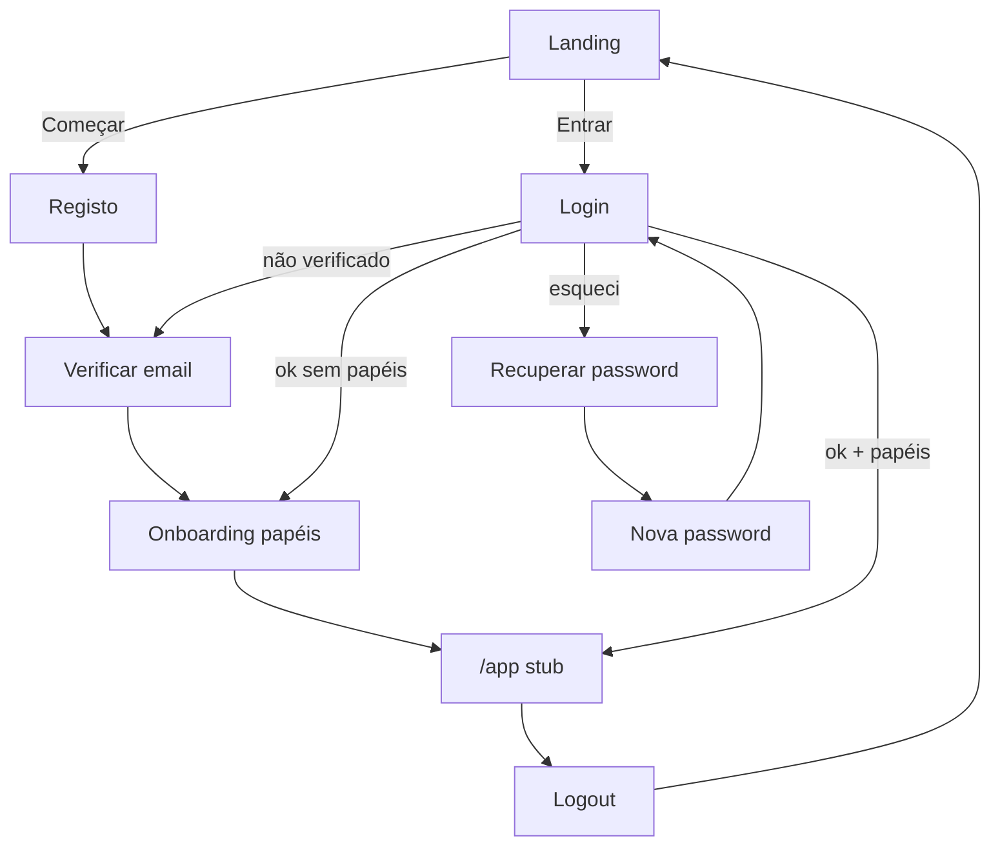
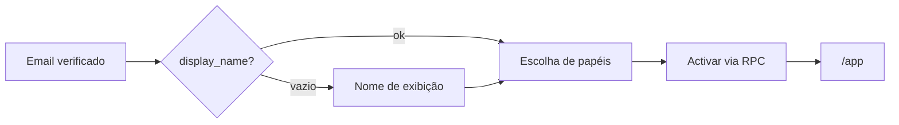
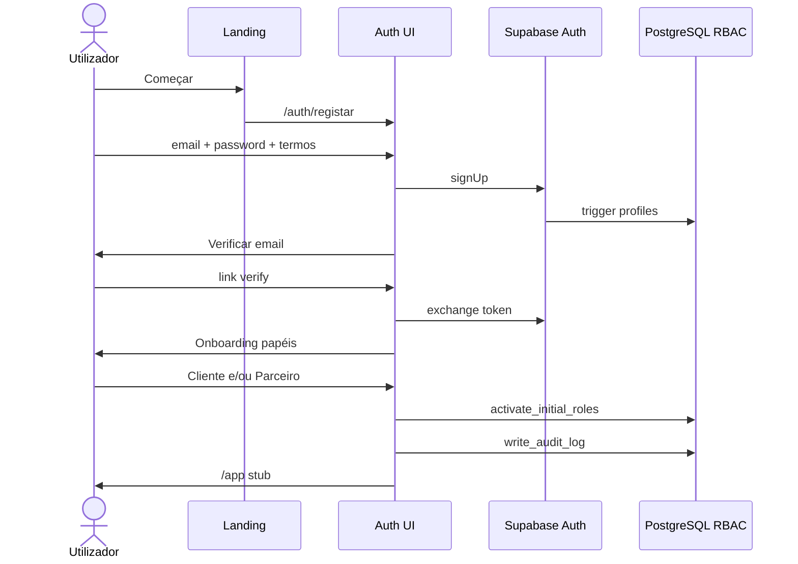

# PRD-001 — Authentication & User Management

**Documento:** Especificação funcional e técnica para revisão de negócio  
**Versão:** 0.2  
**Estado:** 📄 Em revisão de negócio · **Implementação não autorizada**  
**Módulo KEOS:** `apps/web/modules/authentication` (+ `lib/auth`, rotas `(auth)` / `(app)`)  
**Autoridade de produto:** Manual > Blueprint > Design System Nº 003 > PASSO 0 > `AI_CONTEXT` > este PRD  
**Gate:** `docs/backlog/PHASE_GATE_BEFORE_PRD001.md`  
**Pré-implementação obrigatória:** CI activo · migration `0002` no remoto · aprovação desta spec

---

## 0. Registo de autorização (2026-07-30)

| Item | Decisão |
| ---- | ------- |
| Fase anterior (dev) | Concluída |
| P0 técnico | Concluído |
| Pendências CI / migration 0002 / domínio | Infra/ops — resolver antes de implementar |
| Elaboração desta spec | **Autorizada** |
| Implementação | **Não autorizada** até aprovação oficial da spec |

---

## 1. Objectivos do módulo

### 1.1 Objectivo de negócio

Transformar um visitante da Landing num **utilizador autenticado da plataforma de património e confiança Kuteka**, com identidade única, um ou mais papéis oficiais, permissões resolvidas na base de dados e rastos de auditoria — sem parecer um site de classificados.

### 1.2 Objectivos específicos

1. **Identidade** — criar e gerir conta (email + password no MVP) via Supabase Auth.
2. **Sessão** — login, logout, refresh SSR-safe, protecção de rotas `(app)`.
3. **Confiança na entrada** — verificação de email, Termos, mensagens claras, zero fricção desnecessária.
4. **Multi-papel** — modelo N:N (`user_roles`); onboarding que activa papéis permitidos.
5. **Autorização** — consumir apenas a fonte oficial P0 (`fetchAuthorizationContext` / RPCs).
6. **Auditoria** — eventos auth só via `writeAuditLog`.
7. **Preparar o futuro** — contratos de identidade compatíveis com Passaporte Digital, SCK e KAI (sem implementar esses produtos neste PRD).
8. **Substituir** o placeholder `/auth` pelos fluxos reais ligados aos CTAs da Landing.

### 1.3 Métricas de sucesso (pós-lançamento do módulo)

| Métrica | Intenção |
| ------- | -------- |
| Taxa registo → email verificado | Medir fricção do verify |
| Taxa verify → papel activado | Medir abandono no onboarding |
| Tempo até primeiro acesso `(app)` | Simplicidade do fluxo |
| Taxa de recuperação concluída | Qualidade do reset |
| Incidentes de auth / locks indevidos | Segurança vs usabilidade |

*(Instrumentação detalhada pode ficar para um follow-up analítico; o módulo deve emitir eventos audit nomeados.)*

---

## 2. Fora de âmbito (não-objectivos)

| Fora do PRD-001 | Onde vive |
| --------------- | --------- |
| MFA | Pós-MVP / PRD futuro |
| KYC completo / verificação documental de pessoa | Pós-MVP / Trust |
| Shell completo, sidebars, dashboards de negócio | FASE 3+ |
| Passaporte Digital do Imóvel (produto) | PRD património / Trust |
| KAI conversacional / dock completo | Fase KAI |
| Activar património, visitas, contratos, wallet | PRDs 002+ |
| Consola admin de gestão massiva de users | PRD-005 |
| Auth legado Vite / Google client-side | `legacy/` — não reutilizar |
| Alteração DNS / Render | Ops (paralelo) |

**Regra:** o PRD-001 **prepara ganchos** para Passaporte e KAI; **não entrega** esses produtos.

---

## 3. Perfis de utilizador e multi-papel

### 3.1 Conceitos

| Conceito | Definição Kuteka |
| -------- | ---------------- |
| **Utilizador** | Identidade (`auth.users` + `profiles`) |
| **Papel** | Função na plataforma (`roles.code`) |
| **Permissão** | Capacidade (`permissions.code`) |
| **Atribuição** | Ligação N:N em `user_roles` |
| **Papel activo (UX)** | No MVP = conjunto de papéis atribuídos; switcher “Actuar como…” → Shell |

### 3.2 Papéis oficiais (seed actual)

| Código | Nome de produto | Pode self-activar no onboarding MVP? | Permissions iniciais |
| ------ | --------------- | ------------------------------------ | -------------------- |
| `client` | Cliente | ✅ Sim (preseleccionado) | `platform.access` |
| `patrimonial_partner` | Parceiro Patrimonial | ✅ Sim | `platform.access` |
| `certified_agent` | Agente Certificado | ❌ Não — convite / processo Kuteka | `platform.access` |
| `administrator` | Administrador | ❌ Não — apenas processo interno | `platform.access` + `admin.panel` |

### 3.3 Regras de multi-papel

1. Uma conta **pode** ter vários papéis ao longo do tempo.
2. Autorização **nunca** usa `if (role === 'admin')` — usa `can(permission)`.
3. União de permissions de todos os papéis atribuídos = contexto efectivo.
4. Novos papéis futuros (Avaliador, Advogado, …) = rows + seed, sem mudar o modelo.
5. Utilizador **sem** nenhum papel após verify → obrigado a concluir onboarding de papéis antes de `(app)`.
6. Agente e Admin **não** aparecem como opções self-serve; copy: “Estes papéis são atribuídos pela Kuteka.”

### 3.4 Perfis (dados mínimos MVP)

| Campo | Origem | Obrigatório MVP |
| ----- | ------ | --------------- |
| Email | Auth | Sim |
| Password | Auth | Sim (registo email) |
| `display_name` | `profiles` | Sim no onboarding se vazio |
| `locale` | `profiles` (default `pt`) | Default |
| `avatar_url` | `profiles` | Não (opcional; storage policies = risco P1) |
| Aceitação Termos | audit + (proposto) `profiles.terms_accepted_at` | Sim no registo |
| Email verificado | Auth | Sim antes de `(app)` |

---

## 4. Permissões

### 4.1 Fonte de verdade

- Seed / tabelas PostgreSQL (`docs/database/PERMISSIONS_MATRIX.md`)
- Runtime: `get_user_permission_codes` → `fetchAuthorizationContext`
- App: `@kuteka/auth` avalia arrays já resolvidos — **proibida** matriz TS paralela

### 4.2 Matriz MVP (actual)

| Permissão | client | patrimonial_partner | certified_agent | administrator |
| --------- | ------ | ------------------- | --------------- | ------------- |
| `platform.access` | ✓ | ✓ | ✓ | ✓ |
| `admin.panel` | | | | ✓ |

### 4.3 Uso no PRD-001

| Permissão | Efeito UX |
| --------- | --------- |
| Ausência de qualquer papel / sem `platform.access` | Bloqueia `(app)` → onboarding |
| `platform.access` | Acesso ao stub autenticado `/app` |
| `admin.panel` | Acesso a stub `/app/admin` (sem consola real) |

Novas permissions de negócio (ex. `passport.read`, `kai.use`) **não** entram no MVP auth; ficam reservadas para PRDs futuros, documentadas como extensão do mesmo modelo.

---

## 5. Segurança

### 5.1 Princípios

1. Passwords **nunca** em texto simples na aplicação; só Supabase Auth.
2. Service role **nunca** no browser.
3. RLS mantido; writes privilegiados via RPC `SECURITY DEFINER` auditada.
4. Auditoria auth **só** por `write_audit_log` / `writeAuditLog`.
5. Mensagens de erro genéricas no login (não revelar se o email existe).
6. Rate limiting: confiar nos controlos Supabase + UX de reenvio com cooldown.
7. `robots: noindex` em `/auth/*`.
8. Sessão via cookies HTTP (`@supabase/ssr`); middleware refresca tokens.
9. Logger já bloqueia campos `password` / `token` — manter.
10. HTTPS em todos os ambientes públicos.

### 5.2 Ameaças e controlos

| Ameaça | Controlo |
| ------ | -------- |
| Enumeração de contas | Copy genérica no login/reset |
| Session fixation / XSS roubo de sessão | Cookies seguros, CSP base existente, sem tokens em `localStorage` de produto |
| Privilege escalation self-serve | RPC de activação rejeita agent/admin |
| Tamper `audit_logs` | P0-2 (sem INSERT directo) |
| Bypass de verify | Middleware + server checks: email confirmado obrigatório para `(app)` |
| Open redirect em `?next=` | Allowlist de paths relativos internos |

### 5.3 Checklist pré-produção (implementação futura)

- [ ] Migration `0002` aplicada
- [ ] Providers Auth (email) configurados no Supabase
- [ ] Templates de email (verify / reset) com marca Kuteka
- [ ] URLs de redirect allowlist no Supabase
- [ ] CI verde no PR

---

## 6. Fluxos completos de autenticação

### 6.1 Mapa geral



### 6.2 Registo (email + password)

**Entrada:** `/auth` ou `/auth/registar` (CTA Começar).

**Passos:**

1. Utilizador preenche email, password, confirmação, checkbox Termos/Privacidade.
2. Validação client + server (password mínima: política Supabase documentada na implementação; UX mostra regras).
3. `signUp` → trigger cria `profiles`.
4. Audit `auth.signup` + `auth.terms_accepted`.
5. Ecrã “Verifique o seu email” com reenvio (cooldown visual).
6. Não entra em `(app)` antes de verify + papel.

### 6.3 Verificação de email

1. Link do email → `/auth/verificar` (troca de token Supabase).
2. Sucesso → audit `auth.email_verified` → onboarding se sem papéis.
3. Token inválido/expirado → pedir reenvio.
4. Já verificado e com papéis → `/app`.

### 6.4 Login

**Entrada:** `/auth/entrar` ou `/auth?mode=entrar`.

1. Email + password → `signInWithPassword`.
2. Falha → mensagem genérica; audit opcional `auth.login_failed` sem PII sensível em excesso.
3. Sucesso → audit `auth.login` → carregar autorização.
4. Regras de destino: ver §8 Redirect.

### 6.5 Logout

1. Acção explícita na UI autenticada.
2. `signOut` + invalidação cookies.
3. Audit `auth.logout`.
4. Redirect `/`.

### 6.6 Sessão e middleware

- Refresh em rotas `(auth)` relevantes e todas `(app)`.
- Sem sessão em `(app)` → `/auth/entrar?next=<path>`.
- `next` sanitizado (só paths relativos da app).

---

## 7. Recuperação de conta

### 7.1 Esqueci a password

1. `/auth/recuperar` — pede email.
2. Sempre mostra sucesso genérico (“Se existir conta, enviámos instruções”) — anti-enumeração.
3. Audit `auth.password_reset_requested` (quando aplicável server-side sem vazar).
4. Email Supabase → `/auth/recuperar/confirmar`.
5. Nova password + confirmar → sucesso → audit `auth.password_reset_completed` → login.

### 7.2 Conta sem acesso ao email

- **MVP:** suporte humano / processo operacional (fora do self-serve).
- Spec reserva mensagem: “Não tem acesso ao email? Contacte a Kuteka.” → `/contacto`.

### 7.3 Fora do MVP

- Recuperação por telefone / MFA recovery codes.

---

## 8. Onboarding

### 8.1 Princípio

Um ecrã = uma missão. Não forçar questionário longo antes de valor (Manual / UX). O onboarding do PRD-001 é **só** o necessário para identidade e papel.

### 8.2 Sequência pós-verify



### 8.3 Escolha de papéis (MVP)

**Título:** “Como quer usar a Kuteka hoje?”

| Opção | Copy curta |
| ----- | ---------- |
| Cliente | Encontrar e avançar com confiança na habitação |
| Parceiro Patrimonial | Activar e acompanhar o meu património |
| (Info) Agente / Admin | Atribuídos pela Kuteka — não seleccionáveis |

- Permite seleccionar **um ou ambos** Cliente + Parceiro.
- CTA: Continuar (disabled até ≥1 selecção).
- RPC `activate_initial_roles` (nome final na implementação) aplica regras §3.2.
- Audit `auth.role_activated` por papel (ou um evento com metadata da lista).

### 8.4 O que o onboarding **não** pede no MVP

- Preferências de zona / orçamento (Cliente → PRD-003)
- Dados de imóvel (Parceiro → PRD-002)
- Upload de documentos KYC
- Telefone obrigatório

---

## 9. Redirect inteligente pós-login

| Estado | Destino |
| ------ | ------- |
| Não autenticado a aceder `(app)` | `/auth/entrar?next=…` |
| Autenticado, email não verificado | `/auth/verificar` |
| Verificado, 0 papéis | `/auth/onboarding/papeis` |
| `platform.access`, sem `admin.panel` | `/app` |
| `admin.panel` e `next` admin ou escolha admin | `/app/admin` stub |
| `next` válido | Honorar após checks acima |

Landing visitada já autenticada: opcional redirect suave para `/app` (decisão D11 abaixo) — **não** esconder a Landing por completo no MVP.

---

## 10. Integração com o Passaporte Kuteka

### 10.1 O que é (produto)

O **Passaporte Digital do Imóvel** é a memória permanente de um património (histórico, confiança, documentos, score). Pertence ao domínio de património / Trust — **não** é um ecrã do PRD-001.

### 10.2 O que o PRD-001 deve garantir (contrato)

Para o Passaporte funcionar depois, a auth deve:

1. Garantir **identidade estável** (`user_id` / `profiles.id` = `auth.users.id`).
2. Garantir **papéis correctos** (Parceiro activa património; Cliente consulta; Agente opera; Admin governa).
3. Garantir **auditoria** de quem acedeu / alterou (padrão `writeAuditLog` reutilizável em `passport.*` no futuro).
4. **Não** criar atalhos de permissão ad hoc que o Passaporte tenha de contornar.

### 10.3 Ganchos explícitos (sem UI de Passaporte)

| Gancho | Descrição |
| ------ | --------- |
| `AuthorizationContext` | Base para `passport.read` / `passport.write` futuros |
| Eventos audit com `actor_id` | Mesmo actor do Passaporte |
| Onboarding Parceiro | Copy pode mencionar “mais tarde poderá activar património e construir o Passaporte” — **sem** CTA falso de produto inexistente |
| Proibir | Inventar selos SCK / KTK Score no ecrã de auth |

### 10.4 Fora deste PRD

UI Passaporte, histórico do imóvel, documentos do activo, KTK Score no património.

---

## 11. Integração futura com o KAI

### 11.1 Princípio de identidade

KAI é presença constante na **App**, nunca página escondida (PASSO 0). No PRD-001 **ainda não há App shell** — logo **não há dock KAI** neste módulo.

### 11.2 O que preparar agora

| Preparação | Detalhe |
| ---------- | ------- |
| Identidade do utilizador | KAI futuro personaliza por `userId`, papéis e locale |
| Contexto de autorização | KAI não deve burlar RBAC; age no contexto do utilizador |
| Eventos | Reservar namespace `kai.*` para audits futuros; auth não os emite ainda |
| Copy auth | Tom alinhado ao KAI (consultivo, concreto) — sem chatbot no registo |
| Stub `/app` | Pode incluir nota discreta “O KAI estará disponível na plataforma” **sem** botão morto que finja chat |

### 11.3 Explicitamente não fazer no PRD-001

- Widget/chat KAI
- Endpoints de IA
- Prometer respostas de KAI no onboarding

---

## 12. Rotas e arquitectura técnica (resumo)

### 12.1 Rotas

| Rota | Função |
| ---- | ------ |
| `/auth` · `/auth/registar` | Registo |
| `/auth/entrar` | Login (`?mode=entrar` alias) |
| `/auth/verificar` | Verify email |
| `/auth/recuperar` | Pedido reset |
| `/auth/recuperar/confirmar` | Nova password |
| `/auth/onboarding/papeis` | Multi-papel inicial |
| `/auth/onboarding/perfil` | Nome se necessário (pode fundir-se no fluxo) |
| `/app` | Stub autenticado |
| `/app/admin` | Stub admin (`admin.panel`) |

### 12.2 Packages

Reutilizar: `@kuteka/database`, `@kuteka/auth`, `@kuteka/validation`, `@kuteka/types`, `@kuteka/ui`.

### 12.3 Novos (só após aprovação + implementação)

- RPC activação papéis iniciais  
- Migration `0003` se `terms_accepted_at` / ajustes RLS  
- Session helpers + middleware refresh  
- ADR-004  

---

## 13. Eventos de auditoria (canónicos)

| Evento | Quando |
| ------ | ------ |
| `auth.signup` | Conta criada |
| `auth.terms_accepted` | Checkbox Termos |
| `auth.email_verified` | Verify OK |
| `auth.login` | Login OK |
| `auth.login_failed` | Opcional, sem vazar segredos |
| `auth.logout` | Logout |
| `auth.password_reset_requested` | Pedido reset |
| `auth.password_reset_completed` | Password alterada |
| `auth.role_activated` | Papel(is) initial |

---

## 14. Decisões propostas para aprovação de negócio (D1–D12)

| ID | Proposta | Precisa de sim/não |
| -- | -------- | ------------------ |
| D1 | MVP = email+password (sem OAuth) | ☐ |
| D2 | Telefone fora do MVP | ☐ |
| D3 | Self-serve só Cliente + Parceiro | ☐ |
| D4 | Agente/Admin só atribuição Kuteka | ☐ |
| D5 | Stub `/app` até FASE 3 | ☐ |
| D6 | Rotas nested `/auth/...` + aliases Landing | ☐ |
| D7 | MFA fora | ☐ |
| D8 | Switcher multi-papel adiado ao Shell | ☐ |
| D9 | UI pt-AO | ☐ |
| D10 | Termos obrigatórios no registo | ☐ |
| D11 | Utilizador já logado na Landing: **permanece na Landing** (sem force redirect) | ☐ |
| D12 | Google OAuth: **follow-up** pós-MVP auth | ☐ |

---

## 15. Casos limite (edge cases)

| # | Caso | Comportamento esperado |
| - | ---- | ---------------------- |
| E1 | Registo com email já existente | Mensagem segura; oferecer Entrar / Recuperar |
| E2 | Login com email não verificado | Bloquear `(app)`; forçar `/auth/verificar` + reenvio |
| E3 | Token verify expirado | Erro claro + reenvio |
| E4 | Token reset expirado | Idem |
| E5 | Utilizador verificado sem papéis (falha RPC a meio) | Ficar em onboarding; retry; suporte |
| E6 | Tentativa self-activar `administrator` | RPC rejeita; audit de segurança opcional |
| E7 | Sessão expirada a meio do onboarding | Re-login; retomar onboarding |
| E8 | `?next=https://evil.com` | Ignorar; ir para `/app` |
| E9 | `?next=/app/admin` sem `admin.panel` | Ir para `/app` |
| E10 | Duplo submit registo | Idempotência UX (disabled button + loading) |
| E11 | Password nos critérios mínimos falha | Inline validation antes do submit |
| E12 | Utilizador desactiva conta (soft delete futuro) | Fora MVP; reservar `profiles.deleted_at` já no schema |
| E13 | Multi-tab logout | Sessão invalidada; próximo request → login |
| E14 | Landing CTA com sessão activa | Mostrar Entrar como “Ir para a plataforma” **ou** manter Entrar→`/app` (fechar em D11) |
| E15 | Locale `en` no perfil | MVP UI pt; campo existe para futuro |
| E16 | Supabase email delay | Copy “pode demorar alguns minutos”; reenvio com cooldown |
| E17 | Utilizador Cliente+Parceiro | Permissions unidas; stub `/app` único no MVP |
| E18 | Falha de rede no login | Toast/erro recuperável |
| E19 | Aceder `/auth/onboarding/papeis` sem verify | Redirect verify |
| E20 | Aceder `/auth/*` já com papéis e sessão | Redirect `/app` (exceto logout/recuperar) |

---

## 16. Critérios de aceitação

### 16.1 Gate pré-código

- [ ] Spec aprovada (D1–D12 fechados)
- [ ] CI definitivamente activo e verde
- [ ] Migration `0002` aplicada no remoto
- [ ] Autorização explícita de implementação

### 16.2 Funcional

- [ ] Registo + Termos + verify + onboarding + `/app`
- [ ] Login / logout
- [ ] Recuperação de password completa
- [ ] Landing Começar/Entrar → fluxos reais
- [ ] Regras de redirect §8
- [ ] Self-serve papéis só Cliente/Parceiro
- [ ] Admin/Agent não self-serve

### 16.3 Segurança / arquitectura

- [ ] Sem matriz TS de permissions
- [ ] Audits canónicos presentes
- [ ] Sem service role no client
- [ ] Open-redirect protegido
- [ ] Testes unit + e2e smoke

### 16.4 Produto / confiança

- [ ] Copy pt-AO alinhada PASSO 0 (sem linguagem de classificados)
- [ ] Sem UI falsa de Passaporte/KAI/SCK
- [ ] Ganchos §10–§11 documentados no ADR de implementação

### 16.5 Quatro níveis (após implementação futura)

Implementação → Auto-revisão → Testes → Validação funcional/visual + aprovação final

---

## 17. Riscos

| Risco | Impacto | Mitigação |
| ----- | ------- | --------- |
| Implementar sem CI / sem `0002` | Regressões, RPCs em falta | Gate 16.1 |
| Scope creep (dashboards, KAI, Passaporte UI) | Atraso, qualidade | Não-objectivos §2 |
| Fricção no verify email | Abandono | Copy + reenvio + métrica |
| Onboarding confuso multi-papel | Contas sem papel / papel errado | UI simples D3 + defaults |
| Enumeração de contas | Privacidade | Mensagens genéricas |
| Policies storage avatar | Upload inseguro | Avatar opcional / adiar upload |
| Confusão com legado | Dévida técnica | Proibir `legacy/` auth |
| Email deliverability | Contas bloqueadas em verify | Templates + domínio sender (ops) |

---

## 18. Wireframes dos fluxos principais

> Wireframes de baixa fidelidade para revisão de negócio. Visual final = Design System (Orange / Slate, tipografia oficial). Sem cards decorativos no hero de auth; um ecrã = uma missão.

### 18.1 Registo — `/auth/registar`

```
┌──────────────────────────────────────────────┐
│  Kuteka                                      │
│                                              │
│  Criar conta                                 │
│  Entre na plataforma de património e         │
│  confiança.                                  │
│                                              │
│  Email                                       │
│  ┌────────────────────────────────────────┐  │
│  │                                        │  │
│  └────────────────────────────────────────┘  │
│  Password                                    │
│  ┌────────────────────────────────────────┐  │
│  │                                        │  │
│  └────────────────────────────────────────┘  │
│  Confirmar password                          │
│  ┌────────────────────────────────────────┐  │
│  │                                        │  │
│  └────────────────────────────────────────┘  │
│                                              │
│  [ ] Li e aceito os Termos e a Privacidade   │
│                                              │
│  [ Criar conta          ]  (primário Orange) │
│                                              │
│  Já tem conta? Entrar                        │
└──────────────────────────────────────────────┘
```

### 18.2 Verificar email — `/auth/verificar`

```
┌──────────────────────────────────────────────┐
│  Kuteka                                      │
│                                              │
│  Verifique o seu email                       │
│  Enviámos um link para confirmar a conta.    │
│                                              │
│  [ Reenviar email ]   (cooldown 60s)         │
│                                              │
│  Errado o email? Voltar ao registo           │
└──────────────────────────────────────────────┘
```

### 18.3 Login — `/auth/entrar`

```
┌──────────────────────────────────────────────┐
│  Kuteka                                      │
│                                              │
│  Entrar                                      │
│                                              │
│  Email                                       │
│  ┌────────────────────────────────────────┐  │
│  │                                        │  │
│  └────────────────────────────────────────┘  │
│  Password                                    │
│  ┌────────────────────────────────────────┐  │
│  │                                        │  │
│  └────────────────────────────────────────┘  │
│                                              │
│  [ Entrar               ]                    │
│                                              │
│  Esqueceu a password?                        │
│  Criar conta                                 │
└──────────────────────────────────────────────┘
```

### 18.4 Recuperar — `/auth/recuperar`

```
┌──────────────────────────────────────────────┐
│  Kuteka                                      │
│                                              │
│  Recuperar acesso                            │
│  Indique o email da conta. Se existir,       │
│  enviamos instruções.                        │
│                                              │
│  Email                                       │
│  ┌────────────────────────────────────────┐  │
│  │                                        │  │
│  └────────────────────────────────────────┘  │
│                                              │
│  [ Enviar instruções    ]                    │
│                                              │
│  Voltar a Entrar                             │
│  Sem acesso ao email? Contacto               │
└──────────────────────────────────────────────┘
```

### 18.5 Nova password — `/auth/recuperar/confirmar`

```
┌──────────────────────────────────────────────┐
│  Kuteka                                      │
│                                              │
│  Nova password                               │
│                                              │
│  Password                                    │
│  ┌────────────────────────────────────────┐  │
│  │                                        │  │
│  └────────────────────────────────────────┘  │
│  Confirmar                                   │
│  ┌────────────────────────────────────────┐  │
│  │                                        │  │
│  └────────────────────────────────────────┘  │
│                                              │
│  [ Guardar e entrar     ]                    │
└──────────────────────────────────────────────┘
```

### 18.6 Onboarding papéis — `/auth/onboarding/papeis`

```
┌──────────────────────────────────────────────┐
│  Kuteka                                      │
│                                              │
│  Como quer usar a Kuteka hoje?               │
│  Pode escolher mais do que um.               │
│                                              │
│  ┌────────────────────────────────────────┐  │
│  │ ( ) Cliente                            │  │
│  │     Habitação com confiança            │  │
│  └────────────────────────────────────────┘  │
│  ┌────────────────────────────────────────┐  │
│  │ ( ) Parceiro Patrimonial               │  │
│  │     Activar e acompanhar património    │  │
│  └────────────────────────────────────────┘  │
│                                              │
│  Agente Certificado e Administrador são      │
│  atribuídos pela Kuteka.                     │
│                                              │
│  [ Continuar            ]  (disabled se 0)   │
└──────────────────────────────────────────────┘
```

### 18.7 Stub autenticado — `/app`

```
┌──────────────────────────────────────────────┐
│  Kuteka          [Terminar sessão]           │
│                                              │
│  Bem-vindo, {display_name}                   │
│                                              │
│  A sua conta está activa.                    │
│  A plataforma (patrimónios, Passaporte e     │
│  KAI) será disponibilizada nas próximas      │
│  fases — com a mesma identidade e papéis.    │
│                                              │
│  (Sem dock KAI neste PRD — preparado §11)    │
└──────────────────────────────────────────────┘
```

### 18.8 Fluxo condensado (sequência de ecrãs)



---

## 19. Plano de testes (para a fase de implementação futura)

| Camada | Foco |
| ------ | ---- |
| Unit | Validators, permission helpers, sanitização `next` |
| Integration | RPC rejeita admin/agent; audit path |
| E2E | Registo→verify(test hooks)→onboarding→app; login; reset UI |
| Segurança | Sem INSERT audit directo; sem open redirect |

---

## 20. Entregáveis quando a implementação for autorizada

1. Branch de implementação (ex. `cursor/prd-001-authentication-f96b`)  
2. Código + migration `0003` se necessário  
3. ADR-004  
4. Relatório 4 níveis  
5. Actualização AI_CONTEXT / gate  

**Nesta entrega (v0.2):** apenas especificação.

---

## 21. Histórico

| Versão | Data | Notas |
| ------ | ---- | ----- |
| 0.1 | 2026-07-30 | Rascunho inicial |
| 0.2 | 2026-07-30 | Spec completa para revisão de negócio (fluxos, Passaporte/KAI, edges, wireframes); autorização só de especificação |

---

## 22. Pedido à revisão de negócio

Pedimos:

1. **Aprovação ou correcção** das decisões D1–D12  
2. Validação dos wireframes e da copy de papéis  
3. Confirmação dos limites Passaporte (§10) e KAI (§11)  
4. Após aprovação + infra (CI, `0002`, domínio conforme ops): **autorização explícita de implementação**

Até lá: **nenhuma implementação**.
