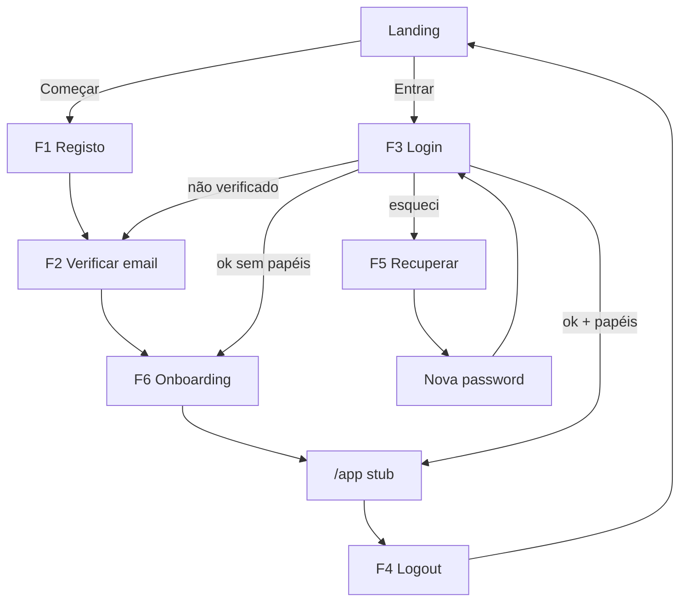
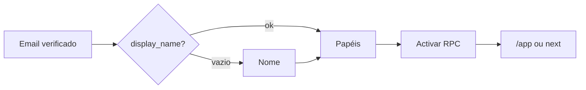
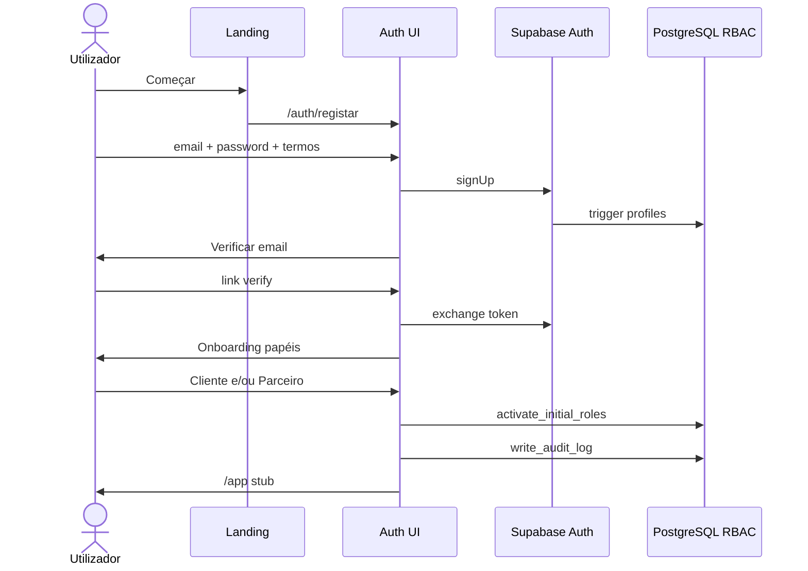

# PRD-001 — Authentication & User Management

**Documento:** Especificação funcional e técnica para revisão de negócio  
**Versão:** 0.4  
**Estado:** 📄 Em revisão de negócio · Bloco 1 ✅ · Bloco 2 (fluxos) ▶️ · **Implementação não autorizada**  
**Módulo KEOS:** `apps/web/modules/authentication` (+ `lib/auth`, rotas `(auth)` / `(app)`)  
**Autoridade de produto:** Manual > Blueprint > Design System Nº 003 > PASSO 0 > `AI_CONTEXT` > este PRD  
**Gate:** `docs/backlog/PHASE_GATE_BEFORE_PRD001.md`  
**Pré-implementação obrigatória:** CI activo · migration `0002` no remoto · aprovação integral desta spec

---

## 0. Registo de autorização e revisão

| Item | Decisão |
| ---- | ------- |
| Fase anterior (dev) | Concluída |
| P0 técnico | Concluído |
| Pendências CI / migration 0002 / domínio | Infra/ops — resolver antes de implementar |
| Elaboração / ajuste desta spec | **Autorizada** |
| Implementação | **Não autorizada** até aprovação oficial integral da spec |
| Bloco 1 — D1–D12 | **Fechado** (2026-07-30) — ver §14 |
| Bloco 2 — Fluxos principais | **Em revisão** (v0.4) — ver §6 |

### 0.1 Princípios arquitecturais oficiais (plataforma)

Assumidos em **toda** a Kuteka a partir deste PRD — não só no módulo auth:

1. **Uma pessoa = uma conta Kuteka.**
2. **Uma conta pode possuir vários papéis.**
3. **Os papéis são contextos de actuação**, não identidades diferentes.
4. **Nenhuma funcionalidade futura** deve obrigar o utilizador a criar uma segunda conta.
5. **Uma identidade, um perfil** (`auth.users` + `profiles`); papéis vivem em `user_roles`.
6. A autenticação deve **escalar** para OAuth, MFA, telefone no perfil e módulos futuros **sem redesenhar** o módulo — apenas estender.

### 0.2 Princípio de experiência — primeiro contacto com o ecossistema

A autenticação **não** é apenas um mecanismo de acesso. É o **primeiro contacto** do utilizador com o ecossistema Kuteka e deve transmitir, desde o primeiro momento, três sensações:

| Sensação | Significado na prática |
| -------- | ---------------------- |
| **Simplicidade** | Poucos campos; etapas curtas; sem questionários longos no MVP |
| **Confiança** | Linguagem clara; o utilizador sabe o que acontece e porquê; tom de património/confiança (não de classificados) |
| **Controlo** | O utilizador percebe o próximo passo; pode voltar, reenviar, recuperar; erros orientados para a solução |

**Regras de UX dos fluxos (MVP):**

1. Progressão por **etapas** (um ecrã = uma missão).
2. **Feedback imediato** (loading, sucesso, estados vazios).
3. **Linguagem simples** (pt-AO).
4. **Validação em tempo real** nos campos (sem esperar só pelo submit, quando fizer sentido).
5. **Mensagens de erro claras** e orientadas para a solução.
6. Explicar sempre: **o que** está a acontecer, **porquê**, e **qual o próximo passo**.
7. Privilegiar redução de fricção sobre formulários longos.

### 0.3 Template de documentação de cada fluxo (Bloco 2+)

Cada fluxo principal é descrito com:

1. Objectivo do fluxo  
2. Condições de entrada  
3. Sequência passo a passo  
4. Estados possíveis  
5. Mensagens principais ao utilizador  
6. Casos de erro e comportamento  
7. Critérios de aceitação  
8. Oportunidades futuras (quando aplicável)

---

## 1. Objectivos do módulo

### 1.1 Objectivo de negócio

Transformar um visitante da Landing num **utilizador autenticado da plataforma de património e confiança Kuteka**, com identidade única, um ou mais papéis oficiais, permissões resolvidas na base de dados e rastos de auditoria — sem parecer um site de classificados.

### 1.2 Objectivos específicos

1. **Identidade única** — uma conta Kuteka por pessoa (email + password no MVP) via Supabase Auth.
2. **Sessão** — login, logout, refresh SSR-safe, protecção de rotas `(app)`.
3. **Confiança na entrada** — verificação de email, Termos, mensagens claras, zero fricção desnecessária.
4. **Multi-papel desde o dia 1** — modelo N:N (`user_roles`) como arquitectura permanente; onboarding activa papéis self-serve permitidos; adição/remoção futura sem nova conta.
5. **Autorização** — consumir apenas a fonte oficial P0 (`fetchAuthorizationContext` / RPCs).
6. **Auditoria** — eventos auth só via `writeAuditLog`.
7. **Extensibilidade** — arquitectura preparada para OAuth (Google, Apple, …), MFA e telefone no perfil, sem os entregar no MVP.
8. **Contratos discretos** — identidade/RBAC/audit compatíveis com Passaporte e KAI futuros **sem** expectativas visuais nestes ecrãs.
9. **Substituir** o placeholder `/auth` pelos fluxos reais ligados aos CTAs da Landing.

### 1.3 Métricas de sucesso (pós-lançamento do módulo)

| Métrica | Intenção |
| ------- | -------- |
| Taxa registo → email verificado | Medir fricção do verify |
| Taxa verify → papel activado | Medir abandono no onboarding |
| Tempo até primeiro acesso `(app)` | Simplicidade do fluxo |
| Taxa de recuperação concluída | Qualidade do reset |
| Incidentes de auth / locks indevidos | Segurança vs usabilidade |

*(Instrumentação detalhada pode ficar para um follow-up analítico; o módulo deve emitir eventos audit nomeados.)*

---

## 2. Fora de âmbito (não-objectivos)

| Fora do MVP do PRD-001 | Preparação arquitectural | Onde vive depois |
| --------------------- | ------------------------ | ---------------- |
| MFA (UI / enforcement) | Sim — modelo de auth extensível | PRD futuro |
| OAuth Google / Apple / outros | Sim — provider-agnostic via Supabase Auth | Follow-up auth |
| Telefone como login | Não | Telefone **no perfil** depois; não como auth inicial |
| UI de gestão de papéis (adicionar/remover) | Modelo `user_roles` já o permite | Shell / definições de conta |
| Switcher visual “Actuar como…” | Conceito de contextos de actuação desde o dia 1 | Shell |
| KYC completo | — | Trust / Pós-MVP |
| Shell / dashboards de negócio | Navegação futura preparada (rotas `(app)`, `next`) | FASE 3+ |
| Passaporte Digital (produto / UI) | Só contrato de identidade/RBAC/audit | PRD património |
| KAI (dock / chat) | Só contrato de identidade/contexto | Fase KAI |
| Auth legado Vite | — | Proibido reutilizar |

**Regra:** preparar **arquitectura e documentação**; **não** criar expectativas visuais de Passaporte/KAI/SCK nos ecrãs de auth ou no stub `/app`.

---

## 3. Perfis de utilizador e multi-papel

### 3.1 Conceitos (princípio fundamental)

| Conceito | Definição Kuteka |
| -------- | ---------------- |
| **Pessoa** | Humano real — corresponde a **uma** conta |
| **Conta / Utilizador** | Identidade única (`auth.users` + **um** `profiles`) |
| **Papel** | Contexto de actuação (`roles.code`) — **não** é outra identidade |
| **Permissão** | Capacidade (`permissions.code`) |
| **Atribuição** | Ligação N:N em `user_roles` (adicionar/remover ao longo do tempo) |
| **Contexto de actuação (UX)** | Papel(is) com que o utilizador opera num momento; switcher visual pode chegar no Shell, mas o **modelo existe desde o dia 1** |

### 3.2 Papéis oficiais (seed actual)

| Código | Nome de produto | Self-serve no onboarding MVP? | Permissions iniciais |
| ------ | --------------- | ----------------------------- | -------------------- |
| `client` | Cliente | ✅ Sim (pode coexistir com Parceiro) | `platform.access` |
| `patrimonial_partner` | Parceiro Patrimonial | ✅ Sim (pode coexistir com Cliente) | `platform.access` |
| `certified_agent` | Agente Certificado | ❌ Só Kuteka | `platform.access` |
| `administrator` | Administrador | ❌ Só Kuteka | `platform.access` + `admin.panel` |

### 3.3 Regras de multi-papel (desde o primeiro dia)

1. **Uma pessoa = uma conta**; nunca segunda conta para “ser também Parceiro”.
2. Cliente e Parceiro Patrimonial **podem coexistir** na mesma conta desde o registo/onboarding.
3. Mais tarde o utilizador poderá **adicionar ou remover** papéis self-serve permitidos **sem** nova conta (UI de gestão pode ser pós-MVP; o modelo de dados e as APIs devem prevê-lo).
4. Autorização **nunca** usa `if (role === 'admin')` — usa `can(permission)`.
5. União de permissions de todos os papéis atribuídos = contexto efectivo (até existir switcher de contexto no Shell).
6. Novos papéis futuros = rows + seed, sem mudar o modelo estrutural.
7. Utilizador **sem** nenhum papel após verify → onboarding de papéis antes de `(app)`.
8. Agente e Admin **não** são self-serve; copy: “Estes papéis são atribuídos pela Kuteka.”
9. O switcher visual “Actuar como…” pode aparecer só no Shell; a especificação **não** trata multi-papel como “feature do Shell” — é **arquitectura de plataforma**.

### 3.4 Perfis (dados mínimos MVP)

| Campo | Origem | Obrigatório MVP |
| ----- | ------ | --------------- |
| Email | Auth | Sim |
| Password | Auth (MVP) | Sim |
| `display_name` | `profiles` | Sim no onboarding se vazio |
| `locale` | `profiles` (default `pt`) | Default; i18n preparado |
| Telefone | Perfil futuro | **Não** no MVP; não é método de auth inicial |
| `avatar_url` | `profiles` | Não (opcional; storage = risco P1) |
| Aceitação Termos | audit + (proposto) `profiles.terms_accepted_at` | Sim no registo |
| Email verificado | Auth | Sim antes de `(app)` |

### 3.5 Extensibilidade de autenticação (sem UI no MVP)

| Capacidade | MVP | Preparação obrigatória na arquitectura |
| ---------- | --- | -------------------------------------- |
| Email + password | ✅ | — |
| Google / Apple / outros OAuth | ❌ | Fluxos e sessão provider-agnostic (Supabase Auth); sem redesenhar o módulo |
| MFA | ❌ | Conta/sessão preparadas para segundo factor futuro |
| Telefone | ❌ | Campo de perfil futuro; recuperação/login por telefone = evolução |

---

## 4. Permissões

### 4.1 Fonte de verdade

- Seed / tabelas PostgreSQL (`docs/database/PERMISSIONS_MATRIX.md`)
- Runtime: `get_user_permission_codes` → `fetchAuthorizationContext`
- App: `@kuteka/auth` avalia arrays já resolvidos — **proibida** matriz TS paralela

### 4.2 Matriz MVP (actual)

| Permissão | client | patrimonial_partner | certified_agent | administrator |
| --------- | ------ | ------------------- | --------------- | ------------- |
| `platform.access` | ✓ | ✓ | ✓ | ✓ |
| `admin.panel` | | | | ✓ |

### 4.3 Uso no PRD-001

| Permissão | Efeito UX |
| --------- | --------- |
| Ausência de qualquer papel / sem `platform.access` | Bloqueia `(app)` → onboarding |
| `platform.access` | Acesso ao stub autenticado `/app` |
| `admin.panel` | Acesso a stub `/app/admin` (sem consola real) |

Novas permissions de negócio (ex. `passport.read`, `kai.use`) **não** entram no MVP auth; ficam reservadas para PRDs futuros, documentadas como extensão do mesmo modelo.

---

## 5. Segurança

### 5.1 Princípios

1. Passwords **nunca** em texto simples na aplicação; só Supabase Auth.
2. Service role **nunca** no browser.
3. RLS mantido; writes privilegiados via RPC `SECURITY DEFINER` auditada.
4. Auditoria auth **só** por `write_audit_log` / `writeAuditLog`.
5. Mensagens de erro genéricas no login (não revelar se o email existe).
6. Rate limiting: confiar nos controlos Supabase + UX de reenvio com cooldown.
7. `robots: noindex` em `/auth/*`.
8. Sessão via cookies HTTP (`@supabase/ssr`); middleware refresca tokens.
9. Logger já bloqueia campos `password` / `token` — manter.
10. HTTPS em todos os ambientes públicos.

### 5.2 Ameaças e controlos

| Ameaça | Controlo |
| ------ | -------- |
| Enumeração de contas | Copy genérica no login/reset |
| Session fixation / XSS roubo de sessão | Cookies seguros, CSP base existente, sem tokens em `localStorage` de produto |
| Privilege escalation self-serve | RPC de activação rejeita agent/admin |
| Tamper `audit_logs` | P0-2 (sem INSERT directo) |
| Bypass de verify | Middleware + server checks: email confirmado obrigatório para `(app)` |
| Open redirect em `?next=` | Allowlist de paths relativos internos |

### 5.3 Checklist pré-produção (implementação futura)

- [ ] Migration `0002` aplicada
- [ ] Providers Auth (email) configurados no Supabase
- [ ] Templates de email (verify / reset) com marca Kuteka
- [ ] URLs de redirect allowlist no Supabase
- [ ] CI verde no PR

---

## 6. Fluxos principais (Bloco 2)

> Cada fluxo segue o template §0.3 e o princípio de UX §0.2 (simplicidade, confiança, controlo).
> Regras de navegação transversais: §9.

### 6.0 Mapa geral



---

### 6.1 F1 — Registo (email + password)

#### Objectivo do fluxo

Criar a **única conta Kuteka** da pessoa, com aceite dos Termos, e conduzi-la com clareza ao próximo passo (verificação de email) — transmitindo simplicidade e confiança desde o primeiro ecrã.

#### Condições de entrada

| Condição | Comportamento |
| -------- | ------------- |
| Visitante anónimo | Mostrar formulário de registo |
| Sessão activa, verify + papéis OK | Redirect app (§9.2) — sem re-registo |
| Sessão activa, onboarding incompleto | Ir para o passo em falta |
| Entrada | `/auth`, `/auth/registar`, CTA **Começar** |

#### Sequência passo a passo

1. Utilizador vê título + frase curta do que vai acontecer e qual o próximo passo após criar conta.
2. Preenche **email**, **password**, **confirmar password**; aceita **Termos e Privacidade**.
3. Validação em tempo real (formato email; regras de password; match da confirmação; checkbox).
4. Submete → loading imediato no CTA (evitar duplo submit).
5. `signUp` Supabase → trigger cria `profiles`.
6. Audits: `auth.signup`, `auth.terms_accepted`.
7. Passa ao ecrã / fluxo **F2 Verificar email** (não entra em `(app)` ainda).

#### Estados possíveis

| Estado | UI |
| ------ | -- |
| Vazio / edição | Formulário editável |
| Validação local inválida | Campos com erro inline; CTA disabled ou submit bloqueado |
| A submeter | CTA loading |
| Sucesso | Transição para F2 |
| Erro de servidor | Mensagem orientada para solução; formulário preservado (exceto password se política assim o exigir) |

#### Mensagens principais ao utilizador

| Momento | Mensagem (orientação de copy) |
| ------- | ----------------------------- |
| Título | Criar conta |
| Apoio | Entre na plataforma de património e confiança. Depois pediremos que confirme o seu email. |
| Termos | Li e aceito os Termos de utilização e a Política de privacidade |
| CTA | Criar conta |
| Link secundário | Já tem conta? Entrar |
| Password help | Indicar requisitos de forma simples (ex.: mínimo de caracteres) |

#### Casos de erro e comportamento

| Erro | Comportamento |
| ---- | ------------- |
| Email inválido | Inline: “Indique um email válido.” |
| Passwords não coincidem | Inline imediato |
| Termos não aceites | Inline / impedir submit |
| Email já registado | Mensagem segura + links **Entrar** e **Recuperar acesso** (sem vazar detalhes desnecessários) |
| Rede / 5xx | “Não foi possível criar a conta. Tente novamente.” + retry |
| Password fraca (servidor) | Mostrar requisitos e focar o campo |

#### Critérios de aceitação

- [ ] Apenas campos essenciais no MVP (sem questionário longo)
- [ ] Validação em tempo real nos campos críticos
- [ ] Termos obrigatórios
- [ ] Após sucesso, utilizador entende que o **próximo passo é verificar o email**
- [ ] Não há acesso a `(app)` antes de verify + papéis
- [ ] Uma conta por pessoa; sem caminho para “segunda conta”

#### Oportunidades futuras

- OAuth (Google, Apple, …) como alternativa de criação de conta na mesma identidade
- Telefone no perfil (não como auth inicial)
- Preferências de produto após valor (não no registo)

---

### 6.2 F2 — Verificação de email

#### Objectivo do fluxo

Confirmar que o utilizador controla o email da conta, com fricção mínima e feedback claro sobre o que fazer a seguir.

#### Condições de entrada

| Condição | Comportamento |
| -------- | ------------- |
| Após registo bem-sucedido | Ecrã “Verifique o seu email” |
| Clique no link do email | `/auth/verificar` com token |
| Login com email não verificado | Redireccionado para este fluxo |
| Já verificado | Saltar para F6 ou app conforme papéis |

#### Sequência passo a passo

1. **Estado pendente:** explicar que foi enviado um email, porque é necessário, e o próximo passo (abrir a caixa de correio e clicar no link).
2. Opção **Reenviar email** com cooldown visível.
3. Utilizador clica no link → troca de token Supabase.
4. Sucesso → audit `auth.email_verified`.
5. Se sem papéis → **F6 Onboarding**; se já tem papéis → destino §9.

#### Estados possíveis

| Estado | UI |
| ------ | -- |
| Aguardando verificação | Instruções + reenvio |
| A processar token | Loading breve |
| Verificado com sucesso | Confirmação curta → redirect |
| Token inválido / expirado | Erro + reenvio / pedir novo link |
| Cooldown de reenvio | CTA disabled com contagem |

#### Mensagens principais ao utilizador

| Momento | Mensagem (orientação) |
| ------- | --------------------- |
| Título | Verifique o seu email |
| Corpo | Enviámos um link para confirmar a sua conta. É um passo de segurança — depois continua o seu acesso. |
| Reenviar | Reenviar email |
| Sucesso | Email confirmado. A seguir, escolha como quer usar a Kuteka. |
| Link auxiliar | Email errado? Voltar ao registo / contacto |

#### Casos de erro e comportamento

| Erro | Comportamento |
| ---- | ------------- |
| Email não chegou (percepção) | Copy: pode demorar alguns minutos; verificar spam; reenviar |
| Token expirado | “Este link expirou. Peça um novo email.” |
| Token inválido / já usado | Mensagem clara + caminho para reenvio ou login |
| Rate limit reenvio | Respeitar cooldown; explicar “aguarde Xs” |
| Rede | Retry |

#### Critérios de aceitação

- [ ] Utilizador compreende o quê / porquê / próximo passo
- [ ] Reenvio com cooldown e feedback imediato
- [ ] Sucesso conduz a onboarding ou app conforme estado
- [ ] Sem acesso `(app)` sem email verificado

#### Oportunidades futuras

- Magic link como único passo (passwordless)
- Verify por SMS quando existir telefone no perfil

---

### 6.3 F3 — Login (Entrar)

#### Objectivo do fluxo

Reconhecer o utilizador da **mesma conta**, com o mínimo de fricção, e devolvê-lo ao sítio onde pretendia continuar (`next`) ou ao stub `/app`.

#### Condições de entrada

| Condição | Comportamento |
| -------- | ------------- |
| Anónimo | Formulário Entrar |
| Autenticado completo | Redirect app / `next` — **sem** formulário |
| Autenticado incompleto | Passo em falta (F2/F6) |
| Entrada | `/auth/entrar`, `/auth?mode=entrar`, CTA **Entrar**; opcional `?next=` |

#### Sequência passo a passo

1. Se já completo → redirect (§9); senão mostrar formulário.
2. Email + password; validação em tempo real básica.
3. Submit → loading.
4. `signInWithPassword` → audit `auth.login` se sucesso.
5. Carregar autorização; aplicar §9 (verify → onboarding → `next` → `/app`).

#### Estados possíveis

| Estado | UI |
| ------ | -- |
| Formulário | Edição |
| Loading | CTA em progresso |
| Sucesso | Redirect sem ecrãs intermédios desnecessários |
| Credenciais inválidas | Erro genérico orientado para retry / recuperar |

#### Mensagens principais ao utilizador

| Momento | Mensagem (orientação) |
| ------- | --------------------- |
| Título | Entrar |
| Apoio | Aceda à sua conta Kuteka. |
| CTA | Entrar |
| Links | Esqueceu a password? · Criar conta |

#### Casos de erro e comportamento

| Erro | Comportamento |
| ---- | ------------- |
| Credenciais inválidas | “Email ou password incorrectos. Tente novamente ou recupere o acesso.” (anti-enumeração) |
| Email não verificado | Não entregar `(app)`; ir a F2 com explicação |
| Sem papéis | Ir a F6 |
| Rede | Retry |
| Conta indisponível (futuro soft-delete) | Mensagem + contacto |

#### Critérios de aceitação

- [ ] Honra `next` seguro após checks
- [ ] Não re-autentica quem já tem sessão completa (Landing CTAs → app)
- [ ] Erros claros e orientados para solução
- [ ] Feedback imediato no submit

#### Oportunidades futuras

- OAuth “Continuar com Google/Apple”
- MFA step-up
- “Lembrar neste dispositivo” (avaliar segurança)

---

### 6.4 F4 — Logout

#### Objectivo do fluxo

Terminar a sessão de forma explícita e compreensível, devolvendo controlo ao utilizador.

#### Condições de entrada

- Utilizador autenticado na UI `(app)` (ou futuras áreas autenticadas).
- Acção explícita “Terminar sessão”.

#### Sequência passo a passo

1. Utilizador activa “Terminar sessão”.
2. Feedback imediato (loading breve se necessário).
3. `signOut` + invalidação de cookies de sessão.
4. Audit `auth.logout`.
5. Redirect `/` (Landing).

#### Estados possíveis

| Estado | UI |
| ------ | -- |
| Confirmado / em curso | Controlo disabled ou spinner |
| Concluído | Landing pública |

*(MVP: sem diálogo de confirmação obrigatório — evitar fricção; pode adicionar-se se produto o pedir.)*

#### Mensagens principais ao utilizador

| Momento | Mensagem |
| ------- | -------- |
| Acção | Terminar sessão |
| Opcional pós-logout na Landing | (nenhuma obrigatória) |

#### Casos de erro e comportamento

| Erro | Comportamento |
| ---- | ------------- |
| Falha parcial de signOut | Forçar limpeza local de sessão + redirect Landing; retry silencioso se aplicável |

#### Critérios de aceitação

- [ ] Sessão inválida após logout
- [ ] Acesso seguinte a `(app)` pede Entrar
- [ ] Multi-tab: pedidos subsequentes tratam sessão como expirada

#### Oportunidades futuras

- “Terminar sessão em todos os dispositivos”
- Confirmação se houver trabalho não guardado (módulos futuros)

---

### 6.5 F5 — Recuperação de conta (password)

#### Objectivo do fluxo

Permitir recuperar o acesso à **mesma conta** com simplicidade e sem expor se o email existe, mantendo confiança e controlo.

#### Condições de entrada

| Condição | Entrada |
| -------- | ------- |
| Link “Esqueceu a password?” | `/auth/recuperar` |
| Link do email de reset | `/auth/recuperar/confirmar` |
| Sem acesso ao email | Direccionar para contacto humano (MVP) |

#### Sequência passo a passo

**Pedido de reset**

1. Explicar: vamos enviar instruções se existir conta; próximo passo = verificar email.
2. Campo email + validação em tempo real.
3. Submit → sempre UI de sucesso genérico (anti-enumeração).
4. Audit `auth.password_reset_requested` quando aplicável server-side sem vazar.

**Nova password**

5. Token válido → formulário nova password + confirmação (validação em tempo real).
6. Sucesso → audit `auth.password_reset_completed` → Entrar (ou sessão conforme Supabase).

#### Estados possíveis

| Estado | UI |
| ------ | -- |
| Pedido | Formulário email |
| Pedido enviado (genérico) | Sucesso + próximos passos |
| Token OK | Formulário nova password |
| Token inválido | Erro + pedir novo link |
| Sem acesso ao email | Link para `/contacto` |

#### Mensagens principais ao utilizador

| Momento | Mensagem (orientação) |
| ------- | --------------------- |
| Título pedido | Recuperar acesso |
| Corpo | Indique o email da conta. Se existir, enviamos instruções. |
| Sucesso genérico | Se existir uma conta com esse email, enviámos instruções. Verifique a caixa de entrada. |
| Nova password | Defina uma nova password para voltar a entrar. |
| Sem email | Não tem acesso ao email? Contacte a Kuteka. |

#### Casos de erro e comportamento

| Erro | Comportamento |
| ---- | ------------- |
| Email inválido | Inline |
| Token expirado | “Este link expirou. Peça novas instruções.” |
| Password fraca / mismatch | Inline orientado |
| Rede | Retry |

#### Critérios de aceitação

- [ ] Sucesso genérico no pedido (anti-enumeração)
- [ ] Fluxo completa até nova password
- [ ] Utilizador sabe sempre o próximo passo
- [ ] MVP: suporte humano se sem acesso ao email

#### Oportunidades futuras

| Evolução | Nota |
| -------- | ---- |
| Recuperação por telefone verificado no perfil | Após telefone no perfil |
| Códigos MFA de recuperação | Com MFA |
| KYC / reivindicação documental | Trust + suporte |
| Self-serve avançado sem email | Só com controlos fortes |

---

### 6.6 F6 — Onboarding (perfil mínimo + papéis)

#### Objectivo do fluxo

Activar a conta para uso na plataforma **sem formulários longos**: garantir nome (se em falta) e pelo menos um papel self-serve, respeitando multi-papel na **mesma conta**.

#### Condições de entrada

| Condição | Comportamento |
| -------- | ------------- |
| Email verificado e 0 papéis | Obrigatório antes de `(app)` |
| Após F2 com sucesso | Entrada natural |
| Login de conta sem papéis | Redireccionado para aqui |
| Já tem ≥1 papel | Não reapresentar (salvo gestão futura de papéis) |

#### Sequência passo a passo

1. Se `display_name` vazio → etapa curta “Como prefere ser chamado?” (um campo).
2. Etapa papéis: “Como quer usar a Kuteka hoje?” — Cliente e/ou Parceiro.
3. Explicar em uma frase: pode escolher um ou ambos; Agente/Admin são atribuídos pela Kuteka.
4. CTA Continuar (disabled até ≥1 papel).
5. RPC de activação + audit `auth.role_activated`.
6. Destino: `/app` (ou `next` se veio de Entrar após completar onboarding — §9 / E21).



#### Estados possíveis

| Estado | UI |
| ------ | -- |
| Etapa nome | Um campo + Continuar |
| Etapa papéis | Selecção multi + Continuar |
| A activar | Loading |
| Sucesso | Redirect |
| Falha RPC | Erro + retry; permanece no onboarding |

#### Mensagens principais ao utilizador

| Momento | Mensagem (orientação) |
| ------- | --------------------- |
| Nome | Como prefere ser chamado? |
| Papéis título | Como quer usar a Kuteka hoje? |
| Apoio | Pode escolher mais do que um. É a mesma conta. |
| Cliente | Habitação com confiança |
| Parceiro | Activar e acompanhar património |
| Nota Agente/Admin | Agente Certificado e Administrador são atribuídos pela Kuteka. |
| CTA | Continuar |

#### Casos de erro e comportamento

| Erro | Comportamento |
| ---- | ------------- |
| Nenhum papel seleccionado | CTA disabled + hint |
| Tentativa de papéis não self-serve | UI não oferece; RPC rejeita se forçado |
| Falha RPC a meio | Mensagem + retry; sem acesso `(app)` até sucesso |
| Sessão expirada a meio | Re-login → retomar onboarding |

#### Critérios de aceitação

- [ ] Sem questionário longo; só nome (se preciso) + papéis
- [ ] Cliente e Parceiro podem coexistir
- [ ] Explica o quê / porquê / próximo passo
- [ ] Sem copy de Passaporte / KAI / SCK
- [ ] Após sucesso, utilizador entra na app (stub) com feedback de conta activa

#### Oportunidades futuras

- UI para **adicionar/remover** papéis self-serve na mesma conta
- Switcher visual de contexto de actuação (Shell)
- Onboarding de valor por papel (após módulos 002/003) — nunca forçar no auth inicial

---

### 6.7 Sessão e middleware (transversal)

Não é um “ecrã”, mas condiciona todos os fluxos:

| Regra | Comportamento |
| ----- | ------------- |
| Refresh | Middleware refresca sessão em `(auth)` relevante e `(app)` |
| Sem sessão em `(app)` | `/auth/entrar?next=<path>` |
| `next` | Apenas paths relativos internos allowlisted |
| Mensagem (quando redirect por sessão expirada) | “A sua sessão terminou. Entre novamente para continuar.” (opcional, se não aumentar ruído) |

---

## 9. Redirect e navegação (contexto)

### 9.1 Regras pós-autenticação

| Contexto de entrada | Destino |
| ------------------- | ------- |
| **Registo** (novo utilizador) | Sempre concluir **verify → onboarding** antes de qualquer destino de app |
| **Entrar** com `?next=` válido | Após checks (verify, papéis), **regressar a `next`** (continuar onde pretendia) |
| **Entrar** sem `next` | Stub `/app` (enquanto não há dashboards) |
| Não autenticado a aceder `(app)` | `/auth/entrar?next=…` |
| Autenticado, email não verificado | `/auth/verificar` |
| Verificado, 0 papéis | `/auth/onboarding/papeis` |
| `next` inválido / externo | Ignorar → `/app` |
| `next=/app/admin` sem `admin.panel` | `/app` |

### 9.2 Landing (D11)

| Situação | Comportamento |
| -------- | ------------- |
| Visitante anónimo na Landing | Permanece; CTAs Começar / Entrar → fluxos auth |
| Utilizador **já autenticado** a ver a Landing | **Não** é forçado a sair; Landing continua pública |
| Autenticado clica **Começar** ou **Entrar** | Encaminhar **directamente para a aplicação** (`/app` ou `next` seguro) — **sem** repetir login/registo |
| Autenticado sem verify / sem papéis | CTAs levam ao passo em falta (verify / onboarding), não ao formulário de login completo |

### 9.3 Preparação de navegação futura

- Parâmetro `next` e grupo `(app)` desde o MVP.
- Quando existirem dashboards, os mesmos redirects passam a destinos reais **sem** redesenhar o módulo auth.
- Stub `/app` é temporário de produto, não um beco sem saída arquitectural.

---

## 10. Integração com o Passaporte Kuteka

### 10.1 Posicionamento neste PRD

O Passaporte Digital do Imóvel é produto de património / Trust. **Não há UI, copy promocional nem expectativas visuais** de Passaporte nos ecrãs de autenticação ou no stub `/app`.

### 10.2 Contrato arquitectural (apenas documentação / modelo)

Para o Passaporte funcionar depois, a auth deve garantir:

1. Identidade estável (`user_id` = `profiles.id` = `auth.users.id`).
2. Papéis correctos na mesma conta (Parceiro, Cliente, etc.) sem segunda conta.
3. Auditoria reutilizável (`writeAuditLog`) para futuros eventos `passport.*`.
4. Extensão de permissions via BD — sem atalhos ad hoc.

### 10.3 Proibido no MVP auth

- Mencionar Passaporte, SCK ou KTK Score na UI de auth / stub.
- CTAs ou placeholders que simulem o produto.

---

## 11. Integração futura com o KAI

### 11.1 Posicionamento neste PRD

KAI será presença na App (PASSO 0). No PRD-001 **não há** dock, chat, botões nem copy que crie expectativa de KAI.

### 11.2 Contrato arquitectural (discreto)

| Preparação | Detalhe |
| ---------- | ------- |
| Identidade | `userId`, papéis, locale disponíveis para personalização futura |
| Autorização | KAI futuro opera no contexto RBAC do utilizador — sem bypass |
| Namespace audit | Reservar `kai.*` para mais tarde; auth não emite |

### 11.3 Proibido no MVP auth

- Widget/chat/botão KAI
- Frases do tipo “o KAI irá ajudá-lo” nos ecrãs de registo, onboarding ou stub
- Endpoints de IA

---

## 12. Rotas e arquitectura técnica (resumo)

### 12.1 Rotas

| Rota | Função |
| ---- | ------ |
| `/auth` · `/auth/registar` | Registo |
| `/auth/entrar` | Login (`?mode=entrar` alias); honra `?next=` |
| `/auth/verificar` | Verify email |
| `/auth/recuperar` | Pedido reset |
| `/auth/recuperar/confirmar` | Nova password |
| `/auth/onboarding/papeis` | Activação inicial de papéis |
| `/auth/onboarding/perfil` | Nome se necessário |
| `/app` | Stub autenticado (temporário) |
| `/app/admin` | Stub admin (`admin.panel`) |

### 12.2 Packages

Reutilizar: `@kuteka/database`, `@kuteka/auth`, `@kuteka/validation`, `@kuteka/types`, `@kuteka/ui`.

### 12.3 Novos (só após aprovação + implementação)

- RPC activação (e, em follow-up, gestão) de papéis self-serve  
- Migration `0003` se `terms_accepted_at` / ajustes RLS  
- Session helpers + middleware refresh  
- Abstração de providers Auth (email agora; OAuth depois)  
- ADR-004  

---

## 13. Eventos de auditoria (canónicos)

| Evento | Quando |
| ------ | ------ |
| `auth.signup` | Conta criada |
| `auth.terms_accepted` | Checkbox Termos |
| `auth.email_verified` | Verify OK |
| `auth.login` | Login OK |
| `auth.login_failed` | Opcional, sem vazar segredos |
| `auth.logout` | Logout |
| `auth.password_reset_requested` | Pedido reset |
| `auth.password_reset_completed` | Password alterada |
| `auth.role_activated` | Papel(is) activados (inicial ou futuro) |
| `auth.role_deactivated` | Reservado para remoção futura de papel |

---

## 14. Decisões D1–D12 — Bloco 1 fechado (2026-07-30)

| ID | Decisão oficial | Estado |
| -- | --------------- | ------ |
| **D1** | MVP = email + password. Arquitectura preparada para Google, Apple e outros OAuth **sem redesenhar** o módulo. | ✅ Aprovado |
| **D2** | Telefone fora do MVP como auth. Futuro: telefone no **perfil**, não como método inicial de autenticação. | ✅ Aprovado |
| **D3** | Uma conta Kuteka. No registo/onboarding: um ou ambos Cliente + Parceiro. Mais tarde: adicionar/remover papéis **sem** nova conta. Princípio de plataforma. | ✅ Aprovado (com alteração) |
| **D4** | Agente e Administrador só pela Kuteka. | ✅ Aprovado |
| **D5** | Stub `/app` temporário. Destino conforme contexto: **Entrar** → regressar a `next` / continuar; **Registo** → concluir onboarding primeiro. Navegação futura preparada. | ✅ Aprovado (com ajuste) |
| **D6** | Rotas nested `/auth/...` + aliases Landing. | ✅ Aprovado |
| **D7** | MFA fora do MVP; arquitectura preparada. | ✅ Aprovado |
| **D8** | Multi-papel é arquitectura desde o dia 1 (uma identidade, um perfil, papéis = contextos). Switcher visual pode ser posterior; o conceito **não** fica “só no Shell”. | ✅ Aprovado (alteração importante) |
| **D9** | pt-AO no MVP; i18n preparado. | ✅ Aprovado |
| **D10** | Termos obrigatórios no registo. | ✅ Aprovado |
| **D11** | Landing pública; autenticado não é forçado a sair. CTAs Começar/Entrar com sessão → **app directamente** (sem repetir auth). | ✅ Aprovado (com ajuste) |
| **D12** | Google OAuth fora do MVP; arquitectura preparada; sem pressão de negócio para o MVP. | ✅ Aprovado |

**Bloco 1 encerrado.** Segue Bloco 2 — análise dos fluxos principais.

---

## 15. Casos limite (edge cases)

| # | Caso | Comportamento esperado |
| - | ---- | ---------------------- |
| E1 | Registo com email já existente | Mensagem segura; oferecer Entrar / Recuperar |
| E2 | Login com email não verificado | Bloquear `(app)`; forçar `/auth/verificar` + reenvio |
| E3 | Token verify expirado | Erro claro + reenvio |
| E4 | Token reset expirado | Idem |
| E5 | Utilizador verificado sem papéis (falha RPC a meio) | Ficar em onboarding; retry; suporte |
| E6 | Tentativa self-activar `administrator` | RPC rejeita; audit de segurança opcional |
| E7 | Sessão expirada a meio do onboarding | Re-login; retomar onboarding |
| E8 | `?next=https://evil.com` | Ignorar; ir para `/app` |
| E9 | `?next=/app/admin` sem `admin.panel` | Ir para `/app` |
| E10 | Duplo submit registo | Idempotência UX (disabled button + loading) |
| E11 | Password nos critérios mínimos falha | Inline validation antes do submit |
| E12 | Utilizador desactiva conta (soft delete futuro) | Fora MVP; reservar `profiles.deleted_at` já no schema |
| E13 | Multi-tab logout | Sessão invalidada; próximo request → login |
| E14 | Landing CTA Começar/Entrar **com sessão activa** | Ir para `/app` (ou verify/onboarding se incompleto) — **sem** re-mostrar formulário de login |
| E15 | Locale `en` no perfil | MVP UI pt-AO; campo existe para i18n futuro |
| E16 | Supabase email delay | Copy “pode demorar alguns minutos”; reenvio com cooldown |
| E17 | Utilizador Cliente+Parceiro | Permissions unidas; uma conta; stub `/app` único no MVP |
| E18 | Falha de rede no login | Erro recuperável |
| E19 | Aceder `/auth/onboarding/papeis` sem verify | Redirect verify |
| E20 | Aceder `/auth/registar` ou `/auth/entrar` já completo (sessão + papéis) | Redirect `/app` (exceto recuperar) |
| E21 | Entrar com `?next=/algum/path` após onboarding em falta | Completar onboarding **depois** honrar `next` |
| E22 | Pedido futuro de “segunda conta para ser Parceiro” | Recusar por princípio; oferecer activar papel na mesma conta |

---

## 16. Critérios de aceitação

### 16.1 Gate pré-código

- [ ] Spec integralmente aprovada (Blocos 1–N da revisão)
- [ ] CI definitivamente activo e verde
- [ ] Migration `0002` aplicada no remoto
- [ ] Autorização explícita de implementação

### 16.2 Funcional

- [ ] Registo + Termos + verify + onboarding (1 ou 2 papéis) + `/app`
- [ ] Login / logout com `next` contextual
- [ ] Recuperação de password completa
- [ ] Landing: anónimo → auth; autenticado + CTA → app sem re-auth
- [ ] Self-serve só Cliente/Parceiro; Agente/Admin bloqueados
- [ ] Princípio “uma conta” respeitado nos fluxos e copy

### 16.3 Segurança / arquitectura

- [ ] Sem matriz TS de permissions
- [ ] Audits canónicos presentes
- [ ] Sem service role no client
- [ ] Open-redirect protegido
- [ ] Modelo multi-papel N:N desde o dia 1; sessão provider-agnostic (pronto para OAuth)
- [ ] Testes unit + e2e smoke

### 16.4 Produto / confiança

- [ ] Copy pt-AO alinhada PASSO 0
- [ ] **Sem** UI nem copy que crie expectativa de Passaporte / KAI / SCK
- [ ] Contratos §10–§11 apenas na documentação / ADR

### 16.5 Quatro níveis (após implementação futura)

Implementação → Auto-revisão → Testes → Validação funcional/visual + aprovação final

---

## 17. Riscos

| Risco | Impacto | Mitigação |
| ----- | ------- | --------- |
| Implementar sem CI / sem `0002` | Regressões, RPCs em falta | Gate 16.1 |
| Scope creep (dashboards, KAI, Passaporte UI) | Atraso, qualidade | Não-objectivos §2 |
| Fricção no verify email | Abandono | Copy + reenvio + métrica |
| Onboarding confuso multi-papel | Contas sem papel / papel errado | UI simples D3 + defaults |
| Enumeração de contas | Privacidade | Mensagens genéricas |
| Policies storage avatar | Upload inseguro | Avatar opcional / adiar upload |
| Confusão com legado | Dévida técnica | Proibir `legacy/` auth |
| Email deliverability | Contas bloqueadas em verify | Templates + domínio sender (ops) |

---

## 18. Wireframes dos fluxos principais

> Wireframes de baixa fidelidade para revisão de negócio. Visual final = Design System (Orange / Slate, tipografia oficial). Sem cards decorativos no hero de auth; um ecrã = uma missão.

### 18.1 Registo — `/auth/registar`

```
┌──────────────────────────────────────────────┐
│  Kuteka                                      │
│                                              │
│  Criar conta                                 │
│  Entre na plataforma de património e         │
│  confiança.                                  │
│                                              │
│  Email                                       │
│  ┌────────────────────────────────────────┐  │
│  │                                        │  │
│  └────────────────────────────────────────┘  │
│  Password                                    │
│  ┌────────────────────────────────────────┐  │
│  │                                        │  │
│  └────────────────────────────────────────┘  │
│  Confirmar password                          │
│  ┌────────────────────────────────────────┐  │
│  │                                        │  │
│  └────────────────────────────────────────┘  │
│                                              │
│  [ ] Li e aceito os Termos e a Privacidade   │
│                                              │
│  [ Criar conta          ]  (primário Orange) │
│                                              │
│  Já tem conta? Entrar                        │
└──────────────────────────────────────────────┘
```

### 18.2 Verificar email — `/auth/verificar`

```
┌──────────────────────────────────────────────┐
│  Kuteka                                      │
│                                              │
│  Verifique o seu email                       │
│  Enviámos um link para confirmar a conta.    │
│                                              │
│  [ Reenviar email ]   (cooldown 60s)         │
│                                              │
│  Errado o email? Voltar ao registo           │
└──────────────────────────────────────────────┘
```

### 18.3 Login — `/auth/entrar`

```
┌──────────────────────────────────────────────┐
│  Kuteka                                      │
│                                              │
│  Entrar                                      │
│                                              │
│  Email                                       │
│  ┌────────────────────────────────────────┐  │
│  │                                        │  │
│  └────────────────────────────────────────┘  │
│  Password                                    │
│  ┌────────────────────────────────────────┐  │
│  │                                        │  │
│  └────────────────────────────────────────┘  │
│                                              │
│  [ Entrar               ]                    │
│                                              │
│  Esqueceu a password?                        │
│  Criar conta                                 │
└──────────────────────────────────────────────┘
```

### 18.4 Recuperar — `/auth/recuperar`

```
┌──────────────────────────────────────────────┐
│  Kuteka                                      │
│                                              │
│  Recuperar acesso                            │
│  Indique o email da conta. Se existir,       │
│  enviamos instruções.                        │
│                                              │
│  Email                                       │
│  ┌────────────────────────────────────────┐  │
│  │                                        │  │
│  └────────────────────────────────────────┘  │
│                                              │
│  [ Enviar instruções    ]                    │
│                                              │
│  Voltar a Entrar                             │
│  Sem acesso ao email? Contacto               │
└──────────────────────────────────────────────┘
```

### 18.5 Nova password — `/auth/recuperar/confirmar`

```
┌──────────────────────────────────────────────┐
│  Kuteka                                      │
│                                              │
│  Nova password                               │
│                                              │
│  Password                                    │
│  ┌────────────────────────────────────────┐  │
│  │                                        │  │
│  └────────────────────────────────────────┘  │
│  Confirmar                                   │
│  ┌────────────────────────────────────────┐  │
│  │                                        │  │
│  └────────────────────────────────────────┘  │
│                                              │
│  [ Guardar e entrar     ]                    │
└──────────────────────────────────────────────┘
```

### 18.6 Onboarding papéis — `/auth/onboarding/papeis`

```
┌──────────────────────────────────────────────┐
│  Kuteka                                      │
│                                              │
│  Como quer usar a Kuteka hoje?               │
│  Pode escolher mais do que um.               │
│                                              │
│  ┌────────────────────────────────────────┐  │
│  │ ( ) Cliente                            │  │
│  │     Habitação com confiança            │  │
│  └────────────────────────────────────────┘  │
│  ┌────────────────────────────────────────┐  │
│  │ ( ) Parceiro Patrimonial               │  │
│  │     Activar e acompanhar património    │  │
│  └────────────────────────────────────────┘  │
│                                              │
│  Agente Certificado e Administrador são      │
│  atribuídos pela Kuteka.                     │
│                                              │
│  [ Continuar            ]  (disabled se 0)   │
└──────────────────────────────────────────────┘
```

### 18.7 Stub autenticado — `/app`

```
┌──────────────────────────────────────────────┐
│  Kuteka          [Terminar sessão]           │
│                                              │
│  Bem-vindo, {display_name}                   │
│                                              │
│  A sua conta está activa.                    │
│  Os módulos da plataforma serão              │
│  disponibilizados nas próximas fases —       │
│  com a mesma conta e os seus papéis.         │
│                                              │
└──────────────────────────────────────────────┘
```

*(Sem menções a Passaporte, KAI, SCK ou scores.)*

### 18.8 Fluxo condensado (sequência de ecrãs)



---

## 19. Plano de testes (para a fase de implementação futura)

| Camada | Foco |
| ------ | ---- |
| Unit | Validators, permission helpers, sanitização `next` |
| Integration | RPC rejeita admin/agent; audit path |
| E2E | Registo→verify(test hooks)→onboarding→app; login; reset UI |
| Segurança | Sem INSERT audit directo; sem open redirect |

---

## 20. Entregáveis quando a implementação for autorizada

1. Branch de implementação (ex. `cursor/prd-001-authentication-f96b`)  
2. Código + migration `0003` se necessário  
3. ADR-004  
4. Relatório 4 níveis  
5. Actualização AI_CONTEXT / gate  

**Nesta entrega (v0.2):** apenas especificação.

---

## 21. Histórico

| Versão | Data | Notas |
| ------ | ---- | ----- |
| 0.1 | 2026-07-30 | Rascunho inicial |
| 0.2 | 2026-07-30 | Spec completa para revisão de negócio |
| 0.3 | 2026-07-30 | Bloco 1: D1–D12 fechados; princípios uma-conta/multi-papel |
| 0.4 | 2026-07-30 | Princípio UX simplicidade/confiança/controlo; Bloco 2 fluxos F1–F6 no template §0.3 |

---

## 22. Estado da revisão de negócio

| Bloco | Conteúdo | Estado |
| ----- | ------- | ------ |
| 1 | Decisões D1–D12 + princípios de plataforma | ✅ **Encerrado** |
| 2 | Fluxos principais (F1–F6) + princípio UX | ▶️ **Em revisão** (v0.4) |
| 3 | Casos limite (detalhe) | Pendente |
| 4 | Critérios de aceitação + UX wireframes | Pendente |
| — | Aprovação oficial integral → implementação | Bloqueada |

**Pedido imediato:** rever os fluxos F1–F6 (§6) quanto a objectivo, passos, mensagens, erros e critérios; indicar ajustes de negócio.

Até aprovação integral: **nenhuma implementação**.
